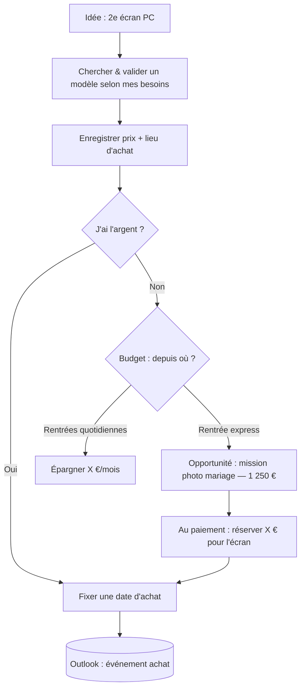
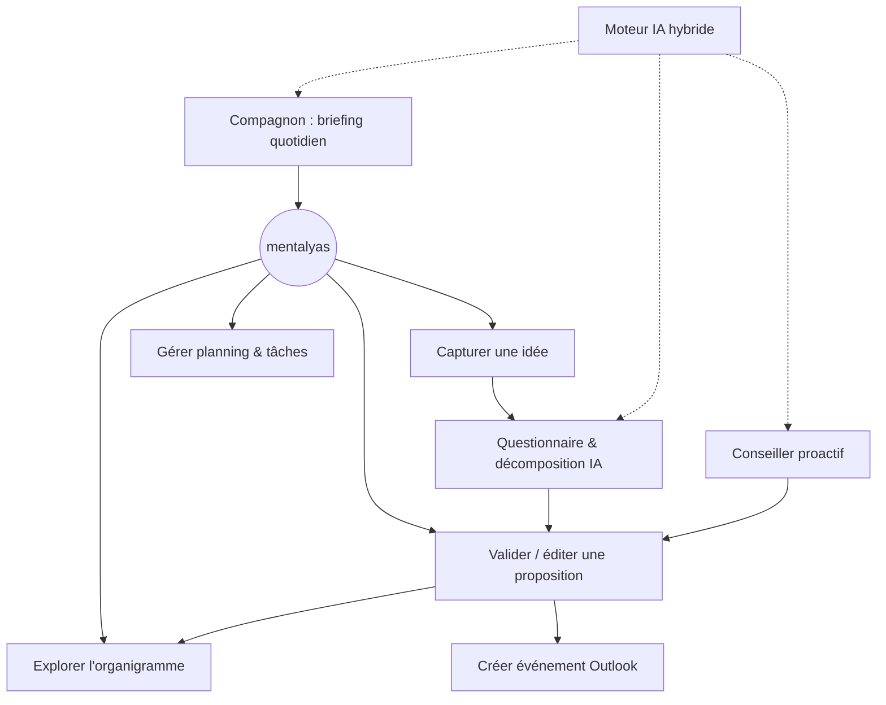

# Niveau 1 — Vision & Cadrage — Gestionnaire_idées
> mentalyas · Full-Stack Dev
> Date : 2026-09-28
> Statut : Niveau 1 terminé — en attente de validation

---

## 1. Concept Global
> **Vision : un « agenda organique » — un secrétaire personnel intelligent.** Plus il s'alimente
> en idées et en infos, mieux il conseille et fait remarquer des opportunités qu'on ne verrait pas seul.

App compagnon desktop (Windows), toujours sous la main, pour capturer en quelques secondes une idée
(générale, achat, projet, sortie, n'importe quoi) au moment où elle vient — avant de l'oublier.
Une IA hybride (locale + Claude), strictement cadrée par un contexte local, structure ensuite ces idées
en arbres de tâches conditionnels via un questionnaire, détecte les liens et opportunités entre idées,
les affiche en organigramme et, après validation, crée les événements dans le calendrier Outlook.
Un compagnon tamagotchi en pixel art délivre le briefing quotidien et évolue avec l'assistant.

**Utilisateur** : mono-utilisateur (mentalyas), usage personnel. Pas de comptes, pas de partage.

## 2. Fonctionnalités

### Fonctionnalités core (MVP)
- [ ] **F1 — Capture rapide** — widget/popup ouvert par raccourci clavier global, saisie éclair
- [ ] **F2 — Structuration IA (questionnaire + décomposition)** — l'IA pose des questions puis produit
      un arbre de tâches avec branches conditionnelles, dépendances/déclencheurs et opportunités (voir 2bis)
- [ ] **F3 — Aperçu & validation** — toute proposition IA passe par un écran de revue (éditer / accepter / refuser) ;
      rien n'est écrit (organigramme, Outlook, budget) sans validation
- [ ] **F4 — Organigramme** — vue interactive des idées, tâches, conditions, dépendances et liens inter-idées
- [ ] **F5 — Interface complète / planning** — gestionnaire de tâches et planning (2e niveau d'interface)
- [ ] **F6 — Synchro Outlook** — création des événements validés dans le calendrier (Microsoft Graph)
- [ ] **F7 — Conseiller proactif** — analyse de l'ensemble des idées/tâches/opportunités → suggestions
      de liens, d'ordonnancement et d'optimisations (soumises à F3)
- [ ] **F8 — Compagnon tamagotchi & briefing quotidien** — pixel art, briefing du jour, évolution RNG pondérée
- [ ] **F9 — Moteur IA hybride & contexte** — routage locale/Claude, profil et cadre injectés, budget API

### Découpage de livraison (décidé)
- **MVP-1 — Le cœur** : F1 Capture · F2 Structuration IA · F3 Validation · F4 Organigramme · F9 Moteur IA
- **MVP-2 — Le secrétaire complet** : F5 Planning · F6 Outlook · F7 Conseiller proactif · F8 Compagnon
- L'architecture prévoit les 9 dès le départ ; seul l'ordre de construction change.

### Fonctionnalités secondaires (v2+)
- [ ] Compagnon « vivant sur le bureau » (déplacements type Shimeji), animations enrichies
- [ ] Autres plateformes que desktop (mobile)
- [ ] Synchronisation bidirectionnelle Outlook (lire les modifications faites dans Outlook)
- [ ] Fine-tuning éventuel du modèle local (écarté pour l'instant)

### Hors scope (explicitement exclu)
- Multi-utilisateur, partage, collaboration
- Génération créative par l'agent (images, poésie, prose), culture générale, code
- Gestion comptable/fiscale complète (on ne gère que le budget lié aux idées)
- Écriture automatique sans validation humaine

## 2bis. Modèle de structuration (cœur de l'app)

Trajet d'une idée : **capture → questionnaire IA → décomposition → validation → organigramme → Outlook**.

1. **Questionnaire** — l'IA pose des questions pour comprendre l'idée (besoin, budget, échéance…).
2. **Décomposition conditionnelle** — sous-tâches avec **branches conditionnelles**
   (« as-tu l'argent ? oui → fixer une date / non → créer un budget ») → **arbre de décision**.
3. **Dépendances & déclencheurs** — une tâche attend un événement d'une autre
   (« au paiement de la mission mariage → réserver X € pour l'écran → puis planifier l'achat »).
4. **Opportunités / ressources** — une idée peut en faire naître une autre (mission photo mariage
   = objectif + tâche + rentrée de 1 250 €) qui alimente la première.
5. **Interconnexions** — l'IA détecte les liens entre idées et **suggère organisations / optimisations**.

### Exemple de référence — « Acheter un 2e écran »

## 2ter. Architecture IA hybride & cadrage de l'agent

| Moteur | Rôle | Exemples |
|--------|------|----------|
| **IA locale** (Ollama, modèle 7-8B, RTX 3070 8 Go) | Garde la main par défaut — petites tâches | Capture, catégorie, briefing, anonymisation/résumé avant envoi |
| **Claude (API, `claude-opus-5` par défaut)** | Raisonnement en profondeur — à la demande | Questionnaire, arbre conditionnel, analyse proactive inter-idées |

- **Abstraction `AIProvider`** : moteurs interchangeables ; **minimisation** : anonymisation locale avant tout envoi à Claude.
- **Budget** : compteur mensuel + plafond 10 €/mois modifiable + limite côté console Anthropic.
- **« Former » l'agent = injection de contexte uniquement** (pas de fine-tuning) : profil distillé du `~/.claude/CLAUDE.md`,
  règles et exemples, mis à jour par Claude Code via un dossier d'import, **aperçu + validation** avant activation.
  Profil stocké dans `%APPDATA%`, jamais dans le repo public.
- **Cadre** : périmètre = idées, tâches, planning, budget lié aux idées, opportunités, rappels ; refus poli hors périmètre
  (images, poésie, culture générale, code) ; **demander plutôt qu'inventer** ; sorties structurées validées.

## 2quater. Compagnon tamagotchi & briefing quotidien

- Rappel quotidien = **briefing** délivré par un compagnon **pixel art**, animations minimales.
- **Évolution** au fil de la maturité de l'assistant (idées capturées/structurées, suggestions acceptées, régularité).
- **Branches tirées au sort (RNG pondéré)** selon les types de projets (Photo, IT, Achat…) — esprit Digimon/Tamagotchi ;
  arbre d'évolution déclaratif (fichier de config) ; chaque tirage est journalisé et explicable.
- Anti-Clippy : 1 briefing/jour, annonces discrètes, report en plein écran.

## 3. Structure de données (macro — détail en niveau 3)

| Entité | Rôle | Relations |
|--------|------|-----------|
| Idée | Capture brute, catégorie | 1 idée → 0..1 arbre de tâches ; N↔N liens inter-idées |
| Tâche | Nœud de l'arbre, sous-tâches | parent/enfants ; 0..1 événement Outlook |
| Condition | Point de décision (oui/non) | branche vers des tâches |
| Dépendance / déclencheur | « quand X est fait/payé → Y » | tâche → tâche |
| Opportunité / rentrée | Source d'argent/ressource | alimente 1..N idées |
| Montant / budget | Prix, montants réservés | lié à tâche/opportunité |
| Suggestion IA | Proposition en attente | statut : proposée/acceptée/refusée |
| Compagnon | Stade, forme, historique des tirages RNG | score de maturité |
| Journal d'usage IA | Appels, moteur, coût | budget mensuel |

## 4. Diagramme Use Cases — vue d'ensemble

## 5. Stack Technologique

| Couche | Technologie | Justification |
|--------|-------------|---------------|
| Shell desktop | **Electron** | Widget always-on-top, tray, raccourci global, fenêtre transparente (compagnon), démarrage avec Windows |
| UI | **React + TypeScript (strict) + Tailwind** | Stack frontend de référence de mentalyas |
| Organigramme | **React Flow** (pressenti) | Nœuds/liens/zoom/drag prêts à l'emploi |
| IA locale | **Ollama** (modèle 7-8B, RTX 3070 8 Go) | Gratuit, privé, hors ligne — petites tâches |
| IA distante | **Claude (API Anthropic, SDK TypeScript)** | Raisonnement profond à la demande |
| Calendrier | **Microsoft Graph + MSAL** (compte perso Hotmail) | API officielle, OAuth2 |
| Stockage | Base locale (SQLite pressenti) — à fixer en niveau 3 | Mono-utilisateur, hors ligne |
| Secrets | Chiffrement OS (DPAPI via `safeStorage` d'Electron) | Clé API + tokens hors du code |
| Démarrage | Lancement avec Windows + icône zone de notification | Décidé |

## 6. Algorithmes & Patterns Techniques
- **Strategy / Adapter (`AIProvider`)** — moteurs IA interchangeables (Ollama / Claude).
- **Routeur de requêtes IA** — règles simples (type de tâche, complexité) → locale ou Claude.
- **Sorties IA structurées + validation de schéma** (Zod) — rejet de toute réponse hors format.
- **Arbre / graphe orienté** — tâches, conditions, dépendances ; détection de cycles.
- **RNG pondéré** (tirage par roulette sur les poids issus des catégories d'idées) — évolution du compagnon,
  tirages journalisés.
- **Human-in-the-loop** — file de propositions en attente de validation.

## 7. Sécurité

### Niveau de sensibilité des données
**Moyen à élevé** — idées personnelles + **données financières** (montants, rentrées, budget) + tokens Microsoft.

### Vulnérabilités à anticiper
| Risque | Vecteur | Mitigation |
|--------|---------|------------|
| Fuite de secrets | Clé API / tokens dans le code ou le repo **public** | `safeStorage` (DPAPI), `.env` ignoré, aucun secret commité |
| Fuite de données perso | Données réelles commitées | Données dans `%APPDATA%`, repo avec exemples fictifs uniquement |
| Exposition à un tiers | Envoi à l'API Claude | Minimisation : résumé/anonymisation par l'IA locale avant envoi |
| Prompt injection | Texte d'idée qui détourne l'agent | Cadre système strict, sorties structurées validées, aucune action sans validation |
| Hallucination | IA invente prix/dates/montants | L'agent pose la question au lieu d'inventer ; revue humaine |
| Sécurité Electron | XSS → accès Node | `contextIsolation`, `sandbox`, pas de `nodeIntegration`, CSP, IPC minimal et validé |
| Abus OAuth | Scopes trop larges | Scopes minimaux (calendrier uniquement), PKCE |
| Dérive de coût | Analyse proactive trop fréquente | Compteur + plafond mensuel (10 € par défaut) |
| Données au repos | Vol du fichier de base | Chiffrement de la base ou des champs sensibles |

### Exceptions & gestion d'erreurs
- Ollama indisponible → mode dégradé explicite (capture OK, structuration mise en file).
- API Claude indisponible / plafond atteint → message clair, file d'attente, pas de perte d'idée.
- Token Microsoft expiré → reconnexion guidée, événements non envoyés conservés.
- Logs locaux sans contenu d'idées, montants ni tokens.

### Checklist sécurité minimale
- [ ] Aucun secret ni donnée réelle dans le repo public
- [ ] Secrets via `safeStorage` (DPAPI)
- [ ] Electron durci (contextIsolation, sandbox, CSP, IPC validé)
- [ ] Validation de schéma de toutes les sorties IA
- [ ] Scopes Graph minimaux + PKCE
- [ ] Minimisation des données envoyées à Claude

## 8. Références
| Référence | Ce qui est inspirant | Ce qu'on fait différemment |
|-----------|---------------------|---------------------------|
| Finch (app mobile) | Compagnon qui grandit avec l'usage | Évolution liée à la maturité de l'agenda + RNG par types de projets |
| Tamagotchi / Digimon | Arbre d'évolution à branches | Poids guidés par les catégories d'idées |
| Shimeji / Desktop Goose | Personnage qui vit sur le bureau | Réservé à la v2 |
| Duolingo | Rappels avec personnalité, régularité | Briefing utile, pas culpabilisant |
| Clippy (contre-exemple) | — | Pas d'interruption intempestive : briefing à moments choisis |
| Spotlight / PowerToys Run | Capture par raccourci global | Capture d'idée au lieu de lancement d'app |

## 9. Décisions prises
- Validation humaine obligatoire avant toute écriture (option A)
- Compte Microsoft personnel (Hotmail) — adresse jamais écrite dans le repo
- IA hybride : locale par défaut, Claude pour le raisonnement profond
- « Former » l'agent = injection de contexte uniquement (profil distillé du CLAUDE.md, mis à jour par Claude Code)
- Budget API : compteur + plafond 10 €/mois modifiable
- Rappel = briefing par compagnon tamagotchi pixel art, animations minimales, évolution RNG pondérée
- Stack : Electron + React + TypeScript + Tailwind ; démarrage avec Windows

## 10. Points ouverts (pour les niveaux suivants)
- [ ] Catégories exactes d'idées (liées aux branches du compagnon)
- [ ] Nombre de stades/branches du compagnon au MVP
- [ ] Moteur de stockage et stratégie de chiffrement
- [x] Règles de routage locale ↔ Claude → voir L3-moteur-ia ; **modèle Claude par défaut : `claude-opus-5`** (décidé, configurable) ; modèle local à benchmarker en implémentation
- [ ] Fréquence / moment du briefing (allumage PC, heure fixe)
