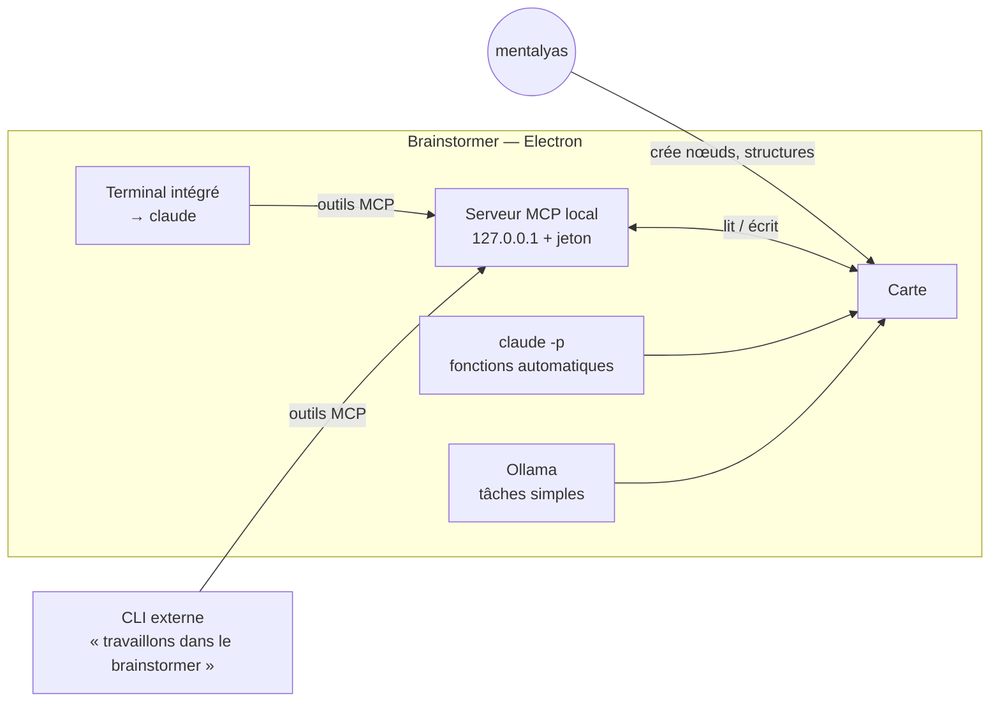

# Niveau 1 (amendement) — Le Brainstormer, interface visuelle de Claude Code
> Projet : Gestionnaire_idées · Amende : L1-fondation.md (§1 vision, §2ter cadre IA, F9 moteur IA), L1b-brainstormer.md
> (§3 cadre IA, §5 plan de livraison), L4c-widgets.md (§5 génération), constitution (principes II, III, IV)
> Date : 2026-10-04 · Statut : vision et 6 arbitrages validés par mentalyas — plan de livraison (§7) à valider

## 1. Constat qui motive l'amendement
Les neurones et les widgets fonctionnent, mais mentalyas ne trouve **aucun cas d'usage concret** : la toile est
générique sans point d'entrée, et rien ne ramène vers l'app. En parallèle, il utilise **Claude Code (CLI) pour
presque tout** — dev, analyse de documents, juridique, cours, photo, carrière — et pense en **cartes, schémas, liens**.
Il produit déjà des visuels au cas par cas (graphify, `blueprint`, canvas `/professor`, MindMap de cours), chacun
jetable et isolé. Le besoin réel : **rendre visuel et persistant ce qu'il fait déjà avec Claude Code.**

## 2. Nouvelle vision
> **Le Brainstormer est l'écran de Claude Code** : la carte est l'interface partagée entre mentalyas et Claude.
> Claude y affiche ce qu'il produit ; mentalyas y crée nœuds et structures que Claude relit comme contexte.

- **Générique par conception** : brainstorm, organisation d'idées, planning, structure de projet ou de code,
  analyse de document, parsing, structuration — tout ce que fait Claude Code, avec du visuel.
- **Pas de page blanche** : peu de **primitives visuelles** (nœud, lien, cadre/groupe, document, tableau, widget)
  + des **recettes** réutilisables (consigne + widgets + disposition) + une **bibliothèque de widgets** persistants,
  réutilisables sur n'importe quel nœud.
- Les neurones (croissance, jauge, éclosion) deviennent **une recette parmi d'autres** (« Brainstorm »).
- Le planning et les rappels deviennent une recette ou une vue, pas la finalité.

## 3. Architecture de principe (décidé)

| Brique | Rôle |
|--------|------|
| **Serveur MCP local** (Model Context Protocol) | Expose la carte à Claude Code : lire (carte, sélection, nœud, espace) et écrire (nœud, lien, cadre, widget). Écoute uniquement `127.0.0.1`, jeton aléatoire stocké dans `%APPDATA%`, entrées validées par Zod. |
| **Terminal intégré** | Lance le vrai CLI `claude` dans le dossier de l'espace actif (modèle des IDE) : pas de clé API, contexte du projet, skills et mémoire de mentalyas. Bouton « Envoyer à Claude » sur un nœud. |
| **CLI externe** | Tout `claude` (VS Code, terminal) voit le même serveur MCP dès que l'app tourne ; un skill `brainstormer` gère « travaillons dans le brainstormer ». |
| **`claude -p`** (mode non interactif du CLI) | Remplace l'API Anthropic pour les fonctions automatiques de l'app. |
| **Ollama** | Reste pour les tâches simples et répétitives (classer, résumer, extraire, renommer). |
| **Contexte de l'app** | `CLAUDE.md` fixe dans le dossier de travail de l'app (règles, usage des outils de la carte) ; les données vivantes passent par MCP, jamais par des `.md` générés (périmés). |

## 4. Arbitrages (décidés le 2026-10-04)
| # | Sujet | Décision |
|---|-------|----------|
| 1 | Écritures de Claude sur la carte | **Directes**, chaque ajout marqué « par Claude », annulable par l'Historique et `Ctrl+Z`. Pas de validation nœud par nœud. |
| 2 | Anonymisation | **Ne s'applique plus** sur le chemin Claude Code : c'est le CLI de mentalyas, sur sa machine. |
| 3 | API externes | **Objectif : supprimer l'API Anthropic** (coût). Plus de clé API Claude dans l'app à terme. |
| 4 | Dossier du terminal | **Espaces liés** : un espace de la carte peut être lié à un vrai dossier (ex. ArtisaStock) ; le terminal s'y ouvre. Sans lien : dossier de travail propre à l'app. |
| 5 | Fonctions IA automatiques (croissance, synthèse, génération de widgets) | **Conservées, via `claude -p`** en arrière-plan (abonnement de mentalyas). Seul le fournisseur change (`ClaudeProvider` → fournisseur CLI, derrière `aiEngine`). |
| 6 | Cadre de l'IA (rôle de partenaire de brainstorm, refus `out_of_scope`) | **Supprimé partout.** Les garde-fous deviennent purement techniques : bac à sable des widgets, sorties validées par Zod, annulation, traçabilité « par Claude ». |

## 5. Ce qui ne change pas
- **Widgets** : bac à sable (`iframe` sans `allow-same-origin`, CSP sans réseau), revue du code et empreinte avant
  toute donnée, résultats bornés. C'est **Claude** qui lit les fichiers (permissions de son CLI), jamais un widget.
- Base SQLite chiffrée : Claude n'y accède **jamais directement**, uniquement par les outils MCP.
- Historique et annulation : toute écriture, humaine ou de Claude, y passe.
- Repo public : aucune donnée réelle, aucun secret (le jeton MCP vit dans `%APPDATA%`).

## 6. Impacts
- **Constitution à amender** : II (validation → annulation pour les écritures de Claude par MCP), III (cadre de l'IA
  supprimé, sorties toujours validées), IV (anonymisation retirée sur le chemin CLI ; « local d'abord » renforcé :
  plus d'appel API direct). À faire via `/speckit-constitution`.
- **Code à retirer à terme** : `ClaudeProvider` (SDK `@anthropic-ai/sdk`), cadre `out_of_scope` et règles de refus,
  anonymisation sur le chemin Claude, réglages de clé API, suivi de coût API (remplacé par le suivi d'usage du CLI).
- **Spec 006 (outils au verrouillage)** : gelée en l'état ; T016 à refaire une fois le moteur CLI en place.
- **Nouvelles dépendances** (à confirmer en L3) : `@modelcontextprotocol/sdk`, `@xterm/xterm`, `node-pty`
  (module natif à recompiler pour Electron, comme `better-sqlite3`).
- **Nouveau concept** : l'**espace** (carte nommée, éventuellement liée à un dossier).

## 7. Nouvelles fonctionnalités et plan de livraison (proposé — à valider)
| # | Fonctionnalité | Contenu | Lot |
|---|----------------|---------|-----|
| F10 | **Pont MCP** | Serveur MCP local, outils lire/écrire, marquage « par Claude », annulation ; enregistrement `claude mcp add --scope user` | **1** — test depuis le CLI externe |
| F11 | **Moteur CLI** | Fournisseur `claude -p` derrière `aiEngine` ; migration des fonctions automatiques ; retrait de l'API, du cadre et de l'anonymisation | **2** |
| F12 | **Terminal intégré & espaces** | xterm + node-pty, espaces liés à un dossier, `CLAUDE.md` de l'app, « Envoyer à Claude » | **3** |
| F13 | **Skill `brainstormer`** | « Travaillons dans le brainstormer » depuis n'importe quel CLI | **3** |
| F14 | **Recettes & bibliothèque de widgets** | Enregistrer et relancer une recette ; poser un widget existant sur n'importe quel nœud | **4** |

Ordre justifié : le **lot 1 valide la sensation** (« Claude Code dessine ma pensée ») avec le moins de code, sans
changer les habitudes ; le lot 2 coupe le coût API ; les lots 3 et 4 rendent l'app autonome et réutilisable.
Nettoyage du code existant : **après le lot 2**, sur ce qui reste.

## 8. Points ouverts
- [ ] Conditions d'usage de l'abonnement pour `claude -p` appelé par l'app (usage personnel) et limites de débit —
  à vérifier avant le lot 2.
- [ ] Latence de `claude -p` (démarrage du CLI à chaque appel) pour les questions de croissance — à mesurer en lot 2 ;
  repli Ollama si trop lent.
- [ ] Hook `UserPromptSubmit` (résumé de la sélection joint à chaque message) : utile ou trop coûteux en jetons ?
- [ ] Nom de l'app (« Brainstormer » ?) — toujours ouvert depuis L1b.
