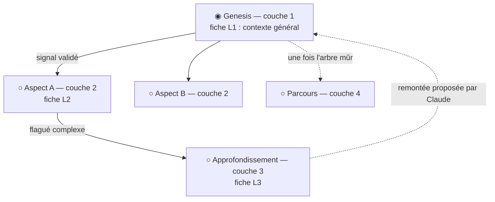

# Niveau 1 (amendement) — Le neurone devient une conversation Claude Code
> Projet : Gestionnaire_idées · Amende : L4b-neurones.md (croissance, jauge, fusion, natures), L1b-brainstormer.md
> (§2 natures Action/Réflexion), L1c-pont-claude-code.md §9 (décisions 9 et 11)
> Date : 2026-10-04 · Statut : vision et 6 arbitrages validés par mentalyas — à décliner en spec 008

## 1. Idée de mentalyas
On part d'une toile vide. Clic droit → nouvelle idée avec un titre : c'est un **neurone genesis**. Double-clic → un
panneau latéral ouvre un **chat qui est en réalité une conversation Claude Code**, qui sait qu'elle est dans le
Brainstormer, sur un genesis. On brainstorme ; le neurone **s'alimente** au fil des questions. Quand un neurone enfant
naît, double-clic → **sa propre conversation**, qui connaît le nœud **et** le contexte général porté par le genesis.
Le genesis garde le contexte général ; les sous-neurones l'approfondissent. **La structure est celle de `/brainstorm`
(couches et sous-couches), rendue visuelle.**

## 2. Définition
> **Un neurone = une conversation Claude Code + une fiche de contexte**, placé dans un **entonnoir en couches**.

| Élément | Rôle |
|---------|------|
| **Conversation** | Session Claude Code propre au neurone, reprise à chaque ouverture (même historique). |
| **Fiche** | Résumé vivant tenu à jour par Claude pendant la conversation : points clés, décisions, manques. C'est la fiche — jamais la conversation brute — qui est transmise aux enfants. Format compatible `/brainstorm` (L1/L2/L3/L4 `.md`). |
| **Couche** | Position dans l'entonnoir : 1 vision & cadrage (genesis), 2 détail par aspect, 3 approfondissement (seulement là où c'est nécessaire), 4 parcours / mise en œuvre (une fois pour l'arbre). |
| **Type d'entonnoir** | Porté par le genesis : projet, achat, événement, décision, apprentissage… Identifié par Claude à la couche 1, modifiable ; adapte les questions et les couches (ex. un achat a une couche « comparatif » plutôt que « technique »). **Remplace les natures Action / Réflexion.** |

## 3. Contexte d'une conversation
- **Héritage descendant** : la conversation d'un neurone reçoit le cadre du Brainstormer, la fiche du genesis, les
  fiches de son chemin (genesis → … → parent) et sa propre fiche. Règle du skill : chaque couche relit les couches
  au-dessus d'elle.
- **Remontée (décidé)** : quand une découverte d'un sous-neurone change le contexte général (ex. « budget max 40 k€ »),
  **Claude propose** de l'ajouter à la fiche du genesis ; mentalyas accepte d'un clic ; les autres branches en
  profitent à leur prochaine ouverture.

## 4. Cycle de vie (remappé sur l'entonnoir — décidé)
| Avant (L4b) | Maintenant |
|-------------|-----------|
| Questions proposées par Ollama, réponses → sous-neurones satellites | Questions posées par **Claude dans le chat** ; les réponses nourrissent la **fiche** |
| Jauge insuffisant / suffisant / complet | **Maturité du neurone dans sa couche** (Claude dit ce qui manque) |
| Verrouiller → synthèse → absorption des sous-neurones | **Valider la couche** = signal de complexité → Claude propose les neurones de la couche suivante → **validation en bloc** → ils naissent. **Plus d'absorption** : l'entonnoir reste visible. |
| Éclosion de l'idée | **Éclosion du genesis** = entonnoir terminé → synthèse finale + **export** (`docs/brainstorm/L*.md` + `FOUNDATION.md`, utilisables par `/hub` et `/pipeline`) |

## 5. Sur la carte (décidé)
- Le neurone affiche sa **fiche condensée** (points clés, décisions, manques) et **grossit avec sa maturité** ; les
  questions-réponses restent dans le chat. Couche lisible d'un coup d'œil (rang, couleur ou anneau — à concevoir en L4).
- Les neurones proposés pour la couche suivante apparaissent en **fantômes** autour du parent jusqu'à validation.
- Widgets, notes, cadres et liens libres (spec 007) restent disponibles autour des neurones.

## 6. Arbitrages (2026-10-04)
| # | Sujet | Décision |
|---|-------|----------|
| 12 | Unité de conversation | **Une conversation par neurone** (remplace « une par idée + une générale » de L1c §9 ; une conversation générale de la carte reste possible, à confirmer en spec). |
| 13 | Remontée du contexte | **Claude propose**, mentalyas accepte. |
| 14 | Naissance des neurones | **Suivant l'entonnoir de `/brainstorm`** : signal de complexité, proposition de la couche suivante, validation en bloc. |
| 15 | Lien avec le skill | **Entonnoir propre au Brainstormer**, générique pour tout sujet, **fiches au format du skill** (export compatible). |
| 16 | Jauge / verrouillage / éclosion | **Remappés sur l'entonnoir** (§4). |
| 17 | Natures Action / Réflexion | **Remplacées par le type d'entonnoir**. |
| 18 | Visuel | **La fiche grandit** dans le nœud. |
| 19 | Ancien moteur | **Remplacé, données converties** : chaque idée existante devient un genesis (réponses et documents nourrissent sa première fiche) ; l'ancien code de croissance (questions Ollama, extensions, sous-neurones réponses, absorption) est retiré après validation. |

## 7. Conséquences techniques (à détailler en L2/L3 de la spec 008)
- **Conversation** : `claude -p --input-format stream-json --output-format stream-json`, une session par neurone
  (`--session-id` à la création, `--resume` ensuite), dossier de travail de l'app, pont MCP branché d'office
  (`--mcp-config`), cadre du Brainstormer et fiches du chemin en `--append-system-prompt`. Permissions de L1c §9 n°10.
- **Nouveaux outils MCP** : mettre à jour la fiche d'un neurone, évaluer sa maturité, proposer la couche suivante
  (fantômes), proposer une remontée vers le genesis.
- **Données** : neurone = genesis ou enfant, couche, type d'entonnoir (genesis), identifiant de session, fiche
  (Markdown), maturité ; propositions (couche suivante, remontée) avec statut.
- **Ollama** : tâches de fond seulement (classer, résumer, détecter des liens, proposer des structures).
- **Migration** : idées → genesis, sous-neurones et documents → première fiche ; puis retrait de l'ancien moteur.

## 8. Points ouverts
- [ ] Conversation générale de la carte : utile en plus des conversations par neurone ?
- [ ] Liste initiale des types d'entonnoir et de leurs couches.
- [ ] Taille des fiches transmises (borne en caractères) quand l'arbre devient profond.
- [ ] Quota d'abonnement : brainstorm intensif sur Opus — choix du modèle par conversation ?
- [ ] Rendu visuel des couches (L4).
