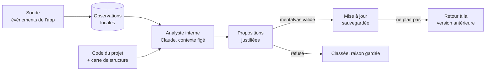

# Niveau 1 (amendement) — L'Analyste interne : une app qui s'observe, propose et s'améliore
> Projet : Gestionnaire_idées · Prolonge : L1e-chirurgie-projet.md (construire avec validation), L1c-pont-claude-code.md,
> spec 014 (fichiers et commandes) · Date : 2026-10-07 · Statut : **niveaux 1 à 3 validés (A1–A9)**, niveau 4 rédigé (`L4e-analyste.md`)

> « Implémenter une sorte de sonde interne qui récupère des logs et analyse l'app en cours de fonctionnement avec
> Claude lui-même, mais sur base d'un contexte bien précis d'Analyste interne. […] Une sorte de testeur complémentaire
> à l'utilisateur qui, sur base de l'utilisation et du comportement de l'app, fait lui-même des auto-corrections, mises
> à jour et améliorations. On aurait une app dynamique qui s'auto-améliore et évolue. » — mentalyas

## 1. Constat
Le Brainstormer est construit **de l'extérieur** : Claude Code (CLI) code l'app à partir des retours de mentalyas, qui
teste à la main (checklists guidées). Les bugs, redondances et lenteurs ne sont vus que si mentalyas les remarque et les
décrit. L'app, elle, sait des choses que personne ne regarde : erreurs du main, tâches IA rejetées, durées, actions
répétées. Il manque **un regard de l'intérieur**, qui voit l'app tourner et l'usage réel.

## 2. Ce que la fonctionnalité apporte (vision)
1. **Observer** : une sonde collecte des événements de fonctionnement (erreurs, durées, tâches IA, parcours
   utilisateur) depuis l'intérieur de l'app.
2. **Analyser** : Claude, dans un rôle d'**Analyste interne** au contexte figé, lit ces observations (et le code) et
   isole : bugs, redondances, incohérences, code mort, frictions du parcours.
3. **Automatiser** : une tâche IA qui refait toujours la même chose (même entrée → même sortie) est repérée ; Claude
   propose de la remplacer par du code déterministe → une tâche IA économisée.
4. **Proposer** : améliorations de fonctionnalités, de visuels, nouvelles idées — chaque proposition justifiée par ce
   qui a été observé.
5. **Appliquer avec validation** : rien ne change sans l'accord de mentalyas ; chaque mise à jour appliquée est
   sauvegardée et réversible (retour à la version précédente).
6. **Rythme** : analyse manuelle « maintenant », ou automatique tous les X temps ; à terme, des analyses sur une
   fenêtre longue pour que le contexte soit assez riche.

## 3. Briques existantes réutilisables (à confirmer au niveau 2)
| Brique | Existe | Rôle pour l'Analyste |
|--------|--------|----------------------|
| Journal de l'app (`infrastructure/logging/logger.ts`, sortie stdout) | oui | Base de la sonde (aujourd'hui non conservé) |
| Journal d'usage IA (tâche, durée, statut, modèle) | oui (constitution IV) | Repérer les tâches IA répétitives |
| `AIGateway` (tâches figées, sorties Zod) | oui | Tâche `analyste` au contexte figé |
| Genesis lié à un dossier + carte de structure (L1e, 017) | oui | L'app peut se lier **à son propre dépôt** et se cartographier |
| Conversations Claude Code avec modes de permission (spec 014) | oui | Appliquer une proposition validée, fichier par fichier |
| Historique annulable (MCP, origine `claude`) | oui | Annuler ce qui touche les données |

## 4. Tensions repérées avec la constitution (à arbitrer)
| # | Principe | Tension |
|---|----------|---------|
| T1 | I. « Les logs MUST NOT contenir de contenu d'idée ni de PII » | Analyser le parcours sans lire le contenu : événements sans texte (quoi, où, combien de temps), jamais ce qui est écrit |
| T2 | II. « L'app ne commite jamais d'elle-même » | La sauvegarde / retour arrière d'une mise à jour demande un point de restauration (git ou autre) : à définir sans contredire II, ou amender |
| T3 | III. Tâches automatiques sans outil (`claude -p`) | Une analyse qui lit le code a besoin d'outils de lecture : conversation dédiée plutôt que tâche automatique ? |
| T4 | IV. Projet « Local uniquement » | Les observations d'un projet local ne doivent jamais partir chez Claude |
| T5 | Analyse automatique « tous les X temps » | Consomme l'abonnement sans que mentalyas le demande : plafond, et rien d'appliqué sans lui |

## 5. Arbitrages
| # | Sujet | Décision |
|---|-------|----------|
| A1 | Cible | **Le Brainstormer seul** : l'app s'observe elle-même et propose des changements à son propre code source. mentalyas est à la fois le dev et l'utilisateur (boucle courte). Les projets liés ne sont pas observés. |
| A2 | Ce que la sonde collecte | **Événements sans contenu** : quoi, où, durée, résultat (action, écran, erreur, lenteur, tâche IA). Jamais le texte saisi. Constitution I respectée telle quelle (lève T1). Pour repérer une tâche IA répétitive sans lire son contenu : **empreinte** (hash) de l'entrée et de la sortie — même empreinte = même travail refait. |
| A3 | Appliquer et sauvegarder | **Une branche git par mise à jour** (`analyste/<id>`) : après acceptation, Claude code la proposition sur cette branche et lance les tests ; mentalyas teste puis **garde** (fusion) ou **jette** la branche. Retour arrière d'une mise à jour gardée = `git revert`. **Amendement de II à écrire** : l'app commite seulement sur une branche `analyste/*`, après l'accord explicite de mentalyas ; jamais sur `main`, jamais de push. Suggestion à confirmer au niveau 2 : coder dans un **worktree git** séparé (une deuxième copie de travail du dépôt) pour ne pas changer le code sous l'app qui tourne. |
| A4 | Rythme | **Manuel + automatique réglable** : bouton « Analyser maintenant » toujours disponible ; analyse automatique tous les X (court en phase de test, ex. 1 h ; long ensuite, ex. 1 semaine), lancée **seulement s'il y a assez d'observations nouvelles**, avec un **plafond de propositions** par analyse. Une analyse automatique ne fait que proposer (lève T5 pour l'application ; la consommation reste bornée par X et le seuil). |
| A5 | Pouvoirs pendant l'analyse | **Lire seulement, puis coder à part** : l'Analyste lit (observations, carte de structure, fichiers du dépôt : lecture et recherche seulement, aucune écriture ni commande), sous une consigne figée, et rend des propositions **validées par schéma**. Le codage n'a lieu qu'après accord, dans la branche `analyste/<id>` (A3). Une injection cachée dans le code ou les observations ne peut rien modifier (lève T3). |
| A6 | Placement | **Sur la carte + boîte de réception** : le Brainstormer a son propre genesis lié à son dépôt (carte de structure) ; chaque proposition s'accroche aux nœuds concernés. Une boîte « Analyste » liste toutes les propositions pour trier vite (accepter / refuser / reporter). |
| A7 | Version de l'app | **Dépôt source seulement** : l'Analyste n'existe que si l'app tourne depuis un dépôt git du Brainstormer désigné par mentalyas dans les Réglages (développement). App installée : sonde et Analyste désactivés, rien n'est collecté. |
| A8 | Analyses du premier lot | **Les cinq** : (1) bugs et erreurs (main, renderer, tâches IA rejetées, lenteurs) ; (2) tâches IA → code (même empreinte répétée) ; (3) parcours et frictions (actions répétées, allers-retours, fonctions jamais utilisées) ; (4) code mort et redondances (analyse statique de la spec 017) ; (5) **évolutivité** (nouvelles fonctionnalités, améliorations, visuels), ajoutée par mentalyas. Chaque proposition porte sa catégorie. |
| A9 | Amendements de la constitution à écrire | **II** : commit permis seulement sur une branche `analyste/*`, après accord explicite, jamais sur `main`, jamais de push (A3). **IV** : la tâche « Analyste » est la seule tâche automatique avec des outils, **de lecture seulement**, limités au dépôt désigné (A5). **I** : ajout de `npm` aux programmes lancés par l'app, limité aux scripts de vérification dans un worktree `analyste/*` (L3-analyste-appliquer §6) ; le reste de I inchangé (A2). |

## 6. Découpage en lots
| Lot | Contenu | Visible pour mentalyas |
|-----|---------|------------------------|
| **A — Sonde** | Garde « dépôt source désigné » (A7), événements sans contenu + empreintes (A2), stockage local borné, vue brute des observations | « Voici ce que l'app a vu » |
| **B — Analyste** | Consigne figée, session de lecture seule (A5), propositions validées par schéma (5 catégories, A8), boîte de réception + accroche sur la carte (A6), « Analyser maintenant » | Les premières propositions justifiées |
| **C — Appliquer** | Worktree + branche `analyste/<id>`, codage par Claude après accord, tests, garder (fusion) / jeter, retour arrière (A3) | Une mise à jour testable et réversible |
| **D — Rythme** | Analyse automatique tous les X, seuil d'observations nouvelles, plafond de propositions (A4) | L'app qui propose d'elle-même |

## 7. Sécurité (macro)
1. **Aucune modification sans accord** : analyse en lecture seule ; codage seulement après acceptation, sur une branche
   dédiée, jamais sur `main`, jamais de push.
2. **Réversible** : garder / jeter la branche ; `git revert` pour une mise à jour gardée.
3. **Injection de prompt** : observations et code lus sont des données balisées, jamais des consignes ; la sortie est
   un schéma fermé (catégorie, justification, fichiers visés dans le dépôt, gravité), tout le reste rejeté.
4. **Pas de contenu personnel** : événements sans texte saisi ; empreintes non réversibles ; rien du dossier de données
   de l'app n'est ouvert à Claude (constitution I).
5. **Périmètre** : dépôt source désigné seulement (A7) ; chemins proposés vérifiés dans ce dépôt.
6. **Consommation bornée** : rythme réglable, seuil d'observations, plafond de propositions ; usage journalisé (IV).

## 8. Points à creuser au niveau 2
- Liste précise des événements de la sonde, format, conservation (durée, volume max), purge.
- Empreintes : quoi exactement (entrée de tâche normalisée ?), seuil de « répétition ».
- Cycle de vie d'une proposition : nouvelle → acceptée / refusée (raison) / reportée → codée → gardée / jetée → annulée ;
  une proposition refusée ne revient pas sans fait nouveau.
- Comment l'Analyste se souvient des analyses précédentes (fenêtre longue, A4) sans tout relire.
- Le worktree : où, comment mentalyas teste la branche (lancer la version de la branche à côté ?), nettoyage.
- Accroche d'une proposition sur la carte (nœud de structure visé, nouveau type de nœud « proposition » ?).
