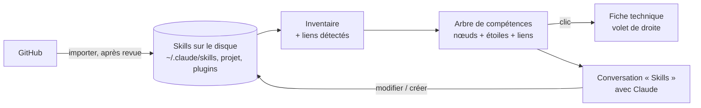

# Niveau 1 (amendement) — L'arbre de skills : la toile de compétences de Claude
> Projet : Gestionnaire_idées · Prolonge : L1c-pont-claude-code.md (Claude Code au cœur de l'app), L1e (carte et nœuds),
> spec 012 (documents), spec 017 (reprise, clone git) · Date : 2026-10-07 · Statut : **niveaux 1 à 3 validés (A1–A9)**, niveau 4 rédigé (`L4f-skills.md`)

> « Il me faut une nouvelle page dans le volet de gauche qui reprend les skills de Claude. Les skills doivent être
> représentés en nœuds de compétences avec les connexions logiques si certains skills communiquent, un peu comme les
> arbres de compétences dans les jeux vidéo. […] Pouvoir brainstormer dans cette partie de l'app avec Claude
> exclusivement sur les skills pour en modifier, en créer ou juste en importer depuis des GitHub, et ainsi voir ma toile
> de compétences s'agrandir. » — mentalyas

## 1. Constat
Les skills de Claude Code (`SKILL.md` : nom, description, instructions, fichiers annexes) sont la boîte à outils de
mentalyas : 17 skills personnels (`~/.claude/skills`), des skills de projet (`.claude/skills`), des plugins. Ils sont
invisibles en tant qu'ensemble : on ne voit ni lesquels existent, ni à quoi ils servent, ni comment ils s'enchaînent
(`hub` → `graphify`, `professor` ; `brainstorm` → Spec Kit → `pipeline`), ni lesquels sont solides ou fragiles.

## 2. Ce que la fonctionnalité apporte (vision)
1. **Voir** : une page « Skills » dans la navigation de gauche ; chaque skill est un **nœud de compétence** (titre,
   niveau de puissance / qualité en étoiles), relié aux skills avec lesquels il communique — un arbre de compétences de
   jeu vidéo.
2. **Comprendre** : un clic ouvre, dans le volet de droite, la **fiche technique** du skill : résumé complet de ce qu'il
   fait, quand l'utiliser (et quand non), ses déclencheurs, ses liens, sa doc.
3. **Faire évoluer** : brainstormer avec Claude **exclusivement sur les skills** : en modifier, en créer, en importer
   depuis GitHub ; combiner des skills, trouver des techniques d'usage.
4. **Grandir** : la toile s'agrandit à chaque skill ajouté ; une vue d'ensemble de ce que Claude sait faire pour
   mentalyas.

## 3. Briques existantes réutilisables
| Brique | Rôle pour l'arbre de skills |
|--------|-----------------------------|
| Carte React Flow, nœuds, disposition pure (specs 009, 017 D17–D21) | Nœuds de compétence, liens, disposition en arbre |
| Conversations Claude Code avec modes de permission (spec 008, 014) | Conversation dédiée aux skills, écriture de `SKILL.md` après autorisation |
| Pont MCP (spec 007) | Outils pour que Claude lise / note la toile |
| Documents (spec 012) et visionneuse (spec 013 D4) | Fiche technique, lecture du `SKILL.md` |
| Clone git contrôlé (spec 017 US5, en pause) | Import depuis GitHub (URL contrôlée, sans exécution) |

## 4. Risques repérés (à arbitrer)
| # | Risque | Piste |
|---|--------|-------|
| R1 | Un skill importé de GitHub est du texte qui **donne des ordres à Claude** (injection) et peut embarquer des **scripts** | Revue avant installation : aperçu, analyse par Claude, rien d'exécuté, validation explicite |
| R2 | Modifier un skill change le comportement de Claude **partout** (tous les projets) | Sauvegarde / version avant chaque modification, annulation |
| R3 | `~/.claude/skills` est hors du dépôt et hors du dossier de données de l'app | Accès limité à ce dossier, chemins contrôlés |
| R4 | « Niveau de puissance » subjectif | Critères explicites et justifiés |

## 5. Arbitrages
| # | Sujet | Décision |
|---|-------|----------|
| A1 | Périmètre | **Tous les skills, par familles** : personnels (`~/.claude/skills`), de projet (`.claude/skills` des projets liés), de plugins installés ; chaque nœud porte son origine, un filtre par famille. |
| A2 | Étoiles | **Deux mesures distinctes** : la **qualité** (1–5 ★), notée par Claude selon une grille fixe et justifiée (clarté des déclencheurs, profondeur, garde-fous, exemples), corrigeable par mentalyas (sa note prime) ; l'**usage** réel (appels sur 30 jours), compté par l'app dans les historiques de Claude Code **sans lire le contenu des conversations**. |
| A3 | Liens | **Détectés + proposés** : l'app détecte les liens écrits (un skill qui en cite ou en appelle un autre) = trait plein « appelle » ; Claude propose des liens de sens (« enchaîne vers », « complète », « alternative à ») avec justification = trait pointillé ; mentalyas ajoute ou retire à la main. |
| A4 | Écriture d'un skill | **Brouillon + revue + installation** : Claude rédige un brouillon dans l'app ; mentalyas voit la fiche et les différences avec la version installée ; « Installer » écrit le `SKILL.md` (et ses annexes). Chaque version installée est gardée : « Revenir à la version précédente » en un clic. Rien ne change sur le disque sans le clic de mentalyas (lève R2). |
| A5 | Import GitHub | **Quarantaine + analyse + revue** : le dépôt est cloné en quarantaine (clone contrôlé de la spec 017 US5 : URL vérifiée, rien d'exécuté) ; Claude analyse chaque skill (consignes cachées, scripts, accès réseau) et rend un verdict justifié ; mentalyas choisit les skills à garder, qui deviennent des brouillons (circuit A4). **Scripts exclus par défaut**, autorisés fichier par fichier (lève R1). |
| A6 | Disposition | **Branches par domaine**, comme un arbre de jeu : un tronc central, une branche par domaine (ex. Projet & organisation, Design & UI, Docs & cours, Code & qualité, Photo & médias), les skills le long de leur branche, les liens entre branches. Domaine proposé par Claude, corrigeable. |
| A7 | Conversations | **Une conversation « Skills » + une par skill** : sans sélection, le volet de droite porte la conversation générale (créer, importer, combiner, techniques d'usage) ; un skill sélectionné montre sa fiche technique et sa propre conversation (l'améliorer, l'expliquer). |
| A8 | Droits par famille (proposé) | Skills **personnels** : modifiables (A4). Skills **de projet** : modifiables, écrits dans le dépôt du projet (versionnés par son git, jamais commités par l'app). Skills **de plugins** : lecture seule (gérés par leur plugin) ; « Dupliquer en skill personnel » pour les adapter. |
| A9 | Constitution (à vérifier au plan) | L'app écrit dans `~/.claude/skills` (installer / revenir) : nouvelle zone d'écriture hors du dossier de données et des projets, à inscrire au principe I si nécessaire ; l'usage est compté dans les historiques de Claude Code en ne lisant que les noms d'outils (minimisation, principe IV). |

## 6. Découpage en lots
| Lot | Contenu | Visible pour mentalyas |
|-----|---------|------------------------|
| **A — Voir** | Page « Skills » (navigation de gauche), inventaire des trois familles, liens écrits détectés, arbre par branches, fiche technique tirée du `SKILL.md` | La toile de compétences actuelle |
| **B — Comprendre** | Claude rédige la fiche (résumé, quand l'utiliser ou non, déclencheurs), note la qualité (grille), propose domaines et liens de sens ; usage sur 30 jours ; corrections de mentalyas | Étoiles, usage, liens pointillés |
| **C — Faire évoluer** | Conversation « Skills » et conversations par skill ; brouillons, différences, « Installer », versions et retour arrière ; duplication d'un skill de plugin | Créer et améliorer ses skills |
| **D — Importer** | URL GitHub, clone en quarantaine, analyse de sécurité par Claude, choix des skills, scripts exclus par défaut | La toile qui s'agrandit |

## 7. Sécurité (macro)
1. **Rien ne change sans clic** : brouillon, différences, « Installer » ; chaque version gardée, retour arrière.
2. **Import = donnée non fiable** : quarantaine, rien d'exécuté, analyse (consignes cachées, scripts, réseau), scripts
   exclus par défaut ; le contenu d'un skill importé n'est jamais une consigne pour l'app.
3. **Chemins contrôlés** : écriture limitée aux dossiers de skills connus, noms de skill vérifiés (pas de remontée de
   dossier), aucun fichier sensible.
4. **Usage sans contenu** : seuls les noms des skills appelés sont comptés dans les historiques de Claude Code.

## 8. Points à creuser au niveau 2
- Format exact de la fiche technique et grille de qualité (critères, poids).
- Détection des liens écrits (« /nom », nom cité, appel du skill) et faux positifs.
- Versions : où sont gardées les versions précédentes (dossier du profil), combien.
- Domaines : liste de départ, création de branches.
- Quarantaine : emplacement, durée, nettoyage ; réutilisation du clone de la spec 017 US5 (en pause).
