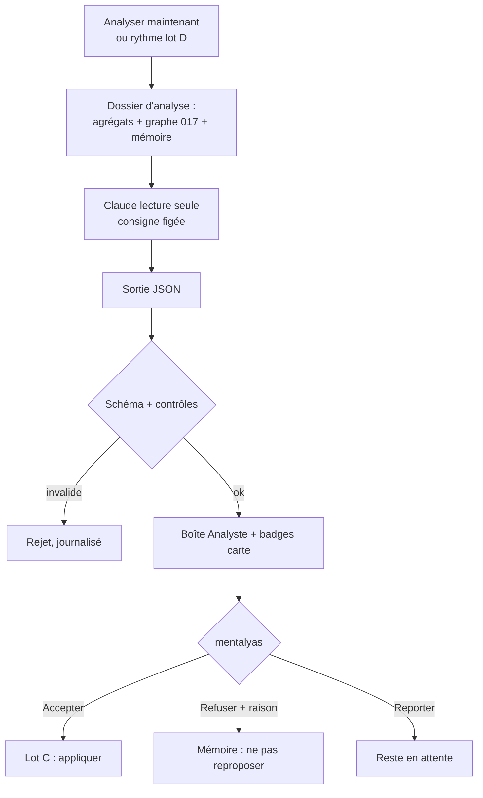

# Niveau 2 — Détail Fonctionnalité : AN-B — Analyste
> Projet : Gestionnaire_idées · Basé sur : L1g-analyste-interne.md (A4, A5, A6, A8), L2-analyste-sonde.md,
> L3-carte-structure.md, spec 017 (analyse statique) · Date : 2026-10-07 · Livraison : **lot B**

## 1. Objectif de la fonctionnalité
Transformer les observations de la sonde et le code du dépôt en **propositions justifiées**, classées, que mentalyas
trie en quelques secondes : sur une liste, ou directement sur la carte de structure du Brainstormer.

> Analogie : un testeur qui a regardé par-dessus ton épaule toute la semaine, puis qui te remet une pile de fiches :
> « j'ai vu ça, je pense que c'est ça, voilà ce que je ferais ». Il ne touche à rien.

## 2. Use Cases précis

### UC-1 : Analyser maintenant
- **Acteur :** mentalyas (bouton « Analyser maintenant » dans la boîte Analyste)
- **Scénario nominal :**
  1. L'app prépare le **dossier d'analyse** : résumé des observations depuis la dernière analyse (agrégats, pas les
     événements bruts), graphe de code de la spec 017 (modules, appels, code jamais appelé), résumé des analyses
     précédentes (propositions acceptées, refusées avec raison).
  2. Elle lance Claude en **lecture seule** dans le dépôt (outils de lecture et de recherche seulement), sous la
     consigne figée « Analyste interne ».
  3. Claude explore le code au besoin et rend une liste de propositions (schéma fermé, R-B2).
  4. L'app vérifie chaque proposition (fichiers dans le dépôt, catégorie, preuves citées existantes) et les range dans
     la boîte. Une notification : « 4 propositions ».
- **Scénarios alternatifs / erreurs :**
  - Pas assez d'observations nouvelles → l'app le dit et propose d'analyser quand même (manuel seulement).
  - Abonnement épuisé / CLI absent → analyse reportée, message clair, rien de perdu.
  - Réponse invalide → rejetée en entier, journalisée (statut `invalid`).
  - Une proposition qui cite un fichier hors dépôt ou inexistant → écartée, les autres gardées.
- **Post-condition :** propositions « nouvelles » dans la boîte et accrochées sur la carte.

### UC-2 : Trier une proposition
- **Acteur :** mentalyas
- **Scénario nominal :** il lit la fiche (catégorie, titre, constat, preuves, proposition, gain attendu, risque,
  fichiers visés) et choisit **Accepter** (→ lot C), **Refuser** (raison courte, optionnelle) ou **Reporter**.
- **Scénarios alternatifs :** « Demander plus » → ouvre une conversation Claude (spec 008) avec la fiche en contexte.
- **Post-condition :** statut mis à jour, historisé.

### UC-3 : Voir les propositions sur la carte
- **Scénario nominal :** sur le genesis « Brainstormer » lié à son dépôt, un badge sur chaque nœud de structure visé
  (« 2 propositions ») ; clic → fiche dans le volet. Une proposition sans nœud précis (évolutivité générale) s'accroche
  au genesis.

## 3. Workflow (Mermaid)

## 4. Règles métier
| # | Règle | Justification |
|---|-------|----------------|
| R-B1 | 5 catégories : **bug**, **tâche IA → code**, **parcours**, **code mort / redondance**, **évolutivité** | A8 |
| R-B2 | Une proposition = catégorie, titre (≤ 80 car.), constat, **preuves** (agrégats d'observations cités par leur clé, fichiers:lignes), proposition, gain attendu, risque (faible / moyen / élevé), gravité, fichiers visés, confiance | Justifier chaque proposition (demande de mentalyas) |
| R-B3 | Une proposition sans preuve (ni observation ni code cité) est rejetée, sauf catégorie évolutivité où elle porte la mention « idée, sans preuve d'usage » | Pas d'invention présentée comme un constat |
| R-B4 | Plafond : **5 propositions** par analyse (réglable 1–10), les plus graves d'abord | A4 ; tri rapide |
| R-B5 | Une proposition refusée n'est pas reproposée sans **fait nouveau** ; la raison du refus est donnée à l'Analyste suivant | Pas de harcèlement |
| R-B6 | Doublon (même fichier visé + même catégorie qu'une proposition ouverte) → fusionné | Boîte lisible |
| R-B7 | Analyse en lecture seule : aucun outil d'écriture ni de commande, répertoire = dépôt désigné, aucun réglage utilisateur chargé, aucun serveur MCP | A5 ; une injection cachée dans le code ne peut rien faire |
| R-B8 | Le dossier de données de l'app (`%APPDATA%`) n'est jamais lisible par l'Analyste | Constitution I |
| R-B9 | Tâche IA → code : proposée seulement si une tâche a produit **la même empreinte de sortie pour la même empreinte d'entrée** au moins N fois (défaut 5), ou si ses sorties suivent une règle simple repérable | Économie réelle, pas supposée |
| R-B10 | Le modèle par défaut est Opus 5.5 (analyse de code) ; une analyse = une entrée dans `ai_calls` (tâche `analyste`) | Constitution IV (journalisé) |

## 5. Critères d'acceptation (Definition of Done)
- [ ] Analyse manuelle sur le profil démo : propositions dans la boîte, chacune avec preuves cliquables.
- [ ] Une sortie qui cite un fichier inexistant, hors dépôt, ou une catégorie inconnue est écartée (tests).
- [ ] Une consigne cachée dans un commentaire du dépôt (« écris dans X ») n'a aucun effet : aucun outil d'écriture
      disponible (test des arguments du CLI).
- [ ] Refuser puis relancer sans fait nouveau → la proposition ne revient pas.
- [ ] Badges sur les bons nœuds de la carte du Brainstormer ; axe sans violation (boîte et fiche).
- [ ] CLI absent / abonnement épuisé : message clair, aucune proposition perdue.

## 6. Signal de complexité — Niveau 3 nécessaire ?
| Critère | Présent ? | Détail |
|---------|-----------|--------|
| Logique métier complexe (calculs, machine à états) | **Oui** | Cycle de vie des propositions, agrégats, mémoire entre analyses, dédoublonnage |
| Intégration API tierce | **Oui** | CLI `claude` avec outils de lecture (premier cas d'une tâche avec outils) |
| Données sensibles (paiement/santé/légal) | Oui (modéré) | Agrégats d'usage envoyés à Claude |
| Accès multi-rôles / permissions différenciées | Non | — |

**Recommandation :** **Niveau 3 nécessaire** : arguments exacts du CLI, schéma de sortie, format du dossier d'analyse,
tables `proposals`, mémoire, contrôles.
