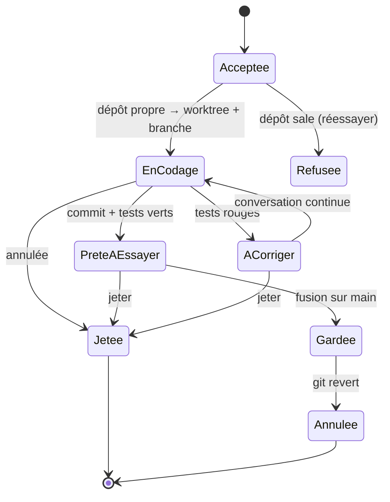

# Niveau 2 — Détail Fonctionnalité : AN-C — Appliquer une proposition
> Projet : Gestionnaire_idées · Basé sur : L1g-analyste-interne.md (A3, A9), L2-analyste-analyse.md, spec 014
> (fichiers et commandes) · Date : 2026-10-07 · Livraison : **lot C**

## 1. Objectif de la fonctionnalité
Une proposition acceptée devient une **mise à jour testable et réversible** : Claude la code sur une branche à part,
les tests tournent, mentalyas l'essaie, puis la garde ou la jette. La version qu'il utilise n'est jamais touchée
pendant ce temps.

> Analogie : un brouillon sur une feuille à part. Tu le compares à ta copie, tu le recopies s'il te plaît, sinon tu le
> jettes. Et même recopié, tu peux toujours revenir à la version d'avant.

## 2. Use Cases précis

### UC-1 : Coder la proposition
- **Acteur :** mentalyas (« Accepter » sur une fiche)
- **Scénario nominal :**
  1. L'app vérifie que le dépôt est propre sur la branche de départ (pas de fichier modifié non commité).
  2. Elle crée un **worktree** (deuxième copie de travail du dépôt, dans un dossier à part) sur une nouvelle branche
     `analyste/<id>-<slug>` depuis `main`.
  3. Elle ouvre une **conversation Claude Code** (spec 008/014) dans ce worktree, fiche en contexte, mode de
     permission **Accepter les modifications** limité au worktree (les commandes restent demandées).
  4. Claude code, ajoute les tests, lance typecheck / lint / tests (demandés à mentalyas selon le mode).
  5. Fin : l'app commite sur la branche (message Conventional Commits, origine « analyste »), affiche le résumé : fichiers
     changés, diff, résultat des tests.
- **Scénarios alternatifs / erreurs :**
  - Dépôt sale → refus, « commite ou range tes changements d'abord ».
  - Tests rouges → la mise à jour reste « à corriger » ; mentalyas peut continuer la conversation ou jeter.
  - Annulation en cours → worktree et branche supprimés (seulement eux).
- **Post-condition :** branche `analyste/…` commitée, statut « prête à essayer ».

### UC-2 : Essayer la mise à jour
- **Scénario nominal :** « Essayer » affiche la commande à lancer dans le worktree (`npm run dev` sur le profil démo)
  et/ou la lance dans le terminal intégré (spec 015) — **jamais** à la place de l'app ouverte. Diff consultable dans
  l'app.

### UC-3 : Garder ou jeter
- **Garder :** l'app fusionne la branche dans `main` (fusion sans avance rapide, un commit de fusion identifiable),
  supprime le worktree. **Aucun push.** Message : « redémarre l'app pour l'utiliser ».
- **Jeter :** worktree et branche supprimés, proposition marquée « jetée » (raison optionnelle → mémoire de l'Analyste).
- **Erreurs :** conflit de fusion (main a bougé) → pas de fusion automatique ; l'app propose de rebaser dans une
  conversation, ou de jeter.

### UC-4 : Revenir en arrière
- **Acteur :** mentalyas, dans l'historique de l'Analyste (« Mises à jour gardées »)
- **Scénario nominal :** « Annuler cette mise à jour » → `git revert` du commit de fusion sur `main` (nouveau commit,
  rien de réécrit), confirmé avant. Redémarrage conseillé.
- **Erreur :** revert en conflit (code modifié depuis) → arrêt propre (`git revert --abort`), explication, conversation
  proposée.

## 3. Workflow (Mermaid)

## 4. Règles métier
| # | Règle | Justification |
|---|-------|----------------|
| R-C1 | Rien n'est codé sans « Accepter » explicite sur la fiche | Constitution II, demande de mentalyas |
| R-C2 | L'app ne commite **que** sur une branche `analyste/*`, ne fusionne dans `main` **que** sur « Garder », ne pousse **jamais**, ne réécrit jamais l'historique (pas de reset, pas de force) | Amendement II (A9) ; `main` reste maître |
| R-C3 | Le code s'écrit dans un worktree hors du dépôt principal ; les écritures de Claude sont limitées à ce worktree | L'app qui tourne n'est pas modifiée sous elle |
| R-C4 | Commandes git lancées par le main uniquement : git par chemin absolu, arguments fixes, noms de branche générés par l'app (jamais par Claude ni le renderer) | Constitution I (commandes) |
| R-C5 | Une seule mise à jour en codage à la fois ; plusieurs peuvent être « prêtes à essayer » | Simplicité, pas de conflits croisés |
| R-C6 | « Garder » exige des tests verts (typecheck, lint, tests) sur la branche ; sinon bouton désactivé avec la raison | Qualité (constitution V) |
| R-C7 | Commit de la branche marqué (trailer `Analyste-Proposal: <id>`) ; jamais de ligne `Co-Authored-By` | Traçabilité, règle git de mentalyas |
| R-C8 | Revert = nouveau commit ; confirmation préalable | Réversible sans perte |
| R-C9 | Worktrees orphelins (app fermée en plein codage) nettoyés au démarrage, après confirmation s'il y a des changements non commités | Pas de déchets |

## 5. Critères d'acceptation (Definition of Done)
- [ ] Accepter sur un dépôt sale → refus explicite, aucun worktree créé.
- [ ] Une proposition codée : branche `analyste/…` avec un commit, `main` inchangé, l'app ouverte inchangée.
- [ ] Jeter → branche et worktree supprimés, aucun autre dossier touché (test).
- [ ] Garder → commit de fusion sur `main`, aucun push (test des commandes git lancées).
- [ ] Annuler une mise à jour gardée → commit de revert, code revenu à l'état d'avant (test sur dépôt jetable).
- [ ] Nom de branche ou chemin fourni par Claude ignoré (test d'injection).
- [ ] Test guidé : une vraie petite proposition gardée puis annulée.

## 6. Signal de complexité — Niveau 3 nécessaire ?
| Critère | Présent ? | Détail |
|---------|-----------|--------|
| Logique métier complexe (calculs, machine à états) | **Oui** | Machine à états ci-dessus, git (worktree, fusion, revert, conflits) |
| Intégration API tierce | **Oui** | git + CLI `claude` en écriture |
| Données sensibles (paiement/santé/légal) | **Oui** | Le code source de l'app elle-même : l'opération la plus risquée du projet |
| Accès multi-rôles / permissions différenciées | Oui (léger) | Mode de permission restreint au worktree |

**Recommandation :** **Niveau 3 nécessaire** : commandes git exactes, gestion des conflits, arguments et mode de la
conversation, modèle de données des mises à jour, amendement II rédigé.
