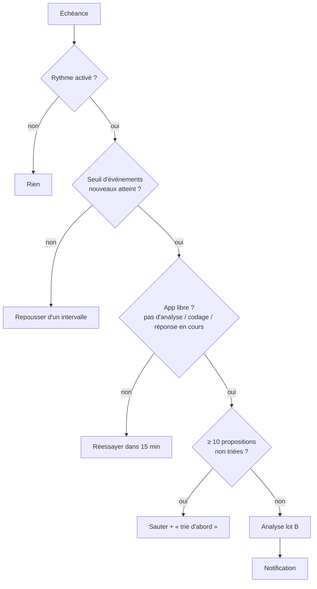

# Niveau 2 — Détail Fonctionnalité : AN-D — Rythme automatique
> Projet : Gestionnaire_idées · Basé sur : L1g-analyste-interne.md (A4), L2-analyste-analyse.md
> Date : 2026-10-07 · Livraison : **lot D**

## 1. Objectif de la fonctionnalité
Laisser l'app lancer l'analyse d'elle-même à intervalle choisi, seulement quand il y a assez de nouveau à analyser,
pour que les propositions arrivent sans y penser — sans jamais rien appliquer ni consommer sans limite.

> Analogie : le contrôle technique de la voiture. Il revient à date fixe, mais seulement si tu as roulé ; et il te
> remet un rapport, il ne répare rien sans toi.

## 2. Use Cases précis

### UC-1 : Régler le rythme
- **Acteur :** mentalyas, Réglages › Analyste
- **Scénario nominal :** il choisit : **Désactivé** (défaut) · toutes les **1 h** (phase de test) · **1 jour** ·
  **1 semaine** ; et le seuil « au moins N événements nouveaux » (défaut 200, 50 en phase de test).
- **Post-condition :** prochaine analyse affichée (« prochaine : demain 9 h, si ≥ 200 événements »).

### UC-2 : Analyse automatique
- **Acteur :** l'app
- **Déclencheur :** échéance atteinte, app ouverte
- **Scénario nominal :**
  1. Vérifie : sonde active, seuil atteint, aucune analyse ni codage en cours, pas de conversation Claude en cours de
     réponse.
  2. Lance l'analyse du lot B (mêmes règles, même plafond).
  3. Notification discrète : « L'Analyste a 3 propositions ».
- **Scénarios alternatifs / erreurs :**
  - Seuil non atteint → échéance repoussée d'un intervalle, rien n'est lancé.
  - App fermée à l'échéance → lancée au prochain démarrage **après** 2 minutes (le démarrage reste rapide), une seule
    fois (pas de rattrapage multiple).
  - Abonnement épuisé → reportée, l'app le dit une fois.
  - Trop de propositions en attente (≥ 10 non triées) → analyse sautée : « trie d'abord ».

## 3. Workflow (Mermaid)

## 4. Règles métier
| # | Règle | Justification |
|---|-------|----------------|
| R-D1 | Désactivé par défaut ; l'activer est un choix explicite | Consommation de l'abonnement (T5) |
| R-D2 | Une analyse automatique ne fait **que** proposer ; elle n'accepte, ne code et ne garde jamais rien | Constitution II |
| R-D3 | Au plus **une analyse automatique par intervalle**, jamais deux en parallèle, aucune pendant un codage (lot C) | Coût prévisible |
| R-D4 | Seuil d'événements nouveaux obligatoire ; ≥ 10 propositions non triées → saut | Rien à dire = rien à dépenser |
| R-D5 | Les analyses automatiques sont journalisées comme les manuelles (`ai_calls`, déclencheur « auto ») et visibles dans l'historique de l'Analyste | Constitution IV |
| R-D6 | Minuterie dans le main, persistée (prochaine échéance en base) ; aucun service Windows ni tâche planifiée hors de l'app | L'app ouverte seulement ; rien qui tourne à l'insu de mentalyas |

## 5. Critères d'acceptation (Definition of Done)
- [ ] Rythme 1 h + seuil 50 : sans activité, aucune analyse ; avec 50 événements, une analyse puis notification
      (test avec horloge simulée).
- [ ] Analyse en cours ou codage en cours → la suivante attend (test).
- [ ] App fermée deux échéances de suite → une seule analyse au démarrage, après le délai.
- [ ] ≥ 10 propositions non triées → saut et message.

## 6. Signal de complexité — Niveau 3 nécessaire ?
| Critère | Présent ? | Détail |
|---------|-----------|--------|
| Logique métier complexe (calculs, machine à états) | Non | Une minuterie et quatre conditions |
| Intégration API tierce | Non | Réutilise le lot B |
| Données sensibles (paiement/santé/légal) | Non | — |
| Accès multi-rôles / permissions différenciées | Non | — |

**Recommandation :** **Niveau 2 suffisant.**
