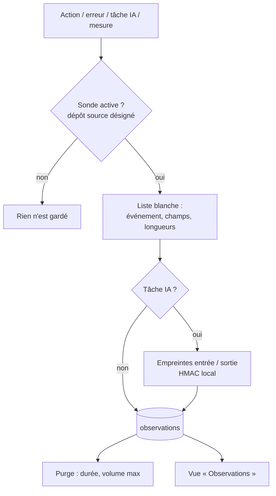

# Niveau 2 — Détail Fonctionnalité : AN-A — Sonde
> Projet : Gestionnaire_idées · Basé sur : L1g-analyste-interne.md (A1, A2, A7, A8)
> Date : 2026-10-07 · Livraison : **lot A**

## 1. Objectif de la fonctionnalité
Donner à l'app une mémoire de son propre fonctionnement : ce qui a été fait, où, combien de temps, avec quel résultat
— **sans jamais garder ce que mentalyas a écrit**. Ces observations sont la matière première de l'Analyste.

> Analogie : la boîte noire d'un avion. Elle enregistre l'altitude, la vitesse et les alarmes, pas les conversations
> des passagers.

## 2. Use Cases précis

### UC-1 : Activer la sonde
- **Acteur :** mentalyas, dans Réglages › Analyste
- **Déclencheur :** il désigne le dossier du dépôt source du Brainstormer (dialogue natif)
- **Scénario nominal :**
  1. L'app vérifie que le dossier est un dépôt git **du Brainstormer** (`package.json` au nom attendu, `src/main`
     présent) et que l'app tourne depuis ce dépôt (mode développement).
  2. La sonde s'active ; un témoin « Sonde active » apparaît dans les Réglages.
- **Scénarios alternatifs / erreurs :**
  - App installée (empaquetée) → section Analyste masquée, sonde inerte (A7).
  - Dossier qui n'est pas le dépôt du Brainstormer → refus, message clair.
- **Post-condition :** les événements sont enregistrés.

### UC-2 : Collecter un événement
- **Acteur :** l'app (main et renderer)
- **Déclencheur :** une action, une erreur, une tâche IA, une mesure de durée
- **Scénario nominal :**
  1. Le main reçoit l'événement (du journal existant, ou du renderer par un canal IPC (Inter-Process Communication —
     échanges entre le processus principal d'Electron et l'interface) dédié, validé par Zod).
  2. Il le filtre par **liste blanche** (nom d'événement connu, champs connus, valeurs courtes) et l'écrit dans la base.
- **Scénarios alternatifs / erreurs :**
  - Champ inconnu ou texte long → retiré (jamais d'erreur bloquante pour l'app).
  - Rafale (ex. 1 000 événements/min) → échantillonnage, compteur « événements regroupés ».
- **Post-condition :** l'événement est stocké, sans contenu.

### UC-3 : Voir ce que l'app a vu
- **Acteur :** mentalyas
- **Scénario nominal :** Réglages › Analyste › « Observations » : liste filtrable (période, type), compteurs, export
  JSON local. C'est la preuve que rien de personnel n'est gardé.

### UC-4 : Purger
- **Scénario nominal :** « Effacer les observations » (confirmation) ; purge automatique au-delà de la durée de
  conservation.

## 3. Workflow (Mermaid)

## 4. Règles métier
| # | Règle | Justification |
|---|-------|----------------|
| SA-1 | Familles d'événements : **navigation** (écran ouvert, panneau, durée), **action** (créer, relier, déplacer, accepter, annuler…, avec l'objet visé par son **type**, jamais son texte), **erreur** (code, module, pile tronquée aux chemins du dépôt), **performance** (durée d'une opération, rendu lent), **IA** (tâche, moteur, durée, statut, empreintes) | Couvre les 5 analyses (A8) |
| SA-2 | Jamais de texte saisi, de titre, de nom de fichier personnel, de chemin hors du dépôt, d'identifiant de neurone réel exportable | Constitution I (A2) |
| SA-3 | Empreinte = **HMAC** (hash à clé — un résumé chiffré qu'on ne peut ni relire ni recalculer sans la clé) de l'entrée normalisée et de la sortie d'une tâche IA ; clé locale gardée par `safeStorage` | Repérer « même travail refait » sans lire ; une empreinte seule ne permet pas de deviner un texte court |
| SA-4 | Les identifiants d'objets sont remplacés par des **pseudonymes de session** (stables pendant une analyse, sans lien avec la base) | Suivre un parcours (« le même neurone ouvert 6 fois ») sans pointer une donnée |
| SA-5 | Conservation : **30 jours** et **50 000 événements** max par défaut (réglables), les plus anciens purgés d'abord | Fenêtre longue (A4) sans gonfler la base |
| SA-6 | Sonde inactive dans l'app installée et tant qu'aucun dépôt source n'est désigné | A7 |
| SA-7 | La sonde ne doit jamais ralentir ni casser l'app : écriture par lots, toute erreur de la sonde est avalée et comptée | L'observation ne doit pas changer ce qu'elle observe |
| SA-8 | Un événement de la sonde n'est jamais une consigne : il est stocké et relu comme donnée | Injection (L1g §7) |

## 5. Critères d'acceptation (Definition of Done)
- [ ] App installée : aucune ligne dans `observations`, section Analyste absente.
- [ ] Un événement avec un champ non listé ou un texte long est stocké sans ce champ (test).
- [ ] Une tâche IA lancée deux fois avec la même entrée produit la même empreinte ; une entrée différente, une autre.
- [ ] La base ne contient aucun texte saisi après un parcours complet de démo (test d'intégration qui cherche les
      textes du profil démo dans `observations`).
- [ ] Purge à 30 jours / 50 000 événements vérifiée.
- [ ] 10 000 événements en rafale : l'interface reste fluide (pas de blocage du main mesurable).

## 6. Signal de complexité — Niveau 3 nécessaire ?
| Critère | Présent ? | Détail |
|---------|-----------|--------|
| Logique métier complexe (calculs, machine à états) | Non | Filtrage et purge simples |
| Intégration API tierce | Non | — |
| Données sensibles (paiement/santé/légal) | **Oui** | Parcours d'usage d'une personne : risque de fuite par le contenu ou les empreintes |
| Accès multi-rôles / permissions différenciées | Non | — |

**Recommandation :** **Niveau 3 nécessaire** : catalogue exact des événements, schéma de la table, normalisation avant
empreinte, pseudonymes.
