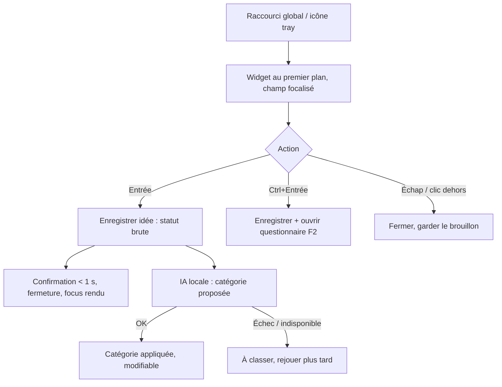

# Niveau 2 — Détail Fonctionnalité : F1 — Capture rapide
> Projet : Gestionnaire_idées · Basé sur : docs/brainstorm/L1-fondation.md
> Date : 2026-09-28 · Livraison : **MVP-1**

## 1. Objectif de la fonctionnalité
Noter une idée en moins de 5 secondes, depuis n'importe quelle application, sans quitter ce qu'on fait.
C'est la porte d'entrée de tout le système : si capturer est pénible, l'agenda ne s'alimente pas.

## 2. Use Cases précis

### UC-1 : Capturer une idée au vol
- **Acteur :** mentalyas
- **Déclencheur :** raccourci clavier global (proposé : `Ctrl+Alt+Espace`, configurable) ou clic sur l'icône de la zone de notification
- **Scénario nominal :**
  1. Le widget apparaît au centre-haut de l'écran, au premier plan, champ texte déjà focalisé.
  2. mentalyas tape son idée (une ou plusieurs lignes).
  3. `Entrée` → l'idée est enregistrée localement, statut **« brute »**.
  4. Le widget affiche une confirmation brève (< 1 s) puis se ferme ; le focus revient à l'app précédente.
  5. En tâche de fond, l'IA locale propose une **catégorie** (voir UC-3).
- **Scénarios alternatifs / erreurs :**
  - `Échap` ou clic hors du widget → fermeture ; si du texte a été saisi, il est conservé en brouillon.
  - `Maj+Entrée` → retour à la ligne (idée multi-lignes).
  - Texte vide → `Entrée` ne fait rien.
  - IA locale indisponible → l'idée est enregistrée sans catégorie (« À classer »), classement rejoué plus tard.
  - Raccourci déjà pris par une autre app → message au démarrage + choix d'un autre raccourci dans les réglages.
- **Post-condition :** idée persistée, statut « brute », catégorie proposée ou « À classer ».

### UC-2 : Capturer et structurer tout de suite
- **Acteur :** mentalyas
- **Déclencheur :** `Ctrl+Entrée` dans le widget
- **Scénario nominal :**
  1. L'idée est enregistrée comme en UC-1.
  2. L'app complète s'ouvre directement sur le questionnaire de structuration (F2).
- **Post-condition :** idée persistée + session de structuration ouverte.

### UC-3 : Catégorisation automatique
- **Acteur :** système (IA locale)
- **Déclencheur :** nouvelle idée enregistrée
- **Scénario nominal :**
  1. L'IA locale reçoit le texte de l'idée + la liste des catégories.
  2. Elle renvoie une catégorie (réponse structurée validée).
  3. La catégorie est appliquée avec la mention « proposée par l'IA », modifiable en un clic.
- **Scénarios alternatifs / erreurs :**
  - Réponse hors liste ou invalide → « À classer ».
- **Post-condition :** idée catégorisée ; la catégorie alimente les poids d'évolution du compagnon (F8).

## 3. Workflow (Mermaid)

## 4. Règles métier
| # | Règle | Justification |
|---|-------|----------------|
| R1 | Le widget s'affiche en < 200 ms après le raccourci | Si c'est lent, on ne l'utilise pas (fenêtre pré-chargée et cachée) |
| R2 | Une capture n'est **jamais** perdue, même si l'IA est indisponible | L'IA est un bonus, la capture est vitale |
| R3 | Aucun appel à Claude lors de la capture — seule l'IA locale intervient | Gratuit, instantané, privé |
| R4 | Catégories MVP : Général · Achat · Projet · Sortie · Photo · IT (liste configurable) | Reprend le besoin exprimé + les deux profils de mentalyas ; alimente les branches du compagnon |
| R5 | Longueur max d'une idée : 2 000 caractères | Borne les appels IA, reste largement suffisant pour une idée |
| R6 | Le brouillon non validé est conservé jusqu'à la prochaine ouverture | Pas de perte si on ferme par erreur |

## 5. Critères d'acceptation (Definition of Done)
- [ ] Raccourci global fonctionnel depuis n'importe quelle application, configurable
- [ ] Widget visible en < 200 ms, champ focalisé, au premier plan
- [ ] `Entrée` enregistre, `Maj+Entrée` retour ligne, `Ctrl+Entrée` enregistre + structure, `Échap` ferme
- [ ] Focus rendu à l'application précédente après fermeture
- [ ] Idée enregistrée même avec Ollama arrêté (catégorie « À classer »)
- [ ] Catégorie proposée par l'IA modifiable en un clic
- [ ] Utilisable 100 % au clavier ; contraste WCAG AA

## 6. Signal de complexité — Niveau 3 nécessaire ?
| Critère | Présent ? | Détail |
|---------|-----------|--------|
| Logique métier complexe (calculs, machine à états) | Non | Enregistrement + catégorisation simple |
| Intégration API tierce | Non | Ollama couvert par F9 |
| Données sensibles (paiement/santé/légal) | Non | Texte libre stocké localement |
| Accès multi-rôles / permissions différenciées | Non | Mono-utilisateur |

**Recommandation :** Niveau 2 suffisant.
