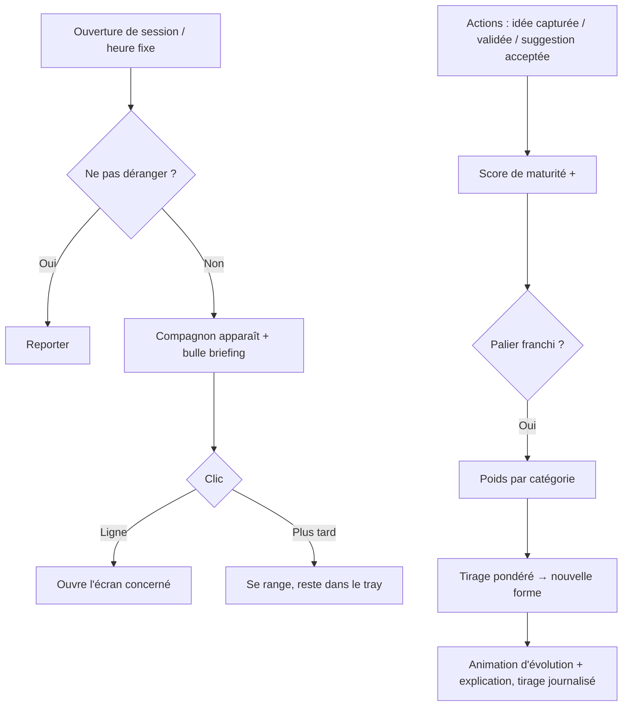

# Niveau 2 — Détail Fonctionnalité : F8 — Compagnon tamagotchi & briefing quotidien
> Projet : Gestionnaire_idées · Basé sur : docs/brainstorm/L1-fondation.md, L2-capture-rapide.md, L2-conseiller-proactif.md
> Date : 2026-09-28 · Livraison : **MVP-2**

## 1. Objectif de la fonctionnalité
Donner un visage au secrétaire : un compagnon en pixel art qui apparaît pour le briefing du jour,
annonce les suggestions, et **évolue** au fil de la maturité de l'agenda — sa forme dépendant, par un
tirage au sort pondéré, des types de projets de mentalyas.

## 2. Use Cases précis

### UC-1 : Briefing du jour
- **Acteur :** compagnon (système)
- **Déclencheur :** première ouverture de session Windows de la journée (ou heure fixe configurable)
- **Scénario nominal :**
  1. Le compagnon apparaît en bas à droite (fenêtre transparente, au premier plan, discrète).
  2. Bulle de dialogue : tâches du jour, retards, idées à structurer, propositions à valider, suggestions (F7).
  3. Chaque ligne est cliquable → ouvre l'écran correspondant.
  4. « Merci, à plus tard » → il se range ; il reste accessible via l'icône tray.
- **Scénarios alternatifs :** rien à signaler → message court et positif, pas de remplissage.
  Mode « Ne pas déranger » (plein écran, présentation) → briefing reporté.

### UC-2 : Annonce ponctuelle
- **Déclencheur :** nouvelle suggestion importante ou déclencheur atteint
- **Scénario nominal :** le compagnon passe en animation « a une idée » (sans surgir en plein écran) ;
  mentalyas clique quand il veut.

### UC-3 : Évolution
- **Acteur :** système
- **Déclencheur :** le score de maturité franchit un palier
- **Scénario nominal :**
  1. Calcul des **poids** par catégorie à partir de la répartition des idées depuis le dernier palier.
  2. Tirage au sort pondéré parmi les formes possibles du stade suivant.
  3. Animation d'évolution + message (« Je suis devenu… parce que tu as beaucoup de projets Photo ! »).
  4. Tirage enregistré (poids, résultat, date).
- **Scénarios alternatifs :** consultation de l'historique → « Pourquoi il est devenu ça ».

### UC-4 : Interagir avec le compagnon
- **Scénario nominal :** clic → menu court : Briefing · Capturer une idée · Ouvrir l'app · Le ranger pour aujourd'hui.

## 3. Workflow (Mermaid)

## 4. Règles métier
| # | Règle | Justification |
|---|-------|----------------|
| R1 | Score de maturité : +1 idée capturée, +3 idée structurée validée, +2 suggestion acceptée, +1 jour d'usage (plafonné) | Récompense l'alimentation **et** l'intelligence de l'agenda |
| R2 | Stades MVP : Œuf → Bébé → Ado → Adulte (3 paliers) | Assez pour sentir l'évolution, dessinable |
| R3 | Branches MVP : 1 forme par catégorie au stade Ado et Adulte (6 catégories) + 1 forme « équilibrée » | ~13 à 15 sprites au total, pixel art |
| R4 | Poids = part de chaque catégorie dans les idées depuis le dernier palier, avec un minimum de 5 % par forme | Guidé mais toujours surprenant |
| R5 | Le tirage est enregistré et explicable | Traçabilité (L1) |
| R6 | Animations minimales : repos (2-4 images), parle, « a une idée », évolution | Pixel art, périmètre maîtrisé |
| R7 | Pas d'apparition intempestive : 1 briefing/jour + annonces discrètes ; respect du plein écran | Anti-Clippy |
| R8 | Le compagnon ne « meurt » pas et ne régresse pas | Motivant, jamais punitif |
| R9 | Arbre d'évolution décrit dans un fichier de config (stades, formes, sprites) | Extensible sans code |

## 5. Critères d'acceptation (Definition of Done)
- [ ] Briefing affiché une fois par jour, lignes cliquables
- [ ] Reporté en mode plein écran / ne pas déranger
- [ ] Palier franchi → tirage pondéré, animation, explication, journalisation
- [ ] Sur 1 000 tirages simulés, la répartition suit les poids (test statistique simple)
- [ ] Ajout d'une forme par simple modification du fichier de config
- [ ] Fenêtre transparente sans bloquer les clics sur les zones vides

## 6. Signal de complexité — Niveau 3 nécessaire ?
| Critère | Présent ? | Détail |
|---------|-----------|--------|
| Logique métier complexe (calculs, machine à états) | **Oui** | Machine à états des stades, score, tirage pondéré |
| Intégration API tierce | Non | — |
| Données sensibles (paiement/santé/légal) | Non | — |
| Accès multi-rôles / permissions différenciées | Non | — |

**Recommandation :** **Niveau 3 nécessaire** (format de l'arbre d'évolution, algorithme de tirage, calcul du score).

## 7. Hypothèses à valider
- Liste des 6 catégories (Général · Achat · Projet · Sortie · Photo · IT) — partagée avec F1
- Qui dessine les sprites : mentalyas, assets libres, ou génération assistée (ComfyUI, équipe Photo & Image IA)
