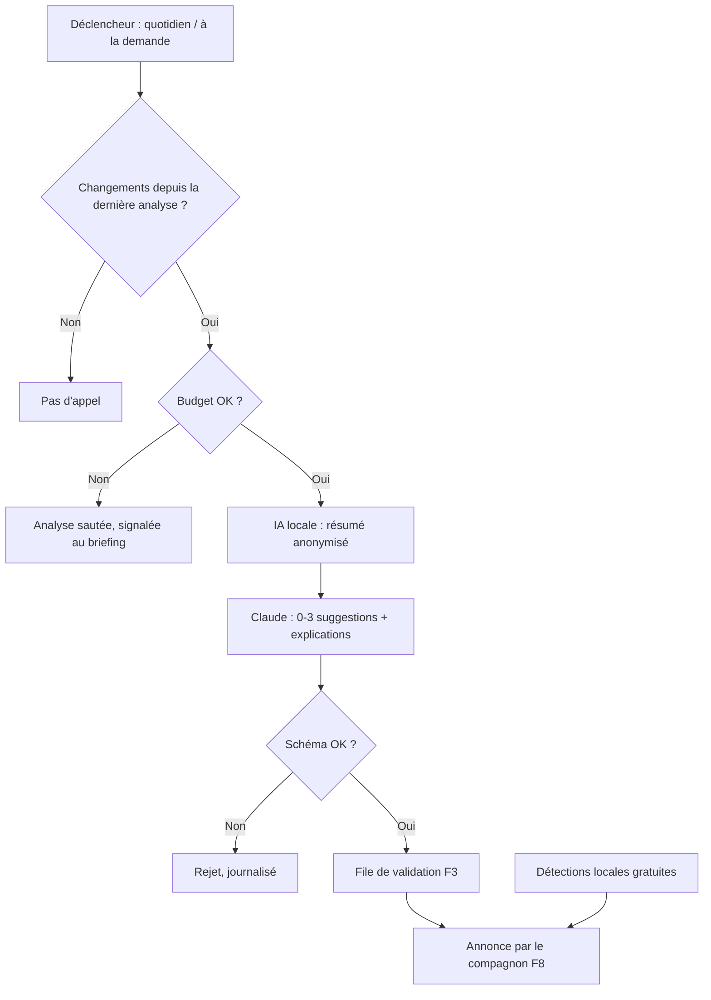

# Niveau 2 — Détail Fonctionnalité : F7 — Conseiller proactif
> Projet : Gestionnaire_idées · Basé sur : docs/brainstorm/L1-fondation.md, L2-structuration-ia.md, L2-validation.md
> Date : 2026-09-28 · Livraison : **MVP-2**

## 1. Objectif de la fonctionnalité
Faire de l'app un **secrétaire qui pense à ta place** : analyser l'ensemble des idées, tâches et
opportunités pour repérer ce qu'on ne voit pas seul (« ta mission mariage peut financer l'écran »,
« ces deux sorties peuvent se faire le même jour », « cette idée dort depuis 3 semaines »).

## 2. Use Cases précis

### UC-1 : Analyse périodique
- **Acteur :** système
- **Déclencheur :** une fois par jour, avant le briefing (F8) — et seulement s'il y a eu du changement
- **Scénario nominal :**
  1. L'IA locale prépare un **résumé anonymisé** de la situation (idées actives, montants arrondis, échéances).
  2. Claude reçoit ce résumé + le cadre + les suggestions déjà refusées (pour ne pas les reproposer).
  3. Claude renvoie 0 à 3 suggestions structurées, chacune avec son **explication** (« pourquoi je te propose ça »).
  4. Les suggestions entrent dans la file de validation (F3) et sont annoncées par le compagnon.
- **Scénarios alternatifs / erreurs :**
  - Rien n'a changé depuis la dernière analyse → pas d'appel (économie).
  - Plafond budget atteint → analyse sautée, signalée dans le briefing.
  - Aucune suggestion pertinente → c'est un résultat valide, rien n'est inventé.

### UC-2 : Analyse à la demande
- **Acteur :** mentalyas
- **Déclencheur :** bouton « Qu'est-ce que je ne vois pas ? »
- **Scénario nominal :** comme UC-1, déclenché immédiatement, coût estimé affiché avant envoi.

### UC-3 : Détections locales gratuites
- **Acteur :** système (règles simples + IA locale, sans Claude)
- **Scénario nominal :** signaler les idées brutes non structurées depuis > 7 jours, tâches en retard,
  déclencheurs probablement atteints (date de paiement passée), doublons d'idées probables.

## 3. Workflow (Mermaid)

## 4. Règles métier
| # | Règle | Justification |
|---|-------|----------------|
| R1 | Max 3 suggestions par analyse | Pas de noyade ; esprit « anti-Clippy » |
| R2 | Chaque suggestion est **expliquée** et cite les idées concernées | Confiance + vérifiable |
| R3 | Une suggestion refusée n'est pas reproposée (sauf changement notable) | Respect des choix |
| R4 | Claude ne reçoit que le résumé anonymisé (montants arrondis, pas de noms de personnes) | Minimisation L1 |
| R5 | Pas d'appel Claude si rien n'a changé | Économie de tokens |
| R6 | Les suggestions ne s'appliquent jamais seules → F3 | Décision L1 |
| R7 | Catégories de suggestions : financement, regroupement, ordonnancement, idée qui dort, doublon | Cadre limité, anti-hallucination |

## 5. Critères d'acceptation (Definition of Done)
- [ ] Sur un jeu de test (écran + mission mariage), la suggestion « la mission finance l'écran » est produite
- [ ] Le résumé envoyé ne contient ni montants exacts ni noms propres de personnes
- [ ] Aucun appel si aucune donnée n'a changé
- [ ] Une suggestion refusée ne revient pas à l'analyse suivante
- [ ] Coût estimé affiché avant une analyse à la demande
- [ ] Détections locales (idée qui dort, retard) fonctionnent sans Claude

## 6. Signal de complexité — Niveau 3 nécessaire ?
| Critère | Présent ? | Détail |
|---------|-----------|--------|
| Logique métier complexe (calculs, machine à états) | **Oui** | Détection de changements, résumé, déduplication des suggestions |
| Intégration API tierce | **Oui** | Claude + Ollama (via F9) |
| Données sensibles (paiement/santé/légal) | **Oui** | Situation financière perso (anonymisation) |
| Accès multi-rôles / permissions différenciées | Non | — |

**Recommandation :** **Niveau 3 nécessaire** (format du résumé anonymisé, contrat des suggestions, déclenchement).
