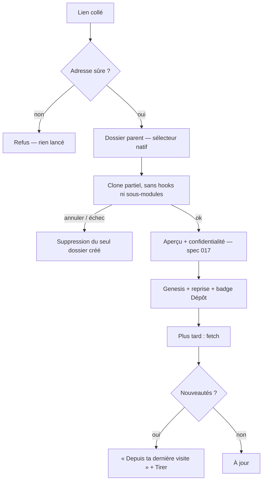

# Niveau 2 — Détail Fonctionnalité : GIT-C — Cloner par lien et suivre les mises à jour
> Projet : Gestionnaire_idées · Basé sur : L1i-git-github.md (D6, D7, §6), spec 017 US5 (clone, en pause),
> L2-reprise-import.md UC-2, spec 020 research R7 · Date : 2026-10-07 · Livraison : **lot C (MVP)**

## 1. Objectif de la fonctionnalité
Récupérer un projet à partir d'un **lien GitHub** (projet open source à étudier, projet d'un collègue) avec son
**historique complet** (G3 en a besoin), le faire entrer dans la carte par l'import existant (« Reprendre un projet »,
spec 017 : genesis + reprise), puis **suivre** ses mises à jour : « ce qui a changé depuis ta dernière visite ».

> Analogie : emprunter un livre à la bibliothèque avec toutes ses éditions précédentes, puis recevoir une note quand
> une nouvelle édition sort, avec la liste des pages changées.

Vocabulaire : *clone* (copie locale d'un dépôt distant), *clone superficiel* (`--depth 1` : seulement le dernier
état, sans historique), *clone partiel* (`--filter=blob:none` : tout l'historique des commits et des noms de
fichiers, mais le contenu des anciennes versions n'est téléchargé qu'à la demande).

## 2. Use Cases précis

### UC-1 : Cloner par lien depuis « Reprendre un projet »
- **Acteur :** mentalyas
- **Déclencheur :** carte → « Reprendre un projet existant » → « Depuis un lien GitHub (ou une adresse git) »
- **Scénario nominal :**
  1. Il colle l'adresse ; l'app la contrôle **avant tout lancement** (`https://` ou `git@hôte:chemin` seulement,
     identifiant retiré de l'affichage).
  2. Il choisit le **dossier parent** au sélecteur natif (pré-positionné : dernier dossier utilisé pour un clone, sinon
     la racine des projets de la spec 016) ; le nom du sous-dossier est proposé (nom du dépôt), modifiable.
  3. Clone **partiel** (historique complet, contenu des anciennes versions à la demande), sans hooks ni sous-modules ;
     progression (réception, résolution) et **Annuler**.
  4. Suite identique à la spec 017 : aperçu, choix de confidentialité (« Claude autorisé » / « Local uniquement »),
     création du genesis, analyse et guide de reprise.
  5. Le genesis porte le badge Dépôt (lot A) ; l'origine (adresse sans identifiant, commit cloné) est gardée.
- **Scénarios alternatifs / erreurs :**
  - Adresse refusée (`ext::`, `file://`, chemin local, option `-…`, caractère de contrôle) → rien n'est lancé.
  - Dépôt privé et git ne s'authentifie pas → « connecte-toi avec ton gestionnaire git habituel ou `gh auth login` ».
  - Dossier cible existant non vide → refus, autre nom proposé.
  - Dossier de données de l'app choisi → refus (il ne doit jamais être ouvert à Claude).
  - Annulation, échec, délai dépassé → le dossier créé par l'app est supprimé, et seulement lui.
  - Dépôt très gros (au-delà du seuil, voir règle GC-6) → avertissement à mi-parcours avec « Continuer » / « Annuler ».
  - Serveur qui ne gère pas le clone partiel → git bascule de lui-même en clone complet ; signalé dans le journal.
- **Post-condition :** dépôt cloné dans le dossier choisi, genesis créé (spec 017), dépôt marqué **non de confiance**
  (hooks jamais lancés, lot A GA-5).

### UC-2 : Suivre les mises à jour
- **Acteur :** mentalyas
- **Déclencheur :** ouverture de la carte d'un projet cloné, ou « Actualiser » dans le volet Dépôt
- **Scénario nominal :**
  1. Fetch (lot B, UC-2) ; si de nouveaux commits existent depuis la **dernière visite** (dernier commit vu), le badge
     affiche « 14 nouveautés ».
  2. Onglet Historique → section « Depuis ta dernière visite (12 sept.) » : commits, auteurs, fichiers touchés, et
     modules de la cartographie concernés (spec 017).
  3. « Tirer » (lot B UC-3, avance rapide) met les fichiers à jour ; l'analyse de reprise peut être relancée sur les
     seuls fichiers changés.
  4. « Marquer comme vu » (ou le pull lui-même) déplace le repère de dernière visite.
- **Scénarios alternatifs :** branche par défaut renommée ou historique réécrit par l'auteur (avance rapide impossible
  sans commit local) → explication, et proposition de recloner dans un nouveau dossier ; jamais de `reset` d'office.
- **Post-condition :** repère de dernière visite à jour.

### UC-3 : Réutiliser le clone pour l'import de skills (spec 020)
- **Acteur :** l'app (spec 020 lot D)
- **Scénario nominal :** l'import de skills appelle le **même service de clone** avec le profil « superficiel »
  (`--depth 1`, quarantaine dans le profil, limites 50 Mo / 2 000 fichiers) ; la reprise de projet appelle le profil
  « historique » (partiel, dossier choisi par mentalyas).
- **Post-condition :** un seul code de clone, deux profils (constitution VI).

## 3. Workflow (Mermaid)

## 4. Règles métier
| # | Règle | Justification |
|---|-------|----------------|
| GC-1 | **Un seul service de clone**, deux profils : `historique` (partiel `--filter=blob:none`, dossier choisi, délai 30 min) et `superficiel` (`--depth 1`, quarantaine, délai 5 min, spec 020) | spec 020 R7 réconciliée, constitution VI |
| GC-2 | Adresse : `https://` et `git@hôte:chemin` seulement ; identifiants retirés avant affichage, journal, stockage ; `--` avant l'adresse ; transports limités à https et ssh | spec 017 FR-008, FR-011 |
| GC-3 | Jamais de hooks, de sous-modules, de `npm install` ni d'exécution du code cloné ; le dépôt cloné n'est pas « de confiance » | §6 de L1i |
| GC-4 | Dossier cible : uniquement via le sélecteur natif ; jamais le dossier de données de l'app ; jamais un dossier existant non vide | spec 017 FR-001, constitution I |
| GC-5 | Un clone à la fois ; annulation et nettoyage du seul dossier créé ; clone interrompu par la fermeture de l'app nettoyé au démarrage | spec 017 FR-009, FR-010 |
| GC-6 | Seuil d'avertissement : 500 Mo reçus ou 100 000 commits → pause « Continuer / Annuler » ; pas de plafond dur pour le profil `historique` | Gros dépôts open source |
| GC-7 | Textes venus du dépôt (README, messages de commit, noms d'auteurs) = **données** : jamais des consignes pour Claude, balisés dans ses cadres | §6 de L1i, constitution III |
| GC-8 | Repère « dernière visite » = un identifiant de commit par projet, mis à jour sur pull ou « Marquer comme vu » | UC-2 |

## 5. Critères d'acceptation (Definition of Done)
- [ ] Cloner un dépôt public de démonstration : progression, aperçu, genesis ; `git log` local montre tout l'historique
      (preuve manuelle ; test automatique avec un dépôt local servi en `file://` **uniquement dans les tests**, via une
      porte de test du service, jamais ouverte en production).
- [ ] `ext::sh -c …`, `file:///…`, `--upload-pack=…`, `https://user:jeton@…` : les trois premiers refusés, le dernier
      accepté avec identifiant retiré partout (tests).
- [ ] Annuler à 40 % : le dossier disparaît, le dossier parent est intact (test).
- [ ] Un dépôt cloné contenant `.git/hooks/post-checkout` simulé ne le lance jamais (test).
- [ ] Après un fetch avec 3 nouveaux commits : « 3 nouveautés », liste correcte, « Marquer comme vu » remet à zéro.
- [ ] L'import de skills (spec 020) utilise le profil `superficiel` du même service (test).

## 6. Signal de complexité — Niveau 3 nécessaire ?
| Critère | Présent ? | Détail |
|---------|-----------|--------|
| Logique métier complexe | Oui | Deux profils, progression, annulation, nettoyage, repère de visite |
| Intégration API tierce | Oui | git réseau, GitHub |
| Données sensibles | Oui | Code non fiable, identifiants dans l'adresse |
| Multi-rôles | Non | — |

**Recommandation :** **Niveau 3** (`L3-git-cloner.md`) : contrat, réconciliation avec la spec 020 R7, séquence.

## Hypothèses à valider
1. **Clone partiel par défaut** pour la reprise (voir L1i §8 tranché) ; un clone complet reste possible par une case
   « Tout télécharger maintenant (hors ligne ensuite) ».
2. **Dossier parent pré-positionné** sur le dernier dossier de clone, sinon la racine des projets ; le clone n'est
   **pas** inscrit d'office au registre du hub (l'Archiviste s'en charge si mentalyas le veut).
3. Le clone lui-même est **livré une fois** (spec 017 US5 ou spec 020 T026–T027, la première codée) et l'autre
   l'appelle avec son profil.
