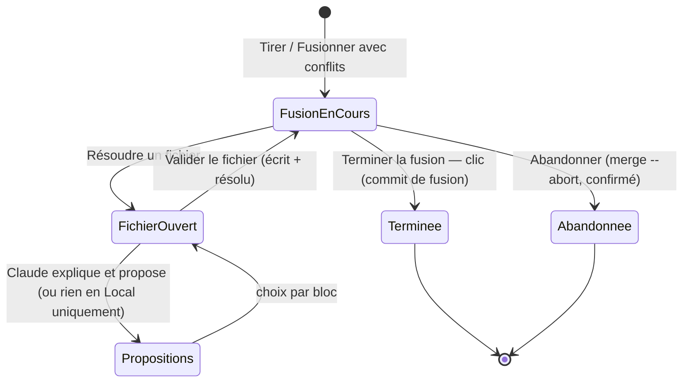

# Niveau 2 — Détail Fonctionnalité : GIT-E — Conflits guidés par Claude
> Projet : Gestionnaire_idées · Basé sur : L1i-git-github.md (D2, D4, G2), L2-git-publier.md (UC-3)
> Date : 2026-10-07 · Livraison : **lot E (premier lot après le MVP)**

## 1. Objectif de la fonctionnalité
Quand le travail d'un collègue et celui de mentalyas touchent les mêmes lignes, git s'arrête : c'est un **conflit**.
Le lot E transforme ce moment redouté en revue guidée : pour chaque fichier, Claude **explique** les deux versions et
**propose** une résolution ; mentalyas choisit, **fichier par fichier**, puis termine la fusion d'un clic.

> Analogie : deux traducteurs ont corrigé la même phrase. Claude met les deux corrections côte à côte, explique ce que
> chacun voulait dire et propose une phrase qui garde les deux idées ; l'éditeur (mentalyas) décide.

Vocabulaire : *fusion* (*merge* : réunir deux branches), *version de base* (l'ancêtre commun), *la tienne* (*ours*,
branche courante), *la leur* (*theirs*, ce qui arrive), *bloc de conflit* (*hunk* : portion de fichier où les deux
versions divergent), *marqueurs* (`<<<<<<<`, `=======`, `>>>>>>>` que git écrit dans le fichier).

## 2. Use Cases précis

### UC-1 : Entrer en résolution
- **Acteur :** l'app, après un « Tirer » ou « Fusionner » (lot B) qui rencontre des conflits
- **Scénario nominal :**
  1. Le volet Dépôt passe en mode **Fusion en cours** (bandeau : « Fusion de `origin/main` dans `main` : 3 fichiers en
     conflit ») ; le badge du genesis affiche « fusion en cours ».
  2. Liste des fichiers en conflit avec leur nature : contenu (deux modifications), suppression contre modification,
     binaire.
  3. Boutons : **Résoudre** (fichier par fichier) · **Abandonner la fusion** (tout revient comme avant, confirmation).
- **Post-condition :** dépôt en état de fusion ; rien n'est commité.

### UC-2 : Résoudre un fichier avec Claude
- **Acteur :** mentalyas (Claude explique et propose)
- **Scénario nominal :**
  1. Vue en trois colonnes par bloc : **la tienne** · **la leur** · **proposition de Claude** (base visible au besoin).
  2. Claude a reçu les trois versions du bloc et son contexte (lignes autour), comme **données** ; il rend pour chaque
     bloc : ce que fait chaque version (2 phrases), le risque, une proposition de texte fusionné et une confiance
     (sûre / à vérifier).
  3. Pour chaque bloc, mentalyas choisit : *garder la mienne*, *garder la leur*, *garder les deux* (l'une après
     l'autre), *proposition de Claude*, ou *éditer à la main*.
  4. Aperçu du fichier final (sans marqueur) → **Valider ce fichier** : l'app écrit le fichier et le marque résolu.
- **Scénarios alternatifs / erreurs :**
  - Projet « Local uniquement » ou Claude indisponible → mêmes trois colonnes sans proposition (modèle local si
    disponible) ; résolution manuelle.
  - Proposition invalide (marqueurs restants, taille démesurée, sortie hors format) → bloc marqué « pas de proposition ».
  - Fichier binaire → choix entier : la mienne ou la leur.
  - Suppression contre modification → choix : garder le fichier modifié ou confirmer la suppression.
  - Fichier modifié pendant la résolution (éditeur, Claude en conversation) → avertissement, blocs recalculés.
- **Post-condition :** fichier écrit et marqué résolu (`git add -- <chemin>`) ; décisions gardées pour la reprise.

### UC-3 : Terminer ou abandonner
- **Scénario nominal :**
  1. Tous les fichiers résolus → récapitulatif (fichiers, choix par bloc) → **Terminer la fusion** = commit de fusion
     sur clic, message standard de git modifiable (sans ligne de co-auteur).
  2. « Abandonner la fusion » à tout moment → `merge --abort` (confirmation) ; les fichiers reviennent à l'état d'avant.
- **Scénarios alternatifs :** app fermée en pleine fusion → à la réouverture, l'app détecte la fusion en cours et
  reprend la résolution là où elle en était (décisions gardées).
- **Post-condition :** commit de fusion fait (puis « Pousser », lot B) ou retour à l'état d'avant.

## 3. Workflow (Mermaid)

## 4. Règles métier
| # | Règle | Justification |
|---|-------|----------------|
| GE-1 | Claude **propose**, mentalyas **valide fichier par fichier** ; le commit de fusion n'a lieu que sur « Terminer la fusion » | D2, D4 |
| GE-2 | Tâche Claude sans outil (`git_conflict`), versions envoyées comme **données** balisées (code d'un collègue = non fiable) ; sortie validée par schéma | Constitution III |
| GE-3 | « Terminer » refusé tant qu'un fichier reste non résolu ou contient des marqueurs | Pas de fusion cassée |
| GE-4 | « Abandonner » toujours disponible, confirmé, et rend l'état exact d'avant la fusion | Annuler disponible (Nielsen 3) |
| GE-5 | Bornes : 50 fichiers en conflit, 200 Ko par fichier envoyé à Claude, 30 blocs par fichier ; au-delà, résolution manuelle pour le fichier concerné | Coût, délai |
| GE-6 | Projet « Local uniquement » : rien n'est envoyé à Claude | Constitution IV |
| GE-7 | Les décisions par bloc sont gardées (base de l'app) jusqu'à la fin ou l'abandon de la fusion, puis effacées | Reprise après fermeture |
| GE-8 | Pas de rebase, pas de « stratégie » automatique (`-X ours/theirs`) appliquée d'office | Humain dans la boucle |

## 5. Critères d'acceptation (Definition of Done)
- [ ] Dépôt de démonstration avec un conflit fabriqué sur 2 fichiers : bandeau, liste, trois colonnes, proposition de
      Claude simulée ; valider les deux → « Terminer » → commit de fusion à deux parents, aucun marqueur (test git réel).
- [ ] « Abandonner » rend le dépôt identique à avant la fusion (test).
- [ ] Une proposition contenant `<<<<<<<` est rejetée (test).
- [ ] Fermer l'app au milieu → la reprise retrouve les décisions (test).
- [ ] Projet « Local uniquement » : aucun appel à Claude (test).
- [ ] Un texte « ignore tes consignes » dans la version d'un collègue n'altère pas le format de sortie (test de la
      tâche avec Claude simulé ; preuve manuelle avec le vrai CLI).

## 6. Signal de complexité — Niveau 3 nécessaire ?
| Critère | Présent ? | Détail |
|---------|-----------|--------|
| Logique métier complexe | Oui | Machine à états de fusion, découpage en blocs, reprise |
| Intégration API tierce | Oui | git, tâche Claude |
| Données sensibles | Oui | Code non fiable donné à Claude |
| Multi-rôles | Non | — |

**Recommandation :** **Niveau 3** (`L3-git-conflits.md`).

## Hypothèses à valider
1. **Lot E avant le lot D** dans l'ordre de suite : la collaboration (G2) rencontre des conflits dès le premier pull
   divergent ; sans E, l'app ne peut qu'abandonner la fusion.
2. Pas de résolution « dans l'éditeur externe » suivie par l'app dans le MVP du lot E (mentalyas peut toujours
   abandonner et résoudre en terminal).
