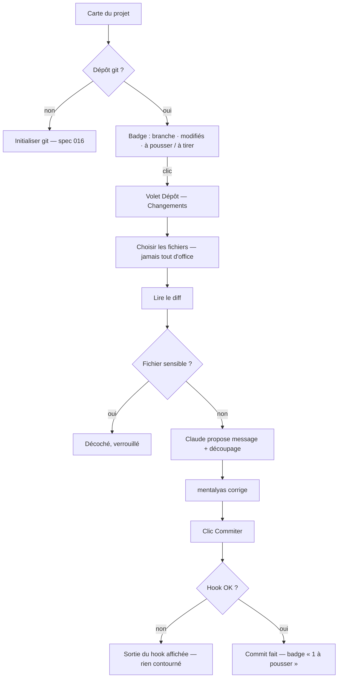

# Niveau 2 — Détail Fonctionnalité : GIT-A — Volet « Dépôt » local (changements, commit, branches, badge)
> Projet : Gestionnaire_idées · Basé sur : L1i-git-github.md (D2, D3, D4, D6), spec 016 (Initialiser git),
> spec 014 US7 (Commiter l'étape) · Date : 2026-10-07 · Livraison : **lot A (MVP)**

## 1. Objectif de la fonctionnalité
Voir, depuis la carte d'un projet, **ce qui a changé** dans son dossier, **relire le diff** (les lignes ajoutées et
retirées), et **commiter** les fichiers choisis avec un message proposé par Claude ; créer et changer de **branche** ;
lire d'un coup d'œil l'état du dépôt sur le nœud genesis.

> Analogie : le carnet de bord d'un chantier. Le volet montre ce qui a bougé depuis la dernière page, Claude propose
> la phrase à écrire, mentalyas relit et signe (le commit). Rien n'est écrit dans le carnet sans sa signature.

Vocabulaire : *commit* (instantané daté et signé des fichiers choisis), *diff* (différence ligne à ligne entre deux
versions), *branche* (ligne de travail parallèle), *index* ou *zone de préparation* (les fichiers cochés pour le
prochain commit), *HEAD* (le commit sur lequel on se trouve).

## 2. Use Cases précis

### UC-1 : Voir l'état du dépôt (badge + volet)
- **Acteur :** mentalyas
- **Déclencheur :** ouverture de la carte d'un projet sous git ; clic sur le badge du genesis ou « Dépôt » dans son menu
- **Scénario nominal :**
  1. L'app lit l'état (`git status`, une seule commande) : branche courante, fichiers modifiés / nouveaux / supprimés,
     commits en avance et en retard sur la branche suivie (le retard vient du dernier `fetch`, lot B).
  2. Le badge du genesis affiche : branche (icône + nom), « 5 modifiés », « 3 à pousser · 2 à tirer » (texte, jamais
     la couleur seule).
  3. Clic → volet « Dépôt » à droite (38 %), onglet **Changements** ouvert.
- **Scénarios alternatifs / erreurs :**
  - Projet sans git → le volet propose « Initialiser git » (spec 016), rien d'autre.
  - git absent → message d'installation (même texte que la spec 016).
  - Dossier lié introuvable (déplacé) → badge « dossier introuvable », volet en lecture seule.
- **Post-condition :** aucun changement sur le disque (lecture seule).

### UC-2 : Relire et commiter
- **Acteur :** mentalyas (Claude propose le message)
- **Déclencheur :** onglet Changements, au moins un fichier modifié
- **Scénario nominal :**
  1. La liste des fichiers s'affiche, chacun avec son statut (icône + lettre : M modifié, A ajouté, D supprimé,
     R renommé) ; **aucun fichier n'est coché d'office** sauf ceux que mentalyas a déjà préparés en terminal.
  2. Clic sur un fichier → son diff (ajouts / retraits, numéros de ligne).
  3. Il coche les fichiers à inclure ; l'app les prépare **nommément** (`git add -- <chemins>`).
  4. « Proposer un message » → Claude rédige un message **Conventional Commits** (`type(scope): description`) à partir
     du diff des fichiers cochés, et peut suggérer un **découpage** (« ces 2 fichiers = un `fix`, ces 3 = un `docs` »).
  5. mentalyas corrige le message s'il le veut et clique **Commiter (3 fichiers)**.
  6. Le commit est fait avec l'identité git de mentalyas ; le volet se met à jour, le badge passe à « 1 à pousser ».
- **Scénarios alternatifs / erreurs :**
  - Fichier sensible coché (`.env`, `*.key`, `*.pem`, `id_rsa`…) → décoché et verrouillé, avec la raison ; commit
    bloqué tant qu'il reste préparé.
  - Hook `pre-commit` d'un dépôt de confiance qui échoue → commit refusé, sortie du hook affichée ; jamais de bouton
    pour le contourner.
  - Identité git absente → message « règle ton identité git » (comme la spec 016).
  - Claude indisponible, ou projet « Local uniquement » → message proposé par le modèle local, ou champ vide.
  - Une autre opération git en cours (terminal, conversation de Claude : fichier `index.lock`) → « git est occupé,
    réessaie dans un instant » ; rien n'est forcé.
- **Post-condition :** un commit de plus sur la branche courante ; opération historisée (identifiant court).

### UC-3 : Découper en plusieurs commits
- **Déclencheur :** Claude a proposé un découpage (UC-2 étape 4)
- **Scénario nominal :** chaque groupe proposé devient une carte « Commit 1/3 » (fichiers + message) ; mentalyas
  les commite **un par un**, chaque fois par un clic ; il peut déplacer un fichier d'un groupe à l'autre ou ignorer
  la proposition.
- **Post-condition :** autant de commits que de clics, jamais plus.

### UC-4 : Branches
- **Acteur :** mentalyas
- **Scénario nominal :**
  1. Onglet **Branches** : branche courante en tête, branches locales, branches distantes connues (après fetch).
  2. « Nouvelle branche » : nom saisi (vérifié par git), créée depuis la branche courante, puis on s'y place.
  3. « Changer » sur une autre branche : l'app s'y place.
- **Scénarios alternatifs / erreurs :**
  - Changements non commités qui seraient écrasés → git refuse ; message « commite ou annule d'abord ces fichiers ».
  - Nom invalide ou déjà pris → refus avant de lancer git.
  - Branches `analyste/*` (spec 019, dépôt du Brainstormer) → visibles, en lecture seule (gérées par l'Analyste).
- **Post-condition :** branche courante changée ; badge et carte rafraîchis.

### UC-5 : Annuler les modifications d'un fichier
- **Scénario nominal :** menu ⋯ d'un fichier modifié → « Rétablir la version du dernier commit » → confirmation qui
  nomme le fichier → l'app restaure ce seul fichier ; une copie de la version jetée est gardée dans la corbeille de
  l'app (comme les retours arrière de la spec 013).
- **Post-condition :** fichier identique au dernier commit ; récupérable depuis la corbeille.

## 3. Workflow (Mermaid)

## 4. Règles métier
| # | Règle | Justification |
|---|-------|----------------|
| GA-1 | Un commit n'a lieu **que sur un clic** de mentalyas, après affichage de la liste des fichiers et de leur diff | D2, constitution II (amendée) |
| GA-2 | Fichiers ajoutés **nommément** (`git add -- <chemins>`) ; jamais `add -A`, `add .` ni `commit -a` | Règle git de mentalyas |
| GA-3 | Aucune ligne `Co-Authored-By` ajoutée par l'app ; une ligne de ce type dans la proposition de Claude est retirée | Règle de mentalyas |
| GA-4 | Fichiers sensibles (liste fixe : `.env*` sauf `.env.example`, `*.key`, `*.pem`, `*.pfx`, `id_rsa*`, `*.p12`, `credentials*.json`…) jamais préparés par l'app | Secrets |
| GA-5 | Hooks : exécutés seulement dans un **dépôt de confiance** (même marque que la spec 014, `trusted_projects`) ; ailleurs, désactivés ; jamais `--no-verify` | Hooks = code ; voir L1i §8 tranché |
| GA-6 | Message proposé par une tâche sans outil (`git_message`) ; le diff est envoyé comme **donnée** délimitée, borné, sans fichier sensible ; projet « Local uniquement » → modèle local ou rien | Constitution III, IV |
| GA-7 | Une seule écriture git à la fois par dépôt (verrou dans le main) ; un `index.lock` présent → « git occupé », jamais supprimé par l'app | Pas de corruption |
| GA-8 | Pas de réécriture d'historique : ni `--amend`, ni `reset`, ni `rebase` proposés | Constitution II |
| GA-9 | Le badge et le volet se rafraîchissent : à l'ouverture, au retour du focus sur l'app, après chaque opération ; pas de surveillance permanente du disque | Simplicité, coût |
| GA-10 | « Commiter l'étape » (spec 014 US7) reste tel quel (Claude, mode de permission) ; ses commits apparaissent dans le volet comme les autres | Pas de doublon |

## 5. Critères d'acceptation (Definition of Done)
- [ ] Sur un projet de démonstration modifié (2 fichiers), le badge affiche « 2 modifiés » ; le volet liste les deux
      fichiers et leurs diffs.
- [ ] Cocher 1 fichier, « Proposer un message » → message au format `type(scope): …` ; « Commiter » → `git log`
      montre un commit avec ce seul fichier et sans ligne de co-auteur (test avec git réel dans un dossier temporaire).
- [ ] Un `.env` modifié ne peut pas être préparé (test).
- [ ] Un hook `pre-commit` qui échoue dans un dépôt de confiance bloque le commit et sa sortie s'affiche ; dans un
      dépôt non de confiance, le hook n'est pas lancé (tests).
- [ ] Créer une branche `feat/demo`, s'y placer, revenir sur `main` ; un nom invalide (`-x`, `a..b`) est refusé (tests).
- [ ] Un `index.lock` présent donne « git occupé » sans rien supprimer (test).
- [ ] Projet « Local uniquement » : aucun appel à Claude pour le message (test avec passerelle simulée).

## 6. Signal de complexité — Niveau 3 nécessaire ?
| Critère | Présent ? | Détail |
|---------|-----------|--------|
| Logique métier complexe | Oui | Lecture d'état, préparation nominative, verrou, hooks selon la confiance |
| Intégration API tierce | Oui | git (nouvelles commandes d'écriture), tâche Claude `git_message` |
| Données sensibles | Oui | Secrets dans le diff, identité git |
| Multi-rôles | Non | — |

**Recommandation :** **Niveau 3** (`L3-git-depot-local.md`) : socle commun à B, C, E, F (profil d'arguments git sûrs,
lecture d'état, verrou, contrats `git:*`).

## Hypothèses à valider
1. **Aucun fichier coché d'office** (sauf ceux déjà préparés en terminal) : plus lent, mais oblige à choisir.
2. **Pas d'« annuler le dernier commit »** dans le MVP (ce serait un `reset`, réécriture) ; le filet est l'historique
   lui-même, et « Rétablir un fichier » garde une copie dans la corbeille.
3. Les hooks suivent la marque « dépôt de confiance » déjà existante (spec 014) plutôt qu'un nouveau réglage.
