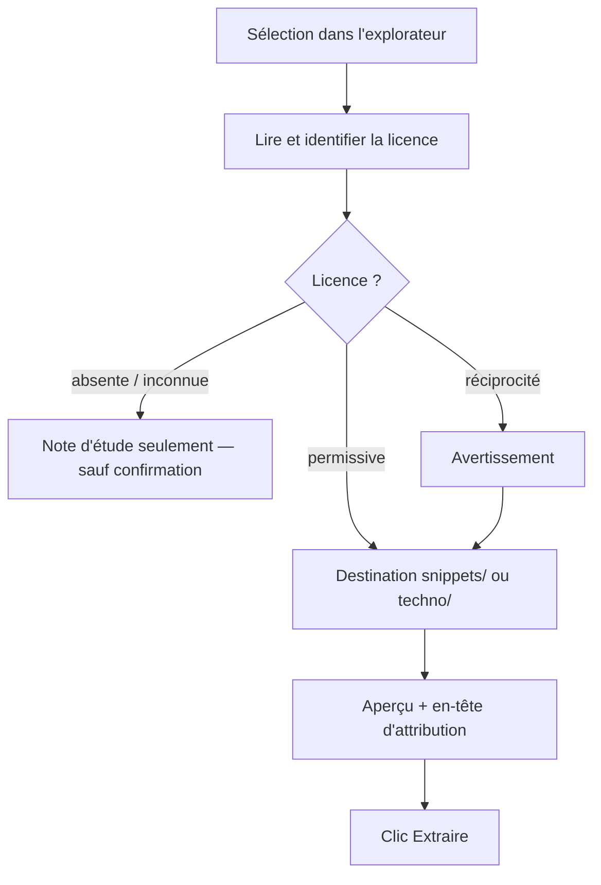

# Niveau 2 — Détail Fonctionnalité : GIT-G — Extraire un morceau d'un projet open source
> Projet : Gestionnaire_idées · Basé sur : L1i-git-github.md (D7 « extraire »), L2-git-cloner.md, workspace
> ProjectMaster (`snippets/`, `techno/`) · Date : 2026-10-07 · Livraison : **lot G (après le MVP)**

## 1. Objectif de la fonctionnalité
Pendant l'étude d'un projet open source cloné (lot C), garder un **morceau utile** (une fonction, un fichier, un
pattern) dans sa bibliothèque personnelle : `snippets/` (code prêt à copier) ou `techno/` (guide, pattern), avec la
**licence lue et affichée avant toute copie** et l'**attribution** gardée.

> Analogie : recopier une recette d'un livre dans son carnet, en notant le titre du livre, l'auteur et la page, et en
> vérifiant d'abord que le livre autorise la recopie.

Vocabulaire : *licence* (contrat qui dit ce qu'on a le droit de faire du code : MIT, Apache-2.0, GPL…), *SPDX*
(identifiant standard d'une licence, ex. `MIT`), *attribution* (mention obligatoire de l'auteur et de la licence).

## 2. Use Cases précis

### UC-1 : Extraire un fichier ou une sélection
- **Acteur :** mentalyas
- **Déclencheur :** explorateur de reprise (spec 017) ou détail d'un commit → menu ⋯ « Extraire vers ma bibliothèque »
- **Scénario nominal :**
  1. L'app lit la licence du dépôt (`LICENSE`, `COPYING`, champ `license` du `package.json`…) et l'identifie (SPDX) ;
     elle l'affiche avec un résumé en une phrase (« MIT : copie permise, garder la mention de copyright »).
  2. Choix de la destination : `snippets/<domaine>/` ou `techno/<techno>/` (liste des dossiers existants du
     workspace), nom du fichier.
  3. Aperçu : le morceau + un **en-tête d'attribution** (dépôt d'origine sans identifiant, chemin, commit, licence,
     copyright) ; Claude peut proposer un court commentaire « à quoi ça sert » (relu).
  4. Clic **Extraire** → le fichier est écrit à la destination, avec son en-tête.
- **Scénarios alternatifs / erreurs :**
  - Licence absente ou inconnue → avertissement fort : « sans licence, le code n'est pas réutilisable par défaut » ;
    extraction en **note d'étude** seulement (`techno/`, lien + explication, pas de copie du code) sauf confirmation
    explicite.
  - Licence à réciprocité (GPL, AGPL…) → avertissement : « réutiliser ce code impose la même licence au projet qui
    l'intègre » ; extraction permise, mention dans l'en-tête.
  - Fichier déjà existant à la destination → refus ou nouveau nom.
  - Fichier binaire ou > 200 Ko → refusé (ce n'est pas un snippet).
- **Post-condition :** morceau rangé avec attribution ; extraction tracée (origine, licence, destination).

## 3. Workflow (Mermaid)

## 4. Règles métier
| # | Règle | Justification |
|---|-------|----------------|
| GG-1 | Licence lue et affichée **avant** toute copie ; jamais de copie silencieuse | D7 |
| GG-2 | En-tête d'attribution toujours écrit (origine, chemin, commit, licence, copyright) ; non supprimable depuis l'app | Respect des licences |
| GG-3 | Destination limitée aux dossiers `snippets/` et `techno/` du workspace (chemins vérifiés, pas de remontée) | Écriture bornée |
| GG-4 | Le code extrait n'est jamais exécuté ; il reste une donnée | §6 de L1i |
| GG-5 | L'app ne commite pas le workspace : l'extraction est un fichier, versionné ensuite par mentalyas (lot A) | D2 |
| GG-6 | Identification de licence par règles fixes (texte comparé aux licences SPDX courantes) ; incertitude → « inconnue » | Pas de faux « MIT » |

## 5. Critères d'acceptation (Definition of Done)
- [ ] Extraire une fonction d'un dépôt MIT fictif → fichier dans `snippets/<domaine>/` avec en-tête complet (test).
- [ ] Dépôt sans licence → seule la note d'étude est proposée par défaut (test).
- [ ] Une destination `../../` est refusée (test).
- [ ] Licence GPL → avertissement affiché avant l'aperçu (test).

## 6. Signal de complexité — Niveau 3 nécessaire ?
| Critère | Présent ? | Détail |
|---------|-----------|--------|
| Logique métier complexe | Faible | Identification de licence par règles fixes |
| Intégration API tierce | Non | Lecture locale |
| Données sensibles | Légal (léger) | Licences et attribution |
| Multi-rôles | Non | — |

**Recommandation :** **Niveau 2 suffisant** : le format d'en-tête et la table des licences reconnues se fixent au
plan de la spec.

## Hypothèses à valider
1. La racine du workspace (`snippets/`, `techno/`) est déduite de la racine des projets de la spec 016 quand elle est
   un workspace ProjectMaster (registre du hub détecté) ; sinon le lot G demande un dossier au sélecteur natif.
2. L'app ne tient pas de registre global des extraits au-delà d'une ligne d'historique (l'en-tête suffit à
   l'attribution).
