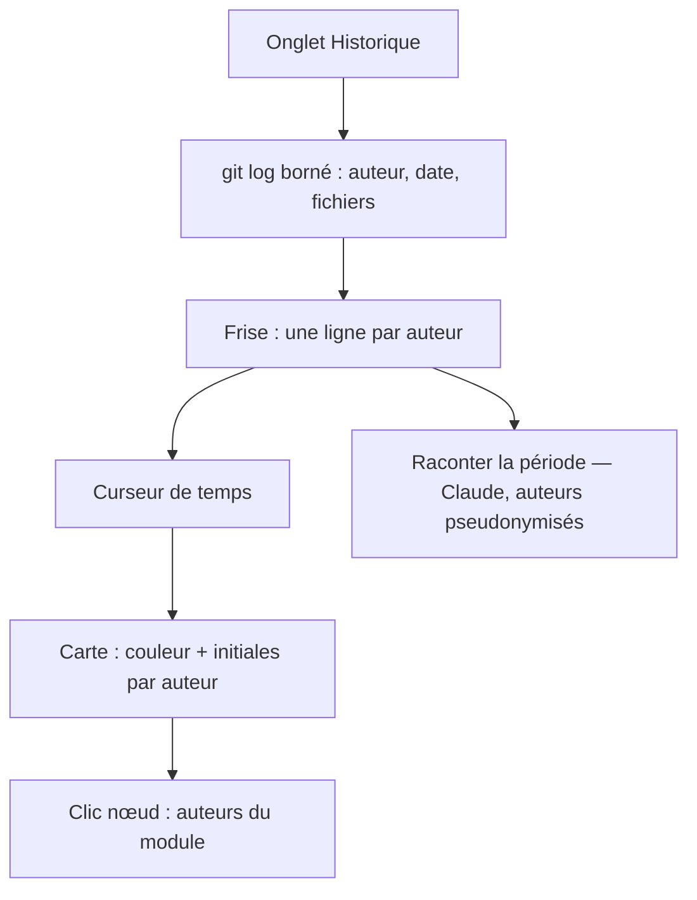

# Niveau 2 — Détail Fonctionnalité : GIT-D — Historique : frise par auteur et carte colorisée
> Projet : Gestionnaire_idées · Basé sur : L1i-git-github.md (D5, G3), spec 017 (cartographie, explorateur),
> L2-git-cloner.md · Date : 2026-10-07 · Livraison : **lot D (après le MVP)**

## 1. Objectif de la fonctionnalité
Répondre à « **qui a fait quoi et quand** » : une **frise** des commits (une ligne par auteur, un curseur de temps) et,
en déplaçant le curseur, la **cartographie** du projet (spec 017) qui se colore selon qui a touché chaque module : une
rediffusion de la vie du projet.

> Analogie : le replay d'un match. La frise est la barre de lecture ; la carte est le terrain ; chaque joueur a sa
> couleur et ses initiales sur le maillot, et l'on voit qui était où à chaque minute.

## 2. Use Cases précis

### UC-1 : Lire la frise
- **Acteur :** mentalyas
- **Déclencheur :** volet Dépôt → onglet **Historique**
- **Scénario nominal :**
  1. L'app lit l'historique de la branche courante (auteur, date, message, fichiers touchés), borné (voir GD-4).
  2. Frise horizontale : une ligne par auteur (initiales + nom, couleur attribuée), un point par commit ; zoom
     semaine / mois / année ; liste des commits sous la frise.
  3. Survol d'un point → message, date, nombre de fichiers ; clic → détail du commit (fichiers, diff à la demande).
  4. Filtres : un auteur, une période, un dossier.
- **Scénarios alternatifs / erreurs :**
  - Un même auteur sous deux noms ou e-mails → regroupés si le dépôt a un `.mailmap` ; sinon « Fusionner ces deux
    auteurs » à la main (réglage local du projet, jamais écrit dans le dépôt).
  - Historique énorme → seuls les N derniers commits ; « Charger plus ancien ».
  - Clone partiel : le diff d'un vieux commit télécharge son contenu à la demande (réseau) ; hors ligne → « contenu
    non disponible hors ligne ».

### UC-2 : Rediffusion sur la carte
- **Déclencheur :** bouton « Rejouer sur la carte » ou déplacement du curseur de la frise
- **Scénario nominal :**
  1. La carte de structure / l'explorateur de la reprise (spec 017) passe en mode **Historique**.
  2. Chaque nœud (module, dossier, fichier) prend la **couleur et les initiales** de l'auteur qui l'a le plus touché
     (ou le dernier, selon le mode choisi) jusqu'à la date du curseur ; les nœuds jamais touchés restent neutres.
  3. Lecture automatique (▶) : le curseur avance, la carte se recolore ; pause, vitesse.
  4. Clic sur un nœud → panneau : auteurs du module (barres + nombres), derniers commits.
- **Scénarios alternatifs :** projet sans cartographie (pas encore analysé) → la rediffusion se fait sur
  l'arborescence des dossiers ; proposition de lancer l'analyse de reprise.

### UC-3 : Demander à Claude de raconter l'historique
- **Déclencheur :** « Raconter cette période » sur une sélection de la frise
- **Scénario nominal :** Claude reçoit les messages de commit et fichiers touchés de la période (données balisées,
  auteurs **pseudonymisés** « Auteur A, B… ») et rédige un résumé ; l'app remet les vrais noms à l'affichage.
- **Post-condition :** résumé affiché, non enregistré dans le dépôt.

## 3. Workflow (Mermaid)

## 4. Règles métier
| # | Règle | Justification |
|---|-------|----------------|
| GD-1 | Couleur **et** initiales sur chaque nœud et chaque ligne ; légende toujours visible ; palette contrastée (≥ 3:1 sur le fond) | WCAG AA, D5 |
| GD-2 | Noms et e-mails d'auteurs : lus dans git, affichés, **jamais** envoyés à Claude par l'app (pseudonymes), jamais journalisés, jamais écrits dans le dépôt de l'app | D5, constitution I et IV |
| GD-3 | Calcul pur et testé : correspondance fichier → nœud de la cartographie, agrégation par auteur jusqu'à une date | Constitution V |
| GD-4 | Bornes : 5 000 derniers commits par lecture, 200 fichiers par commit pris en compte ; au-delà « Charger plus » | Performance |
| GD-5 | Lecture seule : aucune commande d'écriture git dans ce lot | Simplicité |
| GD-6 | Renommages ignorés dans la frise (`--no-renames`) : un fichier renommé compte comme supprimé + ajouté | Évite de télécharger les contenus en clone partiel |
| GD-7 | Fusion manuelle d'auteurs gardée dans la base de l'app (chiffrée), par projet | Pas d'écriture dans le dépôt |

## 5. Critères d'acceptation (Definition of Done)
- [ ] Sur un dépôt de démonstration à 3 auteurs fictifs, la frise montre 3 lignes avec initiales et le bon nombre de
      points.
- [ ] Curseur au milieu de l'historique : chaque module a la couleur de l'auteur attendu (test pur de l'agrégation).
- [ ] « Raconter » n'envoie aucun nom ni e-mail réel à la passerelle (test avec passerelle simulée).
- [ ] Navigation au clavier de la frise (flèches = commit précédent / suivant) ; `expectNoAxeViolations`.
- [ ] 5 000 commits se chargent en moins de 2 s (mesure manuelle sur un dépôt open source moyen).

## 6. Signal de complexité — Niveau 3 nécessaire ?
| Critère | Présent ? | Détail |
|---------|-----------|--------|
| Logique métier complexe | Moyen | Agrégation par auteur et par date, correspondance fichier → nœud (calcul pur) |
| Intégration API tierce | Non | git local en lecture |
| Données sensibles | Oui (PII) | Noms et e-mails d'auteurs |
| Multi-rôles | Non | — |

**Recommandation :** **Niveau 2 suffisant** : lecture seule, calcul pur ; le format exact de `git log` et l'agrégation
se fixent au plan de la spec. La règle GD-2 (PII) est reprise dans les contrats de `L3-git-depot-local.md` (§1).

## Hypothèses à valider
1. Couleur du nœud = **auteur principal** (le plus de commits sur ce nœud jusqu'au curseur) par défaut ; bascule
   « dernier auteur ».
2. La frise n'est **pas stockée** : recalculée à l'ouverture (cache en mémoire le temps de la session).
3. « Raconter la période » envoie à Claude des **messages de commit** (texte d'autrui, donnée) mais aucun nom réel.
