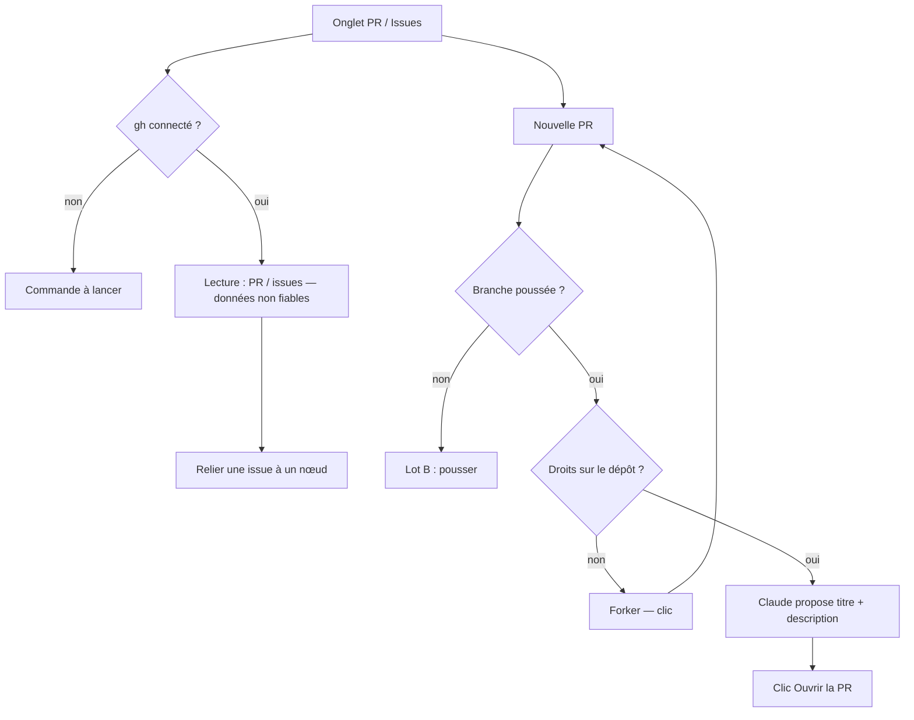

# Niveau 2 — Détail Fonctionnalité : GIT-F — Pull requests, issues et fork
> Projet : Gestionnaire_idées · Basé sur : L1i-git-github.md (D3, D4, D7 « forker et contribuer »),
> L2-git-publier.md · Date : 2026-10-07 · Livraison : **lot F (après le MVP)**

## 1. Objectif de la fonctionnalité
Travailler avec les collègues et contribuer à l'open source **sans quitter la carte** : ouvrir une **PR** (*Pull
Request* — demande d'intégration de changements dans la branche d'un dépôt), voir celles des collègues et leur statut,
lire les **issues** (tickets : bugs, demandes) et les **relier** aux nœuds ou étapes de la carte, et **forker** un
dépôt tiers (en faire une copie sur son compte) pour y proposer des changements.

> Analogie : la boîte à suggestions d'un atelier partagé. On dépose une proposition (PR) avec un mot d'explication ;
> les autres la relisent et l'acceptent ou non. Les tickets (issues) sont les post-it du tableau, et on les épingle
> sur les bonnes zones de la carte.

## 2. Use Cases précis

### UC-1 : Ouvrir une PR
- **Acteur :** mentalyas (Claude propose titre et description)
- **Déclencheur :** onglet **PR** → « Nouvelle PR » (branche courante poussée, différente de la branche de base)
- **Scénario nominal :**
  1. Formulaire : branche de base (défaut : branche par défaut du dépôt cible), titre, description, brouillon oui / non.
  2. « Proposer » → Claude rédige titre (Conventional Commits) et description (résumé, liste des changements, tests)
     à partir des commits et du diff de la branche.
  3. Récapitulatif : dépôt cible, `<base> ← <branche>`, nombre de commits.
  4. Clic **Ouvrir la PR** → la PR est créée ; son numéro et son lien s'affichent.
- **Scénarios alternatifs / erreurs :**
  - Branche pas encore poussée → « Pousse d'abord » (lot B).
  - Dépôt tiers sans droits d'écriture → proposition de **forker** (UC-4) puis PR depuis le fork.
  - PR déjà ouverte pour cette branche → lien vers elle.
- **Post-condition :** PR ouverte sur GitHub ; historisée.

### UC-2 : Voir les PR des collègues
- **Déclencheur :** onglet PR (lecture à l'ouverture, « Actualiser »)
- **Scénario nominal :** liste : numéro, titre, auteur (pseudo GitHub), branche, statut (icône + libellé : ouverte,
  brouillon, approuvée, changements demandés, fusionnée, fermée), vérifications (réussies / échouées / en cours),
  dernière mise à jour ; clic → détail (description, commits, fichiers) ; « Récupérer la branche » pour la tester
  en local (création d'une branche locale, lot A).
- **Post-condition :** lecture seule ; aucune approbation ni fusion de PR depuis l'app (voir hypothèses).

### UC-3 : Issues reliées à la carte
- **Scénario nominal :**
  1. Onglet **Issues** : ouvertes par défaut (numéro, titre, étiquettes, assigné, date) ; recherche, filtre.
  2. « Relier à un nœud » (ou glisser l'issue sur un nœud / une étape de la carte) → un repère `#42` apparaît sur le
     nœud ; clic sur le repère → détail de l'issue.
  3. Depuis un nœud : « Créer une issue » (titre et corps proposés par Claude à partir du nœud, sur clic).
- **Scénarios alternatifs :** issue fermée sur GitHub → repère grisé avec « fermée » (texte), lien conservé.
- **Post-condition :** lien nœud ↔ issue gardé dans la base de l'app (jamais écrit sur GitHub d'office).

### UC-4 : Forker un dépôt tiers pour contribuer
- **Déclencheur :** projet cloné d'un tiers → « Forker pour contribuer »
- **Scénario nominal :**
  1. Récapitulatif : « Créer `<ton compte>/<nom>` (fork de `<auteur>/<nom>`) ; ton clone poussera vers ton fork,
     l'original devient `upstream` (suivi des mises à jour) ».
  2. Clic → fork créé ; remotes réglés ; le badge suit `upstream` pour « à tirer » et `origin` (le fork) pour « à
     pousser ».
  3. PR suivantes : de `<ton compte>:<branche>` vers `<auteur>:<base>`.
- **Post-condition :** fork créé, remotes réglés ; historisé.

## 3. Workflow (Mermaid)

## 4. Règles métier
| # | Règle | Justification |
|---|-------|----------------|
| GF-1 | Toute écriture sur GitHub (PR, issue, fork) : **sur clic**, après récapitulatif | D2 |
| GF-2 | Titres, descriptions, commentaires, noms venus de GitHub = **données non fiables** : affichés en texte (Markdown rendu sans HTML ni image distante), jamais consignes pour Claude | §6 de L1i |
| GF-3 | Liens sortants ouverts dans le navigateur seulement s'ils sont `https://github.com/…` ; autres liens : affichés, copiables, pas cliquables | Hameçonnage |
| GF-4 | Lecture bornée : 50 PR, 100 issues par page ; corps tronqués à 20 000 caractères | Performance |
| GF-5 | Aucune approbation, fusion ou fermeture de PR / issue depuis l'app dans ce lot | YAGNI, risque |
| GF-6 | Liens nœud ↔ issue gardés dans la base de l'app ; rien n'est écrit dans l'issue | D1 (aucune donnée de l'app partagée) |
| GF-7 | Texte de PR / issue proposé par Claude : relu et modifiable avant le clic ; projet « Local uniquement » → modèle local ou vide | Constitution II, IV |

## 5. Critères d'acceptation (Definition of Done)
- [ ] Ouvrir une PR sur un dépôt de test : récapitulatif, PR créée, numéro affiché (preuve manuelle).
- [ ] Liste des PR et issues lue depuis une sortie `gh` simulée ; un titre contenant `` s'affiche en texte
      (test renderer).
- [ ] Relier l'issue #42 à un nœud : repère visible, conservé au redémarrage (test).
- [ ] Forker un dépôt tiers : `origin` = fork, `upstream` = original (test avec `gh` simulé).
- [ ] Un lien `https://exemple.invalid` dans une issue n'est pas cliquable (test).

## 6. Signal de complexité — Niveau 3 nécessaire ?
| Critère | Présent ? | Détail |
|---------|-----------|--------|
| Logique métier complexe | Moyen | Remotes du fork, droits, statuts de PR |
| Intégration API tierce | Oui | GitHub via `gh` (sorties JSON à valider) |
| Données sensibles | Oui | Contenu non fiable affiché et donné à Claude |
| Multi-rôles | Oui | Propriétaire / collaborateur / tiers : droits différents sur GitHub |

**Recommandation :** **Niveau 3** (`L3-git-pr-issues.md`) : contrat `gh`, validation des sorties JSON, rendu sûr.

## Hypothèses à valider
1. **Pas d'approbation ni de fusion de PR** depuis l'app (lecture + ouverture seulement) ; mentalyas fusionne sur
   GitHub.
2. Les liens nœud ↔ issue restent **locaux** (pas de commentaire automatique « relié à… » dans l'issue).
3. « Récupérer la branche » d'une PR de collègue crée une branche locale **sans lancer** son code.
