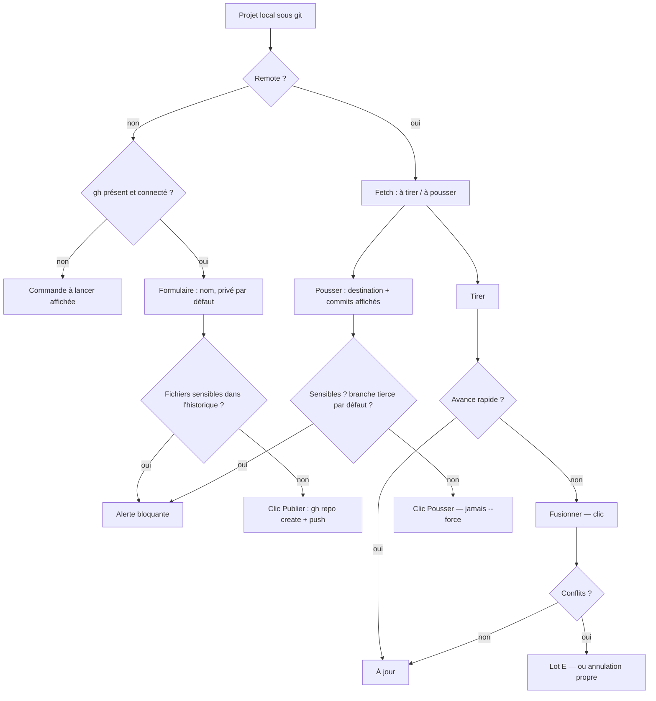

# Niveau 2 — Détail Fonctionnalité : GIT-B — Publier sur GitHub, tirer et pousser
> Projet : Gestionnaire_idées · Basé sur : L1i-git-github.md (D2, D3, §6, §7), L2-git-depot-local.md
> Date : 2026-10-07 · Livraison : **lot B (MVP)**

## 1. Objectif de la fonctionnalité
Prolonger le dépôt local vers GitHub : **créer un dépôt** sur le compte de mentalyas à partir d'un projet (privé par
défaut), puis **tirer** (*pull* : récupérer le travail des autres) et **pousser** (*push* : envoyer ses commits) au
quotidien, toujours sur un clic, la destination affichée avant.

> Analogie : la boîte aux lettres. Pousser, c'est poster ses pages du carnet ; tirer, c'est relever le courrier des
> collègues. L'app montre l'adresse sur l'enveloppe avant de poster, et refuse d'envoyer un document confidentiel.

Vocabulaire : *remote* (dépôt distant, en général appelé `origin`), *branche suivie* (la branche distante associée à
la branche locale), *fetch* (relever le courrier sans l'ouvrir : télécharger sans rien changer aux fichiers),
*fast-forward* (avance rapide : la branche locale n'a qu'à avancer, aucune fusion), *`gh`* (CLI de GitHub, programme
officiel en ligne de commande, déjà connecté par mentalyas avec `gh auth login`).

## 2. Use Cases précis

### UC-1 : Publier un projet local sur GitHub
- **Acteur :** mentalyas
- **Déclencheur :** volet Dépôt d'un projet sans remote → bouton « Publier sur GitHub »
- **Scénario nominal :**
  1. L'app vérifie que `gh` est présent et connecté (`gh auth status`) ; elle affiche le compte connecté.
  2. Formulaire : nom du dépôt (proposé : le slug du projet), description (facultative), visibilité **Privé**
     (cochée par défaut) / Public.
  3. **Contrôle avant premier push** : recherche de fichiers sensibles **dans tout l'historique à pousser** (pas
     seulement le dernier commit) et présence d'un `.gitignore` ; résultat affiché.
  4. Récapitulatif : « Créer `<compte>/<nom>` (privé) et y pousser `main` : 12 commits ».
  5. Clic **Publier** : `gh repo create` (sans pousser), ajout du remote `origin`, puis push de la branche courante
     avec suivi.
  6. Le badge passe à « à jour », le volet affiche le lien du dépôt (ouvert dans le navigateur sur clic).
- **Scénarios alternatifs / erreurs :**
  - `gh` absent → « Installe GitHub CLI (`winget install GitHub.cli`), puis `gh auth login` » ; `gh` non connecté →
    « Lance `gh auth login` dans un terminal » ; jamais de saisie de jeton dans l'app.
  - Fichier sensible trouvé (même supprimé depuis, mais présent dans un commit à pousser) → **alerte bloquante** qui
    nomme le fichier et le commit ; l'app explique qu'il faut le retirer de l'historique hors de l'app (elle ne
    réécrit jamais l'historique) ; pas de bouton « publier quand même ».
  - Pas de `.gitignore` → avertissement non bloquant + « Ajouter le `.gitignore` de base » (celui de la spec 016).
  - Nom déjà pris sur le compte → message de `gh` reformulé, nom à changer.
  - Public coché → seconde confirmation : « tout l'historique sera visible de tous ».
- **Post-condition :** dépôt GitHub créé, `origin` réglé, branche poussée et suivie ; opérations historisées.

### UC-2 : Relever le courrier (fetch) et voir l'écart
- **Déclencheur :** ouverture du volet Dépôt, bouton « Actualiser », ou avant un pull / push
- **Scénario nominal :** `git fetch` du remote suivi ; le badge affiche « 2 à tirer » et l'onglet Historique liste les
  commits entrants (auteur, date, message).
- **Scénarios alternatifs :** réseau absent ou identifiants refusés → badge « non vérifié depuis 2 h » + raison ; rien
  d'autre n'est tenté.

### UC-3 : Tirer (pull)
- **Déclencheur :** clic « Tirer (2) »
- **Scénario nominal :**
  1. Fetch, puis **avance rapide** si la branche locale n'a pas de commit propre.
  2. Le volet affiche les fichiers changés par les collègues ; la carte se rafraîchit.
- **Scénarios alternatifs / erreurs :**
  - Fichiers non commités qui seraient touchés → refus : « commite ou rétablis d'abord ces fichiers ».
  - Les deux côtés ont des commits (divergence) → proposition **« Fusionner »** (un commit de fusion, sur clic) ; jamais
    de *rebase* (réécriture).
  - La fusion a des **conflits** → lot E (conflits guidés) ; tant que le lot E n'existe pas, l'app annule la fusion
    proprement (`merge --abort`), explique les fichiers en conflit et indique de les régler dans l'éditeur ou le
    terminal.
- **Post-condition :** branche locale à jour (ou fusion en cours, lot E).

### UC-4 : Pousser (push)
- **Déclencheur :** clic « Pousser (3) »
- **Scénario nominal :**
  1. Récapitulatif **avant** le clic final : destination (« `origin` → `<compte>/<nom>`, branche `feat/demo` »), liste
     des commits (message, date), nombre de fichiers.
  2. Contrôle des fichiers sensibles dans les commits à pousser (même règle qu'UC-1).
  3. Clic **Pousser** : push de la seule branche courante ; première fois : branche suivie créée.
- **Scénarios alternatifs / erreurs :**
  - Refus « non fast-forward » (un collègue a poussé entre-temps) → « Tire d'abord » ; jamais `--force`.
  - Branche par défaut d'un dépôt dont mentalyas n'est pas propriétaire (dépôt cloné d'un tiers) → refus : « forke
    d'abord (lot F) ou crée une branche ».
  - Branche protégée refusée par GitHub, droits insuffisants, réseau → message de git reformulé.
  - Hook `pre-push` (dépôt de confiance) qui échoue → push refusé, sortie affichée.
- **Post-condition :** commits sur GitHub ; badge « à jour » ; opération historisée (destination, nombre de commits).

## 3. Workflow (Mermaid)

## 4. Règles métier
| # | Règle | Justification |
|---|-------|----------------|
| GB-1 | Push, fusion, création de dépôt : **seulement sur clic**, après récapitulatif (destination, commits) | D2, constitution II amendée |
| GB-2 | Jamais `--force`, `--force-with-lease`, refspec commençant par `+`, `--mirror`, `--all`, `--tags` d'office, `--delete` ; une seule branche poussée à la fois | Pas de destruction distante |
| GB-3 | Jamais de *rebase* ni de `pull --rebase` ; pull = fetch + avance rapide, sinon fusion proposée | Pas de réécriture |
| GB-4 | Contrôle des fichiers sensibles sur **tous les commits à pousser**, bloquant ; contrôle du `.gitignore` au premier push | §6 de L1i |
| GB-5 | Dépôt créé **privé par défaut** ; public = seconde confirmation | Prévention |
| GB-6 | Connexion : git (gestionnaire d'identifiants Windows) et `gh` (déjà connecté) ; l'app ne lit, ne demande, ne stocke ni ne journalise aucun jeton ; jamais `gh auth token` | D3 |
| GB-7 | Refus de pousser vers la branche par défaut d'un dépôt dont le propriétaire n'est pas le compte connecté | §6 de L1i |
| GB-8 | Fetch seulement sur ouverture du volet, « Actualiser », ou juste avant tirer / pousser ; jamais en tâche de fond | Pas d'accès réseau ni de fenêtre d'identifiants surprise |
| GB-9 | Adresse du remote affichée et enregistrée **sans identifiant** | Spec 017 FR-011 |

## 5. Critères d'acceptation (Definition of Done)
- [ ] Publier un projet de démonstration (compte de test) : dépôt privé créé, `main` poussée et suivie (preuve manuelle).
- [ ] Un `.env` commité il y a 3 commits (puis supprimé) bloque la publication en nommant le fichier et le commit (test
      avec git réel dans un dossier temporaire et un remote local simulé).
- [ ] `gh` absent ou non connecté : message avec la commande à lancer, aucun appel réseau (test).
- [ ] Un push refusé « non fast-forward » propose « Tirer d'abord » ; aucune option de forçage n'existe (test).
- [ ] Pull avec divergence sans conflit → fusion sur clic ; avec conflit (sans lot E) → `merge --abort`, dépôt propre
      (test).
- [ ] Pousser vers `main` d'un dépôt tiers cloné est refusé (test).
- [ ] Aucun jeton dans les journaux ni la base après un push (test qui cherche des motifs de jeton `gh[pousr]_…`).

## 6. Signal de complexité — Niveau 3 nécessaire ?
| Critère | Présent ? | Détail |
|---------|-----------|--------|
| Logique métier complexe | Oui | Contrôles avant push, divergence, machine d'états pull / fusion |
| Intégration API tierce | Oui | GitHub via `gh` et git réseau |
| Données sensibles | Oui | Secrets publiés par erreur, identifiants |
| Multi-rôles | Partiel | Propriétaire ou non du dépôt distant (droits GitHub) |

**Recommandation :** **Niveau 3** (`L3-git-publier.md`), avec le texte d'amendement de la constitution.

## Hypothèses à valider
1. **Fetch jamais en tâche de fond** : le compteur « à tirer » peut être en retard ; il affiche depuis quand il est
   vérifié. Alternative : fetch toutes les 15 min si le volet est ouvert.
2. **Un fichier sensible déjà dans l'historique bloque sans contournement** : l'app ne propose pas de réécrire
   l'historique ; mentalyas le fait en terminal (ou avec Claude en conversation).
3. **Divergence → fusion (merge commit)**, jamais rebase, même si l'historique est moins linéaire.
