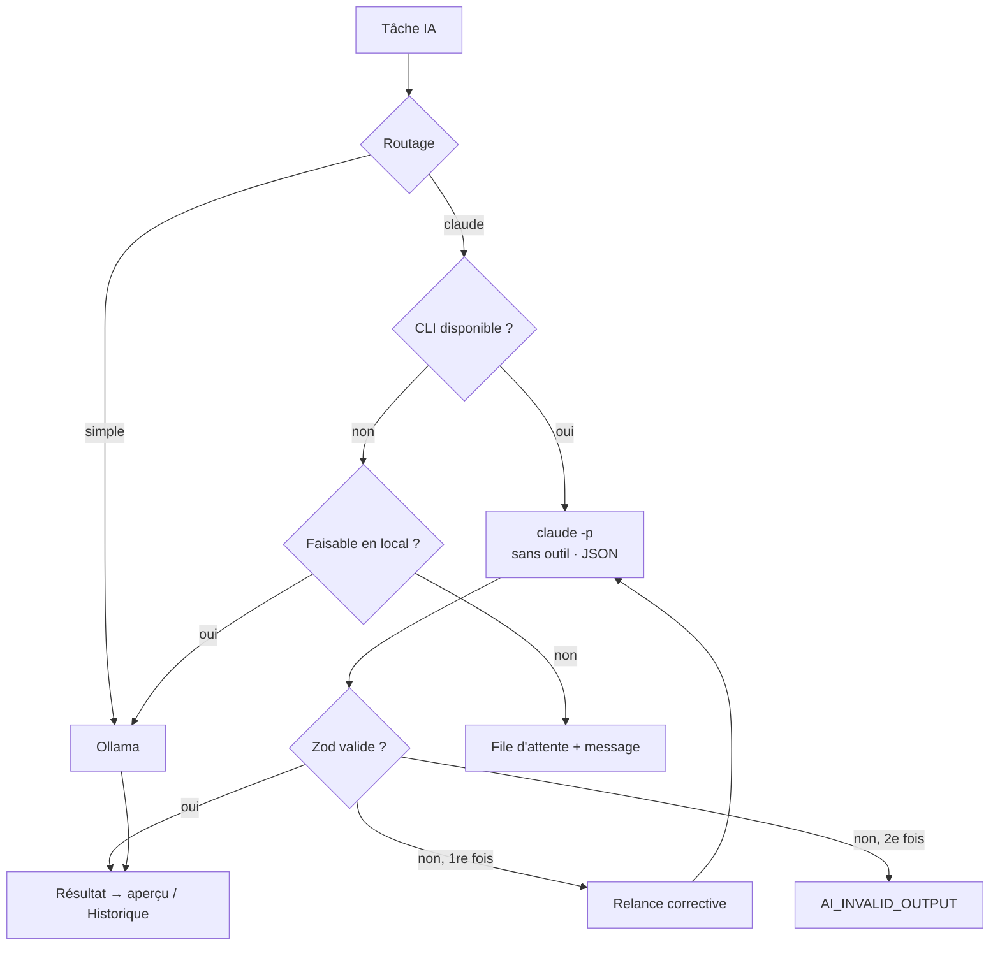

# Niveau 2 — Détail Fonctionnalité : F11 Moteur CLI (`claude -p` remplace l'API Anthropic)
> Projet : Gestionnaire_idées · Basé sur : L1-fondation.md, L1b-brainstormer.md, L2/L3-moteur-ia.md,
> **L1c-pont-claude-code.md** · Date : 2026-10-04

## 1. Objectif de la fonctionnalité
Les fonctions IA automatiques de l'app (questions de croissance, synthèse au verrouillage, révision, suggestions,
recherche web, génération de widgets) passent par le **CLI `claude` en mode non interactif** (`claude -p`), avec
l'abonnement de mentalyas, au lieu de l'API Anthropic. Objectif : **plus de facture API, plus de clé API**.
Ollama garde les tâches simples. Le cadre de l'IA, l'anonymisation sur le chemin Claude et le budget API disparaissent.

## 2. Use Cases précis

### UC-1 : Une tâche Claude passe par le CLI
- **Acteur :** l'app (en réponse à une action de mentalyas : verrouiller, réviser, générer un outil…)
- **Déclencheur :** la passerelle IA route une tâche vers le moteur « Claude »
- **Scénario nominal :**
  1. La passerelle appelle le **fournisseur CLI** (même contrat que l'actuel `ClaudeProvider`).
  2. Le fournisseur lance `claude -p` : consigne système + données + format JSON attendu, **sans aucun outil**
     (ni fichiers, ni commandes), dans un dossier de travail vide de l'app.
  3. Il lit la réponse JSON, la valide avec le schéma Zod de la tâche (comme aujourd'hui).
  4. Le résultat suit le même chemin qu'avant (aperçu, confirmation, Historique).
- **Scénarios alternatifs / erreurs :**
  - Réponse non conforme → **une** relance corrective avec l'erreur de validation, puis échec `AI_INVALID_OUTPUT`.
  - Délai dépassé (borne par tâche) → processus arrêté, erreur `AI_UNAVAILABLE` réessayable.
- **Post-condition :** même résultat fonctionnel qu'avec l'API, sans coût par jeton.

### UC-2 : Recherche web
- **Acteur :** l'app (sous-neurone d'investigation, « chercher sur le web »)
- **Scénario nominal :** `claude -p` avec **le seul outil de recherche web autorisé** ; texte + sources renvoyés au
  format actuel (`ResearchResponse`).
- **Post-condition :** l'investigation fonctionne sans l'outil serveur payant de l'API.

### UC-3 : CLI absent, non connecté, ou limite atteinte
- **Acteur :** l'app
- **Déclencheur :** `claude` introuvable, session expirée, ou limite d'usage de l'abonnement atteinte
- **Scénario nominal :**
  1. Réglages › IA affiche l'état réel : « Claude Code prêt (modèle …) » / « introuvable » / « non connecté »
     (avec la commande à lancer) / « limite atteinte, reprise vers … ».
  2. Tâche faisable en local → repli Ollama (comportement actuel) ; sinon demande mise **en file** et rejouée quand
     Claude redevient disponible (`LocalQueue` existante), l'interface le dit.
- **Post-condition :** aucune perte de demande, aucune erreur muette.

### UC-4 : Choisir le modèle
- **Acteur :** mentalyas, Réglages › IA
- **Scénario nominal :** choix du modèle passé au CLI (`--model`), global et par tâche (widgets plus économes,
  par ex.) — reprise de la table de routage existante.

### UC-5 : Suivre l'usage
- **Acteur :** mentalyas
- **Scénario nominal :** Réglages › IA montre le nombre d'appels, la durée moyenne et les échecs par tâche
  (remplace la dépense en euros, devenue sans objet).

## 3. Workflow (Mermaid)

## 4. Règles métier
| # | Règle | Justification |
|---|-------|----------------|
| R1 | Seul le **fournisseur** change : la passerelle, les schémas, l'aperçu, l'Historique restent. | Changement à faible risque, couvert par les tests existants. |
| R2 | Les tâches automatiques tournent **sans outils** (sauf recherche web : outil web seul), dans un dossier vide. | Une tâche de synthèse n'a pas à lire des fichiers ni à exécuter quoi que ce soit ; plus rapide, plus sûr. |
| R3 | Toute sortie reste **validée par Zod** ; une seule relance corrective. | Seul garde-fou restant sur le contenu (arbitrage L1c n°6). |
| R4 | Le **cadre de l'IA est supprimé** : plus de rôle imposé ni de refus `out_of_scope` ; la consigne de chaque tâche décrit seulement ce qu'elle doit produire. | Arbitrage L1c n°6. |
| R5 | **Plus d'anonymisation** avant Claude ; la tâche locale `anonymiser` disparaît. | Arbitrage L1c n°2. |
| R6 | **Plus de clé API, plus de budget en euros** : `ClaudeProvider`, `@anthropic-ai/sdk`, `BudgetGuard`, le calcul de coût et le réglage de clé sont retirés. | Arbitrage L1c n°3 ; YAGNI. |
| R7 | Appels Claude **un à la fois** (file) ; borne de durée par tâche. | Limites de l'abonnement ; un processus CLI par appel. |
| R8 | Aucun texte d'idée dans les journaux ; seuls tâche, durée, statut, modèle. | Règle de sécurité inchangée (pas de PII dans les logs). |
| R9 | Les données de l'utilisateur sont passées au CLI par l'entrée standard, jamais en argument de ligne de commande. | Pas d'injection de commande ; pas de données visibles dans la liste des processus. |

## 5. Critères d'acceptation (Definition of Done)
- [ ] Verrouiller une idée produit une synthèse via `claude -p`, sans clé API configurée.
- [ ] Questions de croissance, révision, suggestions, génération de widget, recherche web : fonctionnelles via le CLI.
- [ ] Sortie invalide → une relance, puis erreur claire.
- [ ] CLI introuvable / non connecté / limite atteinte → état exact dans Réglages, repli Ollama ou mise en file.
- [ ] `@anthropic-ai/sdk`, `ClaudeProvider`, `BudgetGuard`, anonymisation, cadre `out_of_scope` retirés (code mort supprimé, tests adaptés).
- [ ] Latence mesurée par tâche ; décision documentée pour les questions de croissance (CLI ou Ollama).
- [ ] Test T016 de la spec 006 refait sur ce moteur.
- [ ] Tests : fournisseur CLI avec un faux exécutable (succès, JSON invalide, délai, absent, non connecté).

## 6. Signal de complexité — Niveau 3 nécessaire ?
| Critère | Présent ? | Détail |
|---------|-----------|--------|
| Logique métier complexe (calculs, machine à états) | Oui | États du CLI, relance, file, délais, repli |
| Intégration API tierce | Oui | Pilotage d'un processus externe (`claude -p`), format de sortie, détection de l'état de connexion |
| Données sensibles (paiement/santé/légal) | Oui | Contenu personnel transmis à un processus externe ; lancement de processus sans injection |
| Accès multi-rôles / permissions différenciées | Non | — |

**Recommandation :** Niveau 3 nécessaire (protocole du CLI, sécurité du lancement de processus, plan de retrait).
