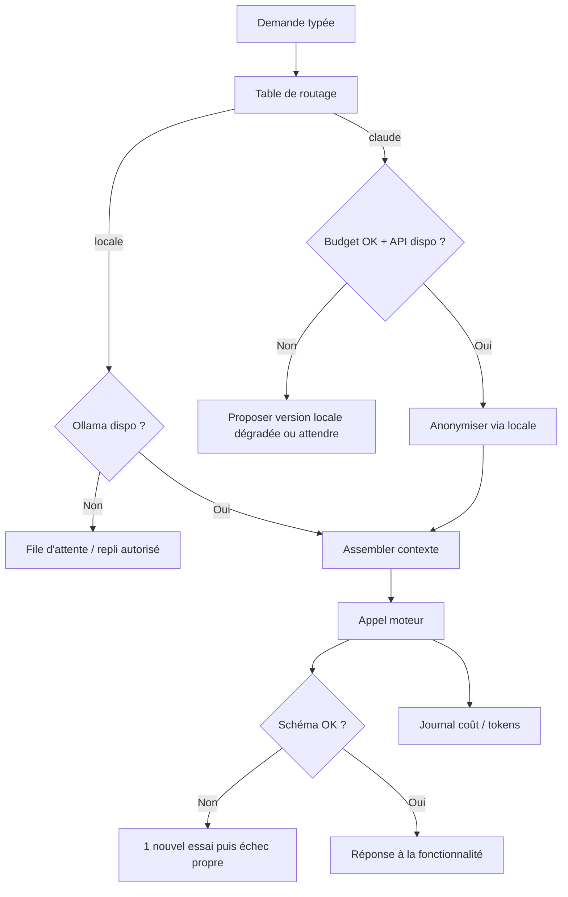

# Niveau 2 — Détail Fonctionnalité : F9 — Moteur IA hybride & contexte
> Projet : Gestionnaire_idées · Basé sur : docs/brainstorm/L1-fondation.md + tous les L2
> Date : 2026-09-28 · Livraison : **MVP-1**

## 1. Objectif de la fonctionnalité
Fournir à toutes les autres fonctionnalités **un seul point d'accès à l'IA** qui choisit le bon moteur
(local ou Claude), injecte le cadre et le profil, valide les réponses, et maîtrise le coût.

## 2. Use Cases précis

### UC-1 : Router une demande IA
- **Acteur :** une fonctionnalité (F1, F2, F7, F8…)
- **Scénario nominal :**
  1. La fonctionnalité envoie une demande typée (ex. `categoriser`, `questionner`, `decomposer`, `resumer`, `suggerer`).
  2. Le routeur choisit le moteur selon une **table de routage** :
     | Demande | Moteur |
     |---------|--------|
     | categoriser, resumer/anonymiser, détections simples, texte du briefing | Locale |
     | questionner, decomposer, restructurer, suggerer | Claude |
  3. Le contexte est assemblé (voir UC-2), l'appel est fait, la réponse est validée par schéma.
- **Scénarios alternatifs / erreurs :**
  - Moteur local indisponible → demandes locales en file d'attente (ou Claude si mentalyas l'a autorisé dans les réglages).
  - Claude indisponible / plafond atteint → proposer la version locale dégradée (signalée) ou attendre.
  - Réponse invalide → 1 nouvel essai, puis échec propre.

### UC-2 : Assembler le contexte
- **Scénario nominal :** contexte = **cadre système** (rôle, périmètre, interdits, règle « demander plutôt qu'inventer »)
  + **profil résumé** + **données utiles à la demande** (jamais toute la base) + **exemples** (décompositions validées, refus).

### UC-3 : Mettre à jour le contexte (depuis Claude Code)
- **Acteur :** mentalyas via Claude Code
- **Scénario nominal :**
  1. Claude Code écrit des fichiers de contexte (profil, règles, exemples) dans un dossier d'import.
  2. L'app détecte la nouveauté et affiche un **aperçu du changement** (avant / après).
  3. mentalyas accepte → le nouveau contexte est actif (version précédente conservée).
- **Scénarios alternatifs :** fichier mal formé → refusé avec message ; ancien contexte conservé.

### UC-4 : Suivre et plafonner le coût
- **Scénario nominal :** chaque appel Claude est journalisé (type, tokens, coût estimé) ;
  jauge mensuelle dans les réglages ; alerte à 80 %, blocage à 100 % (déblocable manuellement).

### UC-5 : Configurer les moteurs
- **Scénario nominal :** Réglages → clé API Claude (saisie masquée, stockée chiffrée), modèle local choisi,
  plafond mensuel, test de connexion pour chaque moteur.

## 3. Workflow (Mermaid)

## 4. Règles métier
| # | Règle | Justification |
|---|-------|----------------|
| R1 | Toutes les fonctionnalités passent par le moteur, jamais d'appel direct | Un seul endroit pour la sécurité, le coût et le cadre |
| R2 | Toute réponse IA est validée par un schéma avant usage | Anti-hallucination, anti-injection |
| R3 | Avant tout appel Claude : anonymisation (montants arrondis, noms de personnes retirés) | Minimisation L1 |
| R4 | Le contexte injecté ne contient que les données utiles à la demande | Coût + confidentialité |
| R5 | Nouveau contexte importé = aperçu + validation, versions conservées | mentalyas garde la main sur ce que l'agent « sait » |
| R6 | Plafond mensuel (10 € par défaut) : alerte 80 %, blocage 100 % | Pas de mauvaise surprise |
| R7 | Clé API et fichiers de profil hors du repo (dossier de données utilisateur, chiffrés) | Repo public |
| R8 | Le contenu des idées n'est jamais écrit dans les logs | Confidentialité |

## 5. Critères d'acceptation (Definition of Done)
- [ ] Changer de moteur pour un type de demande = changer la table de routage, sans toucher aux fonctionnalités
- [ ] Réponse hors schéma rejetée dans 100 % des tests
- [ ] Anonymisation vérifiée : aucun montant exact ni nom de personne dans les appels Claude (test sur jeu fictif)
- [ ] Import de contexte avec aperçu, validation et retour arrière
- [ ] Jauge de coût exacte à ±5 % par rapport à la console Anthropic
- [ ] Blocage effectif à 100 % du plafond
- [ ] Clé API jamais visible en clair après saisie, jamais dans les logs

## 6. Signal de complexité — Niveau 3 nécessaire ?
| Critère | Présent ? | Détail |
|---------|-----------|--------|
| Logique métier complexe (calculs, machine à états) | **Oui** | Routage, replis, anonymisation, budget |
| Intégration API tierce | **Oui** | API Anthropic + Ollama |
| Données sensibles (paiement/santé/légal) | **Oui** | Clé API, profil perso, données financières transitant |
| Accès multi-rôles / permissions différenciées | Non | — |

**Recommandation :** **Niveau 3 nécessaire** (contrat `AIProvider`, format des fichiers de contexte, schémas de sortie, anonymisation, suivi de coût).
