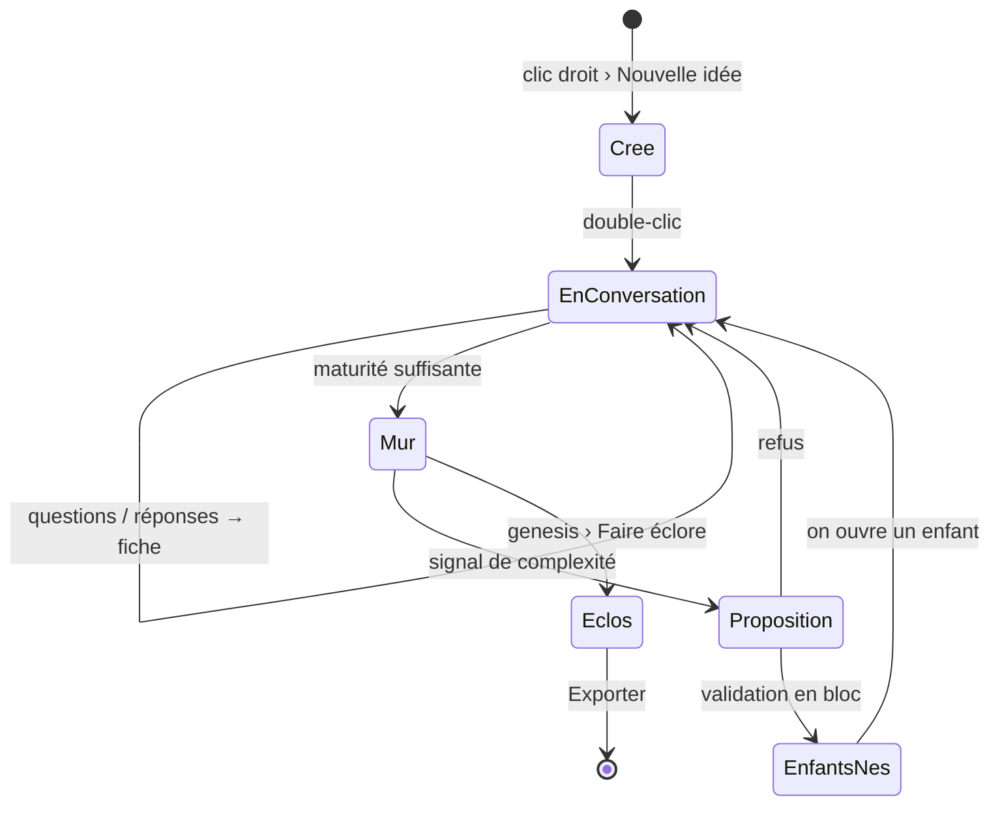

# Niveau 2 — Détail Fonctionnalité : F15 Neurone conversationnel
> Projet : Gestionnaire_idées · Basé sur : L1c-pont-claude-code.md (§9), **L1d-neurone-conversation.md**, L2/L3-pont-mcp.md
> Date : 2026-10-04

## 1. Objectif
Chaque neurone est une conversation Claude Code (chat dans le panneau latéral) qui nourrit sa **fiche** ; les neurones
s'organisent en **entonnoir en couches** (genesis → aspects → approfondissements → parcours), avec héritage du contexte,
remontée proposée vers le genesis, naissances validées en bloc, et export au format `/brainstorm`.

## 2. Use Cases

### UC-1 : Créer un genesis
- **Acteur :** mentalyas · **Déclencheur :** clic droit sur la toile › « Nouvelle idée »
- **Nominal :** 1. Saisie du titre. 2. Un neurone genesis apparaît (couche 1, type d'entonnoir « à déterminer »).
- **Post-condition :** genesis créé, sans conversation tant qu'il n'est pas ouvert.

### UC-2 : Ouvrir et brainstormer un neurone
- **Acteur :** mentalyas · **Déclencheur :** double-clic sur un neurone
- **Nominal :**
  1. Le panneau latéral affiche le chat du neurone (historique s'il existe), sa fiche, sa maturité.
  2. Premier message : l'app joint le **contexte** (cadre du Brainstormer, fiche du genesis, fiches du chemin, fiche du
     neurone, couche, type d'entonnoir) — invisible dans la bulle, visible dans « Contexte envoyé ».
  3. Claude répond en flux (texte qui s'écrit), pose ses questions ; ses actions apparaissent en pastilles
     (« ⚙ fiche mise à jour », « ⚙ maturité : suffisant »).
  4. Au fil des réponses, Claude met à jour la fiche par le pont ; le neurone grossit sur la carte.
- **Alternatifs :** `claude` introuvable / non connecté → message d'aide à la place du chat ; limite d'usage atteinte →
  message avec l'heure de reprise ; réponse interrompue (fermeture) → reprise possible, rien de perdu dans la fiche.
- **Post-condition :** conversation mémorisée (reprise à la prochaine ouverture), fiche à jour.

### UC-3 : Le genesis détermine son type d'entonnoir
- **Nominal :** pendant la couche 1, Claude identifie le type (projet, achat, événement, décision, apprentissage,
  général) et l'enregistre ; un badge l'affiche ; mentalyas peut le changer (menu du neurone).

### UC-4 : Valider une couche et faire naître la suivante
- **Acteur :** Claude puis mentalyas · **Déclencheur :** le neurone est mûr (Claude le dit) ou mentalyas clique « Valider la couche »
- **Nominal :**
  1. Claude affiche le **signal de complexité** et propose les neurones de la couche suivante (titre + objectif) :
     ils apparaissent en **fantômes** autour du neurone.
  2. mentalyas valide en bloc (en retirant ou renommant au besoin) → ils naissent (couche + 1), reliés au parent.
- **Alternatifs :** couche 4 (parcours) : proposée une seule fois pour l'arbre, rattachée au genesis ; refus → les fantômes disparaissent.

### UC-5 : Remontée vers le genesis
- **Déclencheur :** dans un sous-neurone, une découverte change le contexte général
- **Nominal :** Claude propose l'ajout (texte exact) ; une carte « Remontée proposée » apparaît dans le chat et sur le
  genesis ; mentalyas accepte → fiche du genesis mise à jour (annulable) ; refuse → rien.
- **Post-condition :** les autres branches reçoivent la nouvelle fiche à leur prochaine ouverture.

### UC-6 : Éclosion et export
- **Déclencheur :** tous les neurones utiles sont mûrs ; mentalyas clique « Faire éclore » sur le genesis
- **Nominal :** Claude rédige la synthèse finale dans la conversation du genesis ; le genesis éclot ; « Exporter » écrit
  `docs/brainstorm/L1…L4*.md` + `FOUNDATION.md` dans un dossier choisi (sélecteur natif).

### UC-7 : Ollama en tâche de fond
- **Nominal :** à intervalles (et à l'inactivité), Ollama classe les genesis, résume les fiches longues pour l'affichage
  condensé, signale des liens possibles entre genesis (proposés, jamais écrits).

### UC-8 : Conversion des idées existantes
- **Nominal :** au premier démarrage de la nouvelle version, chaque idée devient un genesis ; ses réponses, son
  document et sa synthèse forment sa première fiche (assemblage local, sans IA) ; l'ancien arbre reste en base, masqué.

## 3. Workflow

## 4. Règles métier
| # | Règle | Justification |
|---|-------|----------------|
| R1 | Un neurone = **une** conversation (session Claude Code) et **une** fiche. | L1d n°12. |
| R2 | Le contexte envoyé = cadre + fiche du genesis + fiches du chemin + fiche du neurone, **jamais** une conversation brute ; borné (§ L3). | Coût, lisibilité. |
| R3 | Seul Claude écrit la fiche, par le pont ; mentalyas peut l'éditer à la main (annulable). | Fiche = vérité partagée. |
| R4 | Une remontée vers le genesis **ne s'applique qu'après acceptation**. | L1d n°13 ; le contexte général ne dérive pas tout seul. |
| R5 | Les neurones d'une couche ne naissent qu'après **validation en bloc**. | L1d n°14, comme le skill. |
| R6 | Couche 3 seulement pour un neurone signalé complexe ; couche 4 une seule fois par arbre. | Entonnoir du skill. |
| R7 | Permissions du chat : outils du pont, lecture dans le dossier de l'espace, recherche web ; tout le reste refusé d'office. | L1c n°10. |
| R8 | Ollama n'intervient jamais dans une conversation ; ses suggestions de fond sont des propositions. | L1c n°7. |
| R9 | Toute écriture issue du chat (fiche, naissance, remontée) est dans l'Historique, annulable. | Constitution II. |
| R10 | L'usage de l'abonnement est visible (jauge de quota tirée des événements du CLI). | Quota partagé avec le CLI de mentalyas. |

## 5. Critères d'acceptation
- [ ] Toile vide → nouvelle idée → double-clic → chat → Claude pose des questions et la fiche se remplit.
- [ ] Fermer / rouvrir l'app → même conversation, même fiche.
- [ ] Un enfant ouvert connaît le contexte du genesis sans qu'on le répète (vérifiable : Claude le cite).
- [ ] Remontée proposée → acceptée → la fiche du genesis change, visible depuis une autre branche.
- [ ] Valider une couche → fantômes → validation en bloc → neurones nés, reliés, couche + 1.
- [ ] Export → dossier `docs/brainstorm` + `FOUNDATION.md` lisibles par `/brainstorm export` / `/pipeline`.
- [ ] Aucune question de croissance par Ollama ; anciennes idées converties en genesis.
- [ ] Tests : protocole du chat (faux CLI), contexte assemblé et borné, propositions, migration.

## 6. Signal de complexité
| Critère | Présent ? | Détail |
|---------|-----------|--------|
| Logique métier complexe | Oui | Entonnoir, héritage, propositions, cycle de vie, migration |
| Intégration tierce | Oui | Processus `claude` en flux continu, sessions, quota |
| Données sensibles | Oui | Conversations personnelles ; lancement de processus |
| Multi-rôles | Non | — |

**Recommandation :** Niveau 3 nécessaire.
