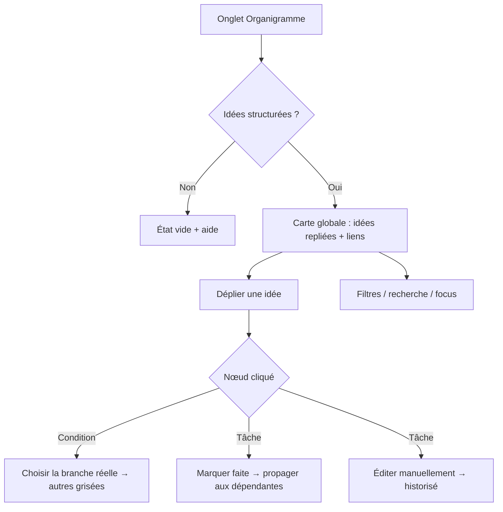

# Niveau 2 — Détail Fonctionnalité : F4 — Organigramme
> Projet : Gestionnaire_idées · Basé sur : docs/brainstorm/L1-fondation.md, L2-structuration-ia.md, L2-validation.md
> Date : 2026-09-28 · Livraison : **MVP-1**

## 1. Objectif de la fonctionnalité
Voir d'un coup d'œil comment ses idées s'organisent : arbres de tâches, conditions, dépendances et
**liens entre idées** (qui finance quoi). C'est la « carte » de l'agenda organique.

## 2. Use Cases précis

### UC-1 : Explorer la carte globale
- **Acteur :** mentalyas
- **Déclencheur :** onglet « Organigramme » de l'app complète
- **Scénario nominal :**
  1. Vue d'ensemble : une carte par idée (repliée), colorée par catégorie, liens inter-idées visibles.
  2. Zoom, déplacement, mini-carte de navigation.
  3. Clic sur une idée → dépliage de son arbre (tâches, conditions en losange, opportunités).
- **Scénarios alternatifs :** aucune idée structurée → état vide explicatif (« Capture une idée avec Ctrl+Alt+Espace »).

### UC-2 : Suivre une branche conditionnelle
- **Acteur :** mentalyas
- **Scénario nominal :** sur une condition (« J'ai l'argent ? »), mentalyas choisit la réponse réelle
  → la branche retenue devient active, les autres sont grisées (conservées, réactivables).
- **Post-condition :** tâches de la branche active deviennent actionnables.

### UC-3 : Cocher une tâche et déclencher la suite
- **Acteur :** mentalyas
- **Scénario nominal :** tâche marquée « faite » → les tâches qui en dépendent passent de « bloquée » à « prête ».
  Un déclencheur (« au paiement de la mission ») est marqué atteint manuellement.
- **Post-condition :** statuts propagés.

### UC-4 : Filtrer et rechercher
- **Scénario nominal :** filtres par catégorie, statut (brute / structurée / en cours / terminée), recherche texte ;
  focus sur une idée et ses voisines directes.

### UC-5 : Éditer manuellement
- **Scénario nominal :** renommer une tâche, changer une date/un montant, ajouter une tâche, repositionner un nœud.
  Les éditions manuelles s'appliquent directement (c'est mentalyas qui agit, pas l'IA) et sont historisées.

## 3. Workflow (Mermaid)

## 4. Règles métier
| # | Règle | Justification |
|---|-------|----------------|
| R1 | Statuts de tâche : bloquée · prête · en cours · faite · abandonnée | Propagation claire des dépendances |
| R2 | Une tâche est « bloquée » tant qu'une dépendance n'est pas faite ou qu'un déclencheur n'est pas atteint | Modèle « au paiement → réserver » |
| R3 | Choisir une branche ne supprime pas les autres (grisées, réactivables) | La situation peut changer |
| R4 | Formes distinctes : idée (carte), tâche (rectangle), condition (losange), opportunité (pièce/€) | Gestalt : même forme = même fonction |
| R5 | Couleur = catégorie (identique au compagnon et au widget) | Cohérence visuelle |
| R6 | Positions des nœuds mémorisées ; mise en page automatique à la première ouverture | Pas de plat de spaghettis |
| R7 | Éditions manuelles appliquées directement (pas de F3) mais historisées | L'humain n'a pas à se valider lui-même |

## 5. Critères d'acceptation (Definition of Done)
- [ ] L'arbre « 2e écran » s'affiche avec condition en losange, branches, opportunité liée
- [ ] Marquer une tâche faite débloque ses dépendantes
- [ ] Choisir une branche grise les autres, réversible
- [ ] Zoom / déplacement / mini-carte fluides avec 50 idées et 300 nœuds
- [ ] Filtres catégorie + statut + recherche fonctionnels
- [ ] Navigation clavier de base (Tab entre nœuds, Entrée pour ouvrir)

## 6. Signal de complexité — Niveau 3 nécessaire ?
| Critère | Présent ? | Détail |
|---------|-----------|--------|
| Logique métier complexe (calculs, machine à états) | Partiel | Propagation de statuts — modèle défini en L3 de F2 |
| Intégration API tierce | Non | React Flow = bibliothèque, pas une API |
| Données sensibles (paiement/santé/légal) | Non | Affichage uniquement |
| Accès multi-rôles / permissions différenciées | Non | — |

**Recommandation :** Niveau 2 suffisant (le parcours visuel sera précisé au niveau 4).
