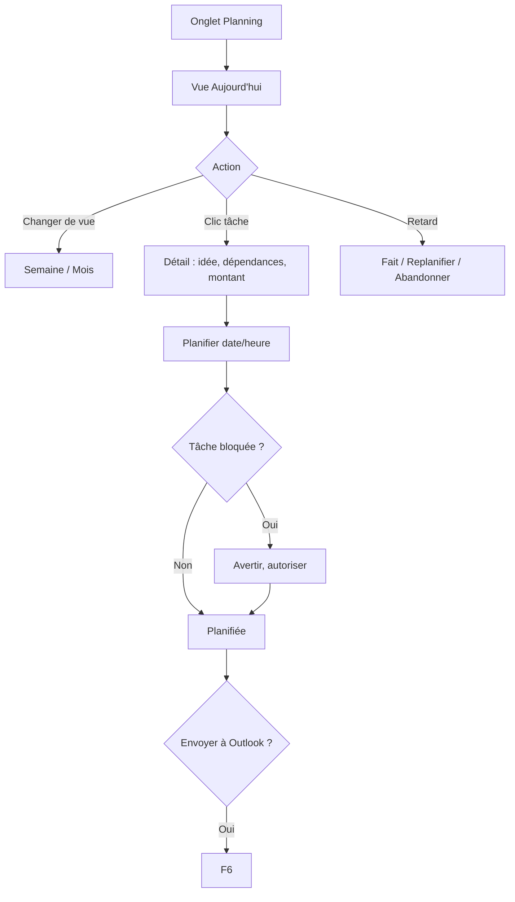

# Niveau 2 — Détail Fonctionnalité : F5 — Interface complète / planning
> Projet : Gestionnaire_idées · Basé sur : docs/brainstorm/L1-fondation.md, L2-organigramme.md
> Date : 2026-09-28 · Livraison : **MVP-2**

## 1. Objectif de la fonctionnalité
Offrir la vue « quoi faire et quand » : les tâches prêtes, planifiées et en retard, dans une liste
et un calendrier, complémentaires de l'organigramme (qui répond à « comment tout s'articule »).

## 2. Use Cases précis

### UC-1 : Voir ma journée / ma semaine
- **Acteur :** mentalyas
- **Déclencheur :** onglet « Planning »
- **Scénario nominal :**
  1. Vue par défaut **« Aujourd'hui »** : tâches du jour, tâches prêtes sans date, retards.
  2. Bascule **Semaine** / **Mois** (calendrier).
  3. Clic sur une tâche → panneau de détail (idée d'origine, dépendances, montant, lien vers l'organigramme).

### UC-2 : Planifier une tâche
- **Scénario nominal :** glisser une tâche prête sur un créneau, ou choisir une date/heure dans le détail.
  Option « Envoyer à Outlook » (F6).
- **Scénarios alternatifs :** planifier une tâche bloquée → avertissement (« dépend de X, pas encore faite »), autorisé quand même.

### UC-3 : Liste des idées
- **Scénario nominal :** liste de toutes les idées avec statut (brute / en questionnaire / à valider / structurée / terminée),
  catégorie, date ; actions rapides : Structurer, Archiver.

### UC-4 : Gérer les tâches en retard
- **Scénario nominal :** une tâche dont la date est passée apparaît en « Retard » ;
  actions : Fait · Replanifier · Abandonner.

## 3. Workflow (Mermaid)

## 4. Règles métier
| # | Règle | Justification |
|---|-------|----------------|
| R1 | La vue d'ouverture est « Aujourd'hui » | Workflow-first : la question du jour est « quoi faire » |
| R2 | Une tâche planifiée dans l'app n'est **pas** envoyée à Outlook sans action explicite | Décision L1 (validation) |
| R3 | Les tâches sans date restent visibles dans « Prêtes, non planifiées » | Rien ne disparaît |
| R4 | Même statuts que l'organigramme (source unique) | Cohérence F4/F5 |

## 5. Critères d'acceptation (Definition of Done)
- [ ] Vues Aujourd'hui / Semaine / Mois fonctionnelles
- [ ] Planifier par glisser-déposer et par sélecteur de date
- [ ] Avertissement en planifiant une tâche bloquée
- [ ] Retards listés avec actions rapides
- [ ] Un changement de statut dans le planning se reflète dans l'organigramme et inversement

## 6. Signal de complexité — Niveau 3 nécessaire ?
| Critère | Présent ? | Détail |
|---------|-----------|--------|
| Logique métier complexe (calculs, machine à états) | Non | Réutilise les statuts de F2/F4 |
| Intégration API tierce | Non | Outlook via F6 |
| Données sensibles (paiement/santé/légal) | Non | — |
| Accès multi-rôles / permissions différenciées | Non | — |

**Recommandation :** Niveau 2 suffisant.
