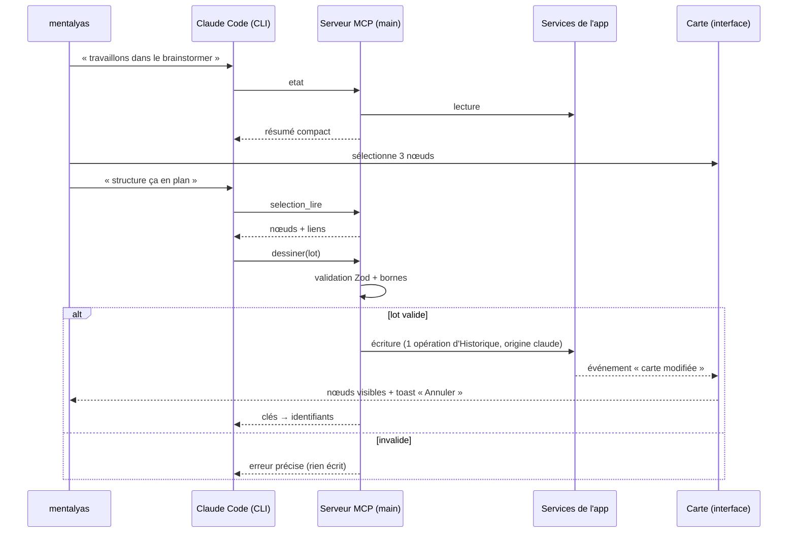

# Niveau 2 — Détail Fonctionnalité : F10 Pont MCP (la carte lue et écrite par Claude Code)
> Projet : Gestionnaire_idées · Basé sur : L1-fondation.md, L1b-brainstormer.md, L4b-neurones.md, L4c-widgets.md,
> **L1c-pont-claude-code.md** · Date : 2026-10-04

## 1. Objectif de la fonctionnalité
Exposer la carte à Claude Code par un serveur MCP (Model Context Protocol : protocole standard qui donne de
nouveaux outils à Claude Code) intégré à l'app. N'importe quel `claude` — terminal intégré (F12) ou CLI externe —
peut **lire** ce que mentalyas a posé sur la carte et y **afficher** ce qu'il produit. La carte devient l'interface
partagée entre mentalyas et Claude.

## 2. Use Cases précis

### UC-1 : Se connecter au Brainstormer depuis un CLI
- **Acteur :** mentalyas (dans un CLI `claude`, externe ou intégré)
- **Déclencheur :** « travaillons dans le brainstormer » (ou toute demande qui concerne la carte)
- **Scénario nominal :**
  1. Claude appelle l'outil `etat` : espaces, espace actif, sélection courante, idées en cours (résumé compact).
  2. Claude annonce ce qu'il voit en une ou deux phrases et propose de continuer sur la carte.
- **Scénarios alternatifs / erreurs :**
  - App fermée → les outils sont indisponibles ; Claude dit « Le Brainstormer n'est pas lancé » (message des
    instructions du serveur) au lieu d'inventer.
  - Intégration jamais installée → le skill `brainstormer` (F13) l'indique et renvoie vers le bouton d'installation.
- **Post-condition :** Claude connaît le contexte de la carte ; rien n'est écrit.

### UC-2 : Claude affiche une structure sur la carte
- **Acteur :** Claude Code
- **Déclencheur :** une tâche dont le résultat se dessine (carte d'un document, structure d'un projet, plan, options…)
- **Scénario nominal :**
  1. Claude appelle `dessiner` avec un lot : nœuds (titre, texte, nature), liens libellés, cadres de regroupement.
     Les nœuds se référencent entre eux par des **clés locales au lot** (`a`, `b`…), pas par des identifiants.
  2. L'app valide le lot, le place sans recouvrement (près de la sélection, ou dans un cadre neuf), l'écrit en
     **une opération d'Historique** marquée « par Claude ».
  3. La carte se met à jour en direct ; un toast discret « Claude a ajouté 12 nœuds — Annuler ».
  4. L'outil renvoie la correspondance clé → identifiant réel, pour les appels suivants.
- **Scénarios alternatifs / erreurs :**
  - Lot invalide (champ manquant, lien vers une clé absente, texte trop long) → refus **entier**, message d'erreur
    précis renvoyé à Claude, qui corrige et renvoie. Rien n'est écrit à moitié.
  - Lot trop gros (> 200 nœuds) → refus avec la borne ; Claude découpe.
- **Post-condition :** la structure est sur la carte, annulable d'un seul `Ctrl+Z`.

### UC-3 : Claude lit ce que mentalyas a posé
- **Acteur :** mentalyas puis Claude
- **Déclencheur :** mentalyas sélectionne des nœuds (ou en crée) puis dit « regarde ma sélection », « complète ça »
- **Scénario nominal :**
  1. Claude appelle `selection_lire` (ou `noeud_lire` / `carte_lire` sur un espace).
  2. L'app renvoie les nœuds, leurs enfants, liens et cadres, en texte compact borné (pagination au-delà).
- **Post-condition :** Claude raisonne sur la vraie structure posée par mentalyas.

### UC-4 : Claude modifie ou complète l'existant
- **Acteur :** Claude Code
- **Déclencheur :** « reformule ce nœud », « ajoute les étapes manquantes », « relie ces deux idées »
- **Scénario nominal :** `noeud_modifier` (titre, texte), `dessiner` rattaché à un nœud existant (enfants),
  `relier` (lien libellé entre deux nœuds existants). Chaque appel = une opération d'Historique « par Claude ».
- **Scénarios alternatifs / erreurs :** identifiant inconnu ou archivé → erreur explicite, rien n'est écrit.

### UC-5 : Claude retire des éléments
- **Acteur :** Claude Code
- **Déclencheur :** « nettoie les doublons », « enlève cette branche »
- **Scénario nominal :** `retirer` archive les éléments (jamais de suppression définitive) en une opération
  d'Historique annulable.
- **Post-condition :** les éléments disparaissent de la carte ; restaurables par l'Historique.

### UC-6 : Claude pose un widget
- **Acteur :** Claude Code
- **Déclencheur :** « fais-moi un calculateur d'épargne sur cette idée »
- **Scénario nominal :**
  1. Claude **écrit lui-même** le code du widget (fichier unique, API `gi` imposée) et appelle `widget_poser`
     (code, titre, nœud source, parties lues) — plus besoin de l'API Anthropic pour générer un widget.
  2. L'app valide, transpile, versionne : le widget arrive **« À revoir »** (revue de la spec 005 inchangée :
     aucune donnée tant que mentalyas n'a pas autorisé cette version).
- **Scénarios alternatifs / erreurs :** code refusé par la validation (ressource externe, taille) → erreur renvoyée,
  Claude corrige.

### UC-7 : mentalyas annule ce que Claude a fait
- **Acteur :** mentalyas
- **Déclencheur :** `Ctrl+Z`, bouton « Annuler » du toast, ou Historique
- **Scénario nominal :** l'opération « par Claude » est annulée comme n'importe quelle autre.
- **Post-condition :** carte revenue à l'état d'avant ; Claude le découvre à sa prochaine lecture.

## 3. Workflow (Mermaid)

## 4. Règles métier
| # | Règle | Justification |
|---|-------|----------------|
| R1 | Le serveur n'est joignable **que depuis la machine** et n'accepte que les clients munis du secret de l'app (transport et secret précisés en L3). | Un serveur qui écrit dans la base ne doit pas être ouvert au réseau ni à une page web. |
| R2 | Claude n'accède **jamais** à la base SQLite : uniquement aux outils, qui passent par les services existants. | Mêmes règles, mêmes validations, même Historique que l'interface. |
| R3 | **Un appel d'outil qui écrit = une opération d'Historique** marquée origine « claude », annulable d'un coup. | Arbitrage L1c n°1 : écriture directe, annulable. |
| R4 | Un lot est **tout ou rien** : validé entièrement avant toute écriture. | Pas de carte à moitié dessinée. |
| R5 | Bornes : 200 nœuds et 400 liens par lot, textes ≤ 20 000 caractères, lectures paginées (taille de réponse bornée). | Coût en jetons et réactivité de la carte. |
| R6 | Claude ne donne pas de coordonnées : l'app place (près de la sélection ou dans un cadre neuf, sans recouvrement). | La disposition est le métier de l'app ; Claude raisonne en structure. |
| R7 | `retirer` **archive**, ne supprime jamais définitivement. | Tout reste restaurable. |
| R8 | Un widget posé par Claude arrive **« À revoir »** ; la revue de la spec 005 reste la seule porte vers les données. | Le code n'est pas de confiance tant que mentalyas ne l'a pas vu. |
| R9 | Les erreurs renvoyées à Claude sont **précises et actionnables** (champ, borne, identifiant). | Claude corrige seul au lieu d'abandonner. |
| R10 | Le serveur publie des **instructions** (texte lu par Claude Code à la connexion) : quand et comment utiliser la carte. | Le contexte d'usage voyage avec le serveur, dans n'importe quel dossier. |
| R11 | Plusieurs clients simultanés (terminal intégré + CLI externe) : autorisé ; les écritures sont sérialisées. | Les deux portes d'entrée de L1c. |

## 5. Critères d'acceptation (Definition of Done)
- [ ] Depuis ce CLI externe, « travaillons dans le brainstormer » → Claude décrit l'état réel de la carte.
- [ ] `dessiner` d'un lot de 30 nœuds + liens + 1 cadre → visible sans recharger, sans recouvrement, un seul `Ctrl+Z` l'annule.
- [ ] Chaque élément créé par Claude porte la marque « par Claude » (carte et Historique).
- [ ] Lot invalide → rien n'est écrit, Claude reçoit une erreur qui nomme le problème.
- [ ] `selection_lire` renvoie exactement la sélection de l'interface.
- [ ] `widget_poser` → widget « À revoir », aucune donnée reçue avant autorisation.
- [ ] Client sans secret, ou connexion hors machine → refusé (test).
- [ ] App fermée → message clair côté Claude, aucun plantage.
- [ ] Tests : validation des lots, bornes, tout-ou-rien, Historique/annulation, refus d'authentification.

## 6. Signal de complexité — Niveau 3 nécessaire ?
| Critère | Présent ? | Détail |
|---------|-----------|--------|
| Logique métier complexe (calculs, machine à états) | Oui | Lots avec clés locales, placement automatique, tout-ou-rien, sérialisation multi-clients |
| Intégration API tierce | Oui | Protocole MCP (SDK, transport, enregistrement dans Claude Code) |
| Données sensibles (paiement/santé/légal) | Oui | Toute la base personnelle devient lisible par un processus externe : authentification locale critique |
| Accès multi-rôles / permissions différenciées | Non | Mono-utilisateur ; Claude agit pour mentalyas |

**Recommandation :** Niveau 3 nécessaire (contrats des outils, transport et authentification, placement).
