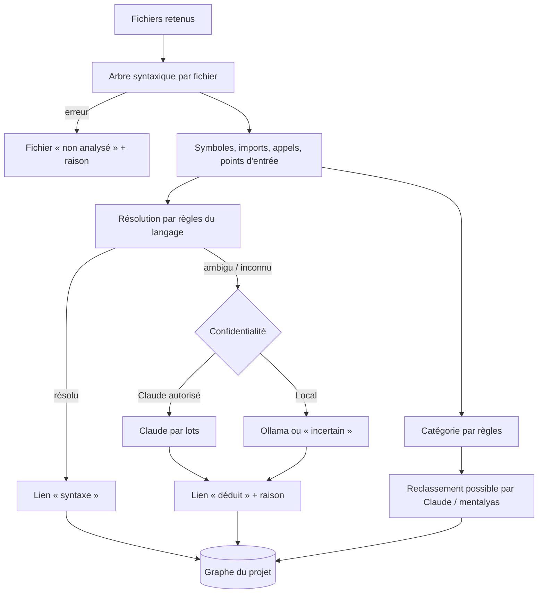

# Niveau 2 — Détail Fonctionnalité : R2 — Analyse statique multi-langage
> Projet : Gestionnaire_idées · Basé sur : L1f-reprise-projet.md (A1, A2, A4), L2-reprise-import.md
> Date : 2026-10-06 · Livraison : **MVP 1 — Voir**

## 1. Objectif de la fonctionnalité
Lire le code d'un projet repris **sans l'exécuter** et en tirer un **graphe** : modules, fichiers, classes et fonctions
(les nœuds), imports et appels (les liens), chacun rangé dans une catégorie (métier, orchestration, infrastructure,
plomberie). C'est la matière première de l'explorateur, du guide et du diagnostic.

> Analogie : un géomètre qui dresse le plan d'une ville sans y faire circuler de voitures. Il voit toutes les rues
> (les appels possibles) et les quartiers (les modules) ; il ne sait pas encore lesquelles sont embouteillées (ça, c'est
> la couche dynamique de la v3).

## 2. Use Cases précis

### UC-1 : Analyser un projet importé
- **Acteur :** l'app (déclenchée par l'import), ou mentalyas (« Réanalyser »)
- **Scénario nominal :**
  1. L'app liste les fichiers retenus (règles d'exclusion R1-5, R1-6).
  2. Chaque fichier TS / JS, C# ou PHP est découpé en arbre syntaxique ; l'app en extrait : symboles (classes,
     interfaces, fonctions, méthodes), imports (`import`, `using`, `use`), appels, et points d'entrée.
  3. Les appels sont **résolus** vers leur cible quand c'est possible (règles par langage, §4).
  4. Chaque symbole reçoit une **catégorie** proposée par des règles (§4).
  5. Le graphe est enregistré ; progression affichée (« 1 240 / 3 100 fichiers »), l'interface reste utilisable.
- **Scénarios alternatifs / erreurs :**
  - Fichier illisible ou syntaxe invalide → fichier marqué « non analysé » avec la raison ; l'analyse continue.
  - Langage non pris en charge → fichier visible dans l'arborescence seulement.
  - Annulation → le graphe précédent (s'il existe) reste intact.
- **Post-condition :** graphe du projet disponible, avec la liste des appels non résolus.

### UC-2 : Lever les ambiguïtés avec Claude (ou Ollama)
- **Acteur :** l'app, après UC-1
- **Scénario nominal :**
  1. Les appels **non résolus ou ambigus** (ex. `repo.Save()` avec trois classes qui ont `Save`) sont regroupés.
  2. En « Claude autorisé » : Claude reçoit, par lots, l'appel, son contexte court (quelques lignes) et les candidats ;
     il choisit la cible ou répond « indéterminé », avec une raison courte.
  3. En « Local uniquement » : même chose avec Ollama, ou appels laissés « incertains ».
  4. Claude peut aussi **reclasser** une catégorie proposée par les règles, avec justification.
- **Scénarios alternatifs :** quota Claude atteint → l'analyse reste utilisable, les liens incertains sont en pointillés.
- **Post-condition :** chaque lien a une **provenance** : `syntaxe` (sûr), `déduit par Claude/Ollama`, ou `incertain`.

### UC-3 : Réanalyser après des changements
- **Acteur :** mentalyas (« Réanalyser ») — automatique en v2 (suivi des changements)
- **Scénario nominal :** seuls les fichiers dont l'empreinte a changé sont relus ; les résolutions de Claude encore
  valables sont gardées ; les corrections de mentalyas (catégories) sont conservées.
- **Post-condition :** graphe à jour en une fraction du temps initial.

## 3. Workflow (Mermaid)

## 4. Règles métier
| # | Règle | Justification |
|---|-------|----------------|
| R2-1 | **Aucune exécution** : ni compilateur du projet, ni `dotnet`, ni `php`, ni `npm` ; seulement la lecture des fichiers | A1, sécurité |
| R2-2 | Niveaux de nœuds : **projet** → **module** (package npm, `.csproj`, dossier racine de `app/` Laravel…) → **dossier / namespace** → **fichier / classe** → **fonction / méthode** | Base du zoom de l'explorateur (R3) |
| R2-3 | Résolution TS / JS : imports relatifs, `paths` du `tsconfig.json`, `package.json` (exports) ; appels résolus par le symbole importé | Précision sans compilateur |
| R2-4 | Résolution C# : `namespace` + `using` + noms de classes du projet ; injection de dépendances (`AddScoped<IX, X>`) lue pour relier une interface à son implémentation | Pattern omniprésent en .NET |
| R2-5 | Résolution PHP / Laravel : namespaces PSR-4 du `composer.json` ; **routes** (`routes/*.php`) → contrôleurs ; modèles Eloquent ; façades connues | Les conventions Laravel cachent beaucoup d'appels |
| R2-6 | Catégories proposées par règles : **orchestration** (contrôleurs, routes, middlewares, `Program.cs`, `main`, handlers IPC) · **infrastructure** (accès BDD, ORM, HTTP, fichiers, file d'attente, cache) · **plomberie** (logs, conversion JSON, utilitaires génériques, getters / setters) · **métier** (le reste) | Grille du brainstorm Gemini ; filtre le bruit |
| R2-7 | Chaque lien porte sa provenance (`syntaxe`, `déduit`, `incertain`) ; un lien déduit garde sa raison courte | On ne présente jamais une déduction comme une certitude |
| R2-8 | Le code envoyé à Claude ou Ollama = **donnée**, jamais une instruction ; extraits courts (contexte de l'appel), jamais un fichier de secrets (R1-6) | Code non fiable, confidentialité |
| R2-9 | Les corrections de mentalyas (catégorie, cible d'un appel) priment sur les règles et sur Claude, et survivent aux réanalyses | L'humain a le dernier mot |
| R2-10 | L'analyse tourne hors du fil principal de l'app (processus de travail) ; l'interface reste fluide | Projets de milliers de fichiers |
| R2-11 | Points d'entrée détectés : routes HTTP, contrôleurs, `Main` / `Program.cs`, commandes CLI, handlers d'événements, tâches planifiées | Préparent le « parcours d'une fonctionnalité » (v2) |

## 5. Critères d'acceptation (Definition of Done)
- [ ] Sur trois projets de démonstration (TS, C#, Laravel) : modules, fichiers, classes, fonctions et appels extraits ;
      taux d'appels résolus « syntaxe » mesuré et affiché.
- [ ] Une erreur de syntaxe dans un fichier n'arrête pas l'analyse (test).
- [ ] Les liens Laravel route → contrôleur → modèle apparaissent (test sur fixture).
- [ ] En C#, une interface injectée est reliée à son implémentation (test sur fixture).
- [ ] En « Local uniquement », la résolution n'appelle jamais Claude (test).
- [ ] Réanalyser après la modification d'un fichier ne relit que ce fichier (test).
- [ ] Un commentaire piégé dans le code (« ignore tes consignes… ») ne change rien au comportement (test hostile).

## 6. Signal de complexité — Niveau 3 nécessaire ?
| Critère | Présent ? | Détail |
|---------|-----------|--------|
| Logique métier complexe (calculs, machine à états) | Oui | Résolution d'appels par langage, catégorisation, analyse incrémentale |
| Intégration API tierce | Oui | Bibliothèque d'analyse syntaxique (tree-sitter et grammaires), Claude / Ollama par lots |
| Données sensibles (paiement/santé/légal) | Oui | Extraits de code envoyés selon la confidentialité |
| Accès multi-rôles / permissions différenciées | Non | — |

**Recommandation :** Niveau 3 nécessaire (schéma du graphe, choix et intégration de l'analyseur, protocole des lots).
