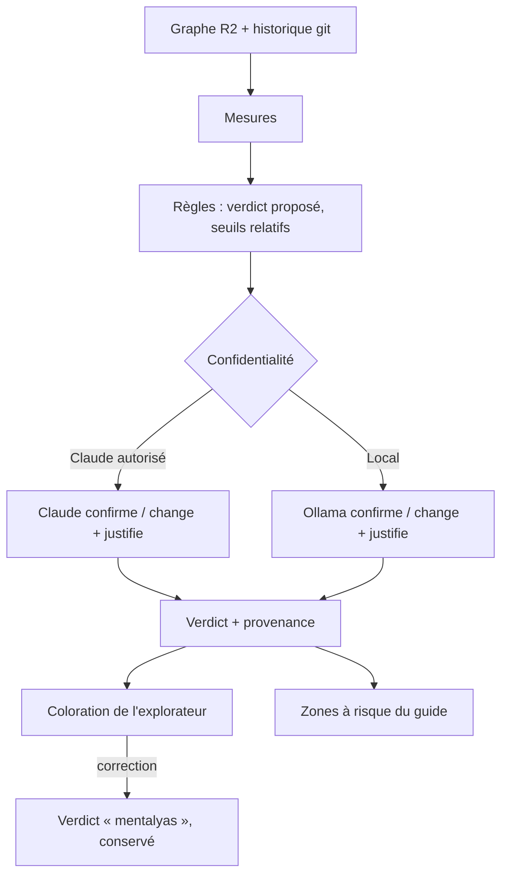

# Niveau 2 — Détail Fonctionnalité : R5 — Mesures et diagnostic en couleurs
> Projet : Gestionnaire_idées · Basé sur : L1f-reprise-projet.md (A3, A8), L2-reprise-analyse.md, L2-reprise-explorateur.md
> Date : 2026-10-06 · Livraison : **MVP 2 — Juger**

## 1. Objectif de la fonctionnalité
Dire, pour chaque partie du projet, **si on peut y toucher et comment** : solide, intouchable, fragile, améliorable ou
point d'extension. Le verdict part de **mesures calculées**, est **justifié par Claude** en langage simple, et
mentalyas peut le **corriger**.

> Analogie : l'inspection d'une maison avant achat. Les mesures sont celles de l'expert (humidité, fissures, âge de
> l'installation électrique) ; le verdict dit « mur porteur, ne pas casser », « fenêtre à changer » ou « bon endroit
> pour une extension ».

## 2. Les cinq verdicts (proposition à valider)
| Verdict | Couleur + icône | Sens pour un dev junior | Signaux principaux |
|---------|-----------------|------------------------|--------------------|
| **Solide** | Vert ✓ | « Ça marche, c'est testé, ça bouge peu : tu peux t'appuyer dessus. » | Tests liés, peu de modifications récentes, complexité modérée |
| **Intouchable** | Violet 🔒 | « Mur porteur : beaucoup de choses en dépendent. Ne pas modifier sans plan et sans tests. » | Beaucoup de dépendants, frontière critique (auth, paiement, migrations, contrats d'API publics) |
| **Fragile** | Rouge ⚠ | « Ça casse souvent ou personne ne vérifie : avance prudemment. » | Pas de tests + modifié souvent, ou très complexe, ou nombreux commits de correction |
| **Améliorable** | Jaune ✎ | « Ça marche mais ça mérite un coup de propre. » | Probablement mort (aucun appelant), très gros, dupliqué, `TODO` / `FIXME` |
| **Point d'extension** | Bleu ⊕ | « Prise électrique prévue pour brancher du neuf. » | Interface avec plusieurs implémentations, injection de dépendances, événements, registre de plugins, routes |

Un élément a **un verdict principal** et des **badges secondaires** (ex. : Intouchable + Fragile = mur porteur fissuré,
le cas le plus dangereux, mis en évidence).

## 3. Use Cases précis

### UC-1 : Calculer le diagnostic
- **Acteur :** l'app, après l'analyse (R2)
- **Scénario nominal :**
  1. L'app calcule les mesures (§5, R5-1) pour chaque fichier, classe et module.
  2. Des **règles** transforment les mesures en verdict proposé, avec des seuils **relatifs au projet** (ex. « parmi
     les 10 % les plus modifiés »).
  3. Claude (ou Ollama) relit chaque verdict proposé avec ses mesures et un extrait : il **confirme ou change**, et écrit
     une justification d'une ou deux phrases, analogie comprise.
  4. L'explorateur passe en coloration « diagnostic ».
- **Scénarios alternatifs :** projet sans git → mesures d'historique absentes, signalé ; verdicts calculés sans elles.
- **Post-condition :** chaque élément a un verdict, sa provenance (règles / Claude / mentalyas) et sa justification.

### UC-2 : Comprendre un verdict
- **Scénario nominal :** clic sur un élément → onglet « Diagnostic » : verdict, justification, mesures en clair
  (« modifié 23 fois en 6 mois, par 4 personnes ; aucun test ne l'utilise ; 18 fichiers en dépendent »).

### UC-3 : Corriger un verdict
- **Acteur :** mentalyas
- **Scénario nominal :** il choisit un autre verdict et peut ajouter une note (« en fait c'est l'ancien module, on va
  le supprimer »). Le verdict passe en provenance « mentalyas » et survit aux réanalyses.

### UC-4 : Vue d'ensemble
- **Scénario nominal :** au niveau Modules, chaque bloc montre la **répartition** de ses verdicts (barre) ; une liste
  « À surveiller » classe les éléments Intouchable + Fragile en tête. La section « Zones à risque » du guide (R4) est
  remplie à partir de cette liste.

## 4. Workflow (Mermaid)

## 5. Règles métier
| # | Règle | Justification |
|---|-------|----------------|
| R5-1 | Mesures MVP : tests liés (un fichier de test l'importe ou l'appelle), dépendants (nombre d'appelants), dépendances, taille (lignes), complexité approchée (branches, imbrication), modifications git sur 6 mois, nombre d'auteurs, date de dernière modification, commits de correction (« fix ») qui le touchent, `TODO` / `FIXME` | Mesures calculables sans exécuter le projet |
| R5-2 | Seuils relatifs au projet (percentiles), pas absolus | Un « gros fichier » n'a pas le même sens dans tous les projets |
| R5-3 | Le verdict n'est jamais présenté sans sa justification et ses mesures | Vérifiable, pédagogique (A8) |
| R5-4 | Priorité des provenances : mentalyas > Claude / Ollama > règles | L'humain a le dernier mot (A3) |
| R5-5 | Couleur **toujours accompagnée d'une icône** et d'un libellé | Accessibilité (daltonisme, WCAG) |
| R5-6 | Les mesures git lisent l'historique local (`git log` par chemin absolu, sans shell) ; aucun auteur n'est envoyé à Claude (seulement des nombres) | Données personnelles des collègues |
| R5-7 | Un verdict est un avis, pas une vérité : le libellé de l'onglet le dit (« diagnostic estimé ») | Pas de fausse certitude |

## 6. Critères d'acceptation (Definition of Done)
- [ ] Sur une fixture contrôlée, chaque verdict sort comme attendu des règles (tests par verdict).
- [ ] Chaque élément affiche verdict, justification, mesures et provenance.
- [ ] Une correction de mentalyas survit à une réanalyse (test).
- [ ] Aucun nom d'auteur git n'est envoyé à Claude (test).
- [ ] Couleur + icône + libellé partout ; axe sans violation.
- [ ] La section « Zones à risque » du guide reprend la liste « À surveiller ».

## 7. Signal de complexité — Niveau 3 nécessaire ?
| Critère | Présent ? | Détail |
|---------|-----------|--------|
| Logique métier complexe (calculs, machine à états) | Oui | Mesures, seuils relatifs, règles de verdict, priorité des provenances |
| Intégration API tierce | Oui | Historique git, Claude / Ollama |
| Données sensibles (paiement/santé/légal) | Oui | Historique des collègues (auteurs) |
| Accès multi-rôles / permissions différenciées | Non | — |

**Recommandation :** Niveau 3 nécessaire (formules, seuils, schéma des mesures et des verdicts).
