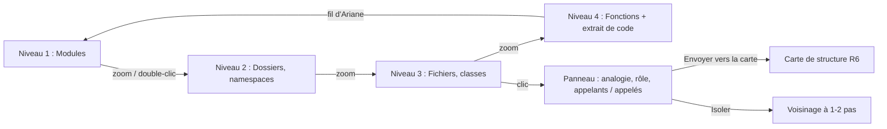

# Niveau 2 — Détail Fonctionnalité : R3 — Explorateur à niveaux
> Projet : Gestionnaire_idées · Basé sur : L1f-reprise-projet.md (A5, A8), L2-reprise-analyse.md
> Date : 2026-10-06 · Livraison : **MVP 1 — Voir**

## 1. Objectif de la fonctionnalité
Montrer le graphe d'un projet repris comme une **carte qu'on zoome** : de loin, les grands modules et leurs échanges ;
de près, les fichiers, puis les fonctions, puis le code. À chaque niveau, seul ce qui compte est visible : la plomberie
est masquée par défaut.

> Analogie : Google Maps. Dézoomé, on voit les pays et les autoroutes ; en zoomant, les villes, puis les rues, puis les
> numéros de maison. On ne voit jamais toutes les rues du pays en même temps.

## 2. Use Cases précis

### UC-1 : Naviguer par le zoom
- **Acteur :** mentalyas
- **Déclencheur :** ouverture de l'explorateur d'un projet repris (depuis le genesis)
- **Scénario nominal :**
  1. Vue de départ : **niveau 1 — Modules** (blocs + flèches dont l'épaisseur = nombre d'appels entre eux).
  2. Zoom (molette, pincement, ou double-clic sur un bloc) → **niveau 2 — Dossiers / namespaces** du bloc visé.
  3. Puis **niveau 3 — Fichiers / classes**, puis **niveau 4 — Fonctions / méthodes**, avec un **extrait de code** en
     lecture seule au niveau le plus fin.
  4. Un **fil d'Ariane** (Projet › Module › Dossier › Fichier) permet de remonter d'un clic.
- **Scénarios alternatifs :** projet sans modules clairs → le niveau 1 montre les dossiers racine.
- **Post-condition :** position et niveau mémorisés pour la prochaine ouverture.

### UC-2 : Lire un élément
- **Scénario nominal :** clic sur un nœud → panneau de détail :
  1. **Ce que c'est, en une analogie** (« le standard téléphonique : reçoit les requêtes et les passe au bon service »),
     puis le rôle technique en deux phrases (généré, R4).
  2. Catégorie, langage, fichiers, taille.
  3. **Qui l'appelle** / **qui il appelle** (liste cliquable), avec la provenance des liens (sûr / déduit / incertain).
  4. Actions : « Centrer », « Isoler », « Envoyer vers la carte de structure » (R6), « Ouvrir dans l'éditeur ».
- **Scénarios alternatifs :** élément non analysé → raison affichée.

### UC-3 : Filtrer le bruit
- **Scénario nominal :**
  1. Filtres par catégorie : **métier**, **orchestration**, **infrastructure** visibles ; **plomberie** masquée.
  2. Filtres par langage et par provenance des liens (masquer les « incertains »).
  3. **Isoler** un nœud : n'afficher que lui et ses voisins à 1 ou 2 pas.
  4. Recherche par nom (fichier, classe, fonction) → la carte se centre sur le résultat.
- **Post-condition :** filtres mémorisés par projet.

### UC-4 : Parcourir sans souris (accessibilité)
- **Scénario nominal :** une **vue liste** équivalente (arbre Projet › Module › … avec appelants / appelés) permet tout
  ce que permet la carte, au clavier et au lecteur d'écran.

## 3. Workflow (Mermaid)

## 4. Règles métier
| # | Règle | Justification |
|---|-------|----------------|
| R3-1 | À tout niveau, les liens vers des nœuds non affichés sont **agrégés** sur leur ancêtre visible (un seul trait, épaisseur = nombre d'appels) | Lisibilité ; même principe que la carte de structure (liens rattachés à l'ancêtre visible) |
| R3-2 | Au plus ~150 nœuds affichés à la fois ; au-delà, l'explorateur regroupe (« + 42 fichiers ») et invite à zoomer ou filtrer | Charge cognitive (loi de Miller) et performances |
| R3-3 | Plomberie masquée par défaut ; un compteur indique ce qui est caché (« 312 appels de plomberie masqués ») | On sait toujours ce qu'on ne voit pas |
| R3-4 | Liens : trait plein = sûr, tirets = déduit, pointillés = incertain ; couleur des nœuds = catégorie (MVP 1), puis diagnostic (MVP 2) avec **icône en plus de la couleur** | Ne jamais coder une information par la seule couleur (WCAG) |
| R3-5 | L'extrait de code est affiché en texte brut coloré, jamais interprété ni exécuté ; jamais un fichier de secrets | Code non fiable |
| R3-6 | Le badge de confidentialité du projet est visible en permanence | A4 |
| R3-7 | Mise en page calculée (couches de gauche à droite : orchestration → métier → infrastructure) et mémorisée ; mentalyas peut déplacer un nœud | Lecture naturelle du flux entrée → cœur → sorties |
| R3-8 | Cible de fluidité : projet de 5 000 fichiers / 50 000 appels navigable sans saccade (≥ 30 images/s au niveau affiché) | Moteur de rendu à choisir au niveau 3 |

## 5. Critères d'acceptation (Definition of Done)
- [ ] Les 4 niveaux s'enchaînent au zoom et par double-clic ; le fil d'Ariane remonte à n'importe quel niveau.
- [ ] Les liens agrégés montrent le bon nombre d'appels (test sur fixture).
- [ ] Plomberie masquée par défaut, compteur exact, réaffichage d'un clic.
- [ ] « Isoler » et la recherche fonctionnent sur la fixture de 5 000 fichiers sans saccade (mesure).
- [ ] La vue liste offre les mêmes informations au clavier ; axe sans violation.
- [ ] Sens des traits (plein / tirets / pointillés) expliqué dans une légende.

## 6. Signal de complexité — Niveau 3 nécessaire ?
| Critère | Présent ? | Détail |
|---------|-----------|--------|
| Logique métier complexe (calculs, machine à états) | Oui | Agrégation des liens par niveau, mise en page en couches, regroupements |
| Intégration API tierce | Oui | Moteur de rendu de graphe pour milliers de nœuds (WebGL ou équivalent) |
| Données sensibles (paiement/santé/légal) | Non | Affichage local |
| Accès multi-rôles / permissions différenciées | Non | — |

**Recommandation :** Niveau 3 nécessaire (choix du moteur de rendu, agrégation, mise en page, performances).
