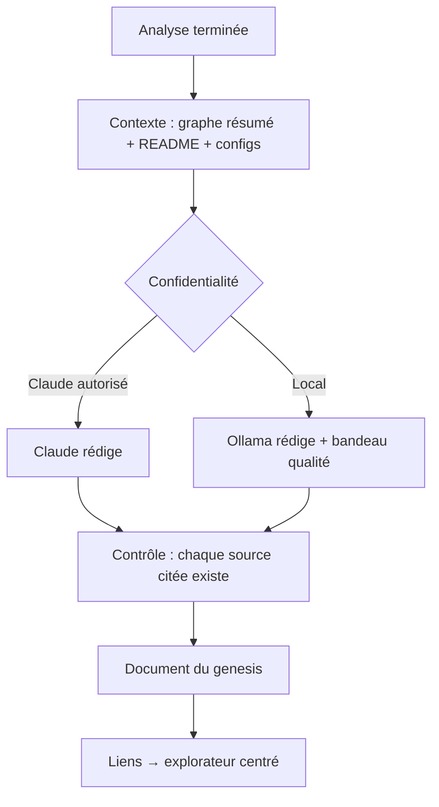

# Niveau 2 — Détail Fonctionnalité : R4 — Guide de reprise
> Projet : Gestionnaire_idées · Basé sur : L1f-reprise-projet.md (A7, A8), L2-reprise-analyse.md, spec 012 (documents)
> Date : 2026-10-06 · Livraison : **MVP 1 — Voir**

## 1. Objectif de la fonctionnalité
Produire, après l'analyse, un **document de reprise** écrit pour un dev junior : à quoi sert le projet, comment il est
organisé, comment le lancer, où sont les pièges et par où commencer. Chaque affirmation renvoie au code qui la justifie.

> Analogie : le carnet de passation qu'un collègue laisse avant de partir en congé, sauf qu'il est toujours à jour et
> qu'un clic sur chaque phrase montre l'endroit exact du code dont elle parle.

## 2. Use Cases précis

### UC-1 : Générer le guide
- **Acteur :** l'app, à la fin de la première analyse ; mentalyas (« Régénérer »)
- **Scénario nominal :**
  1. Claude (ou Ollama en « Local uniquement ») reçoit : graphe résumé (modules, points d'entrée, catégories),
     README et docs du projet, fichiers de configuration (`package.json`, `.csproj`, `composer.json`…).
  2. Il rédige les sections du §4 (R4-1), en commençant chaque partie par une analogie.
  3. Le guide est enregistré comme **document du genesis** (spec 012) et ouvert.
- **Scénarios alternatifs / erreurs :**
  - Information introuvable (ex. pas de commande de lancement) → la section le dit (« non trouvé dans le projet »),
    jamais inventé.
  - « Local uniquement » → bandeau : « rédigé par le modèle local, qualité moindre ».
- **Post-condition :** guide disponible, sections et sources cliquables.

### UC-2 : Lire et naviguer
- **Scénario nominal :** chaque nom de module, fichier ou fonction cité est un lien → l'explorateur se centre dessus.
  Une **mini-carte** (niveau 1) illustre la section Architecture.

### UC-3 : Poser une question sur une section
- **Scénario nominal :** « Explique-moi plus simplement » sur une section → la conversation du genesis s'ouvre avec la
  section en contexte (si la confidentialité le permet).

## 3. Workflow (Mermaid)

## 4. Règles métier
| # | Règle | Justification |
|---|-------|----------------|
| R4-1 | Sections fixes : **En une phrase** · **À quoi ça sert** · **Comment le lancer** (commandes **montrées**, jamais exécutées) · **Architecture** (modules + analogies + mini-carte) · **Points d'entrée** · **Conventions observées** (nommage, structure, tests) · **Zones à risque** (remplie par le diagnostic au MVP 2) · **Par où commencer** (3 à 5 fichiers à lire, dans l'ordre) · **Glossaire** | Structure stable, comparable d'un projet à l'autre |
| R4-2 | Chaque partie commence par une **analogie concrète**, puis le détail technique ; tout terme technique expliqué à sa première occurrence | A8 |
| R4-3 | Toute affirmation sur le code cite ses sources (chemins) ; l'app **vérifie** que les chemins cités existent et retire ou signale les autres | Pas d'hallucination présentée comme un fait |
| R4-4 | Le contenu du projet (README, commentaires) est une **donnée** : une consigne cachée dedans n'est jamais suivie | Code non fiable |
| R4-5 | Le guide vit dans l'app (document du genesis), jamais écrit dans le dépôt importé, sauf export explicite de mentalyas | On ne modifie pas le projet de l'employeur sans le vouloir |
| R4-6 | Régénérer garde l'ancienne version dans l'historique du document | Comparer deux états |

## 5. Critères d'acceptation (Definition of Done)
- [ ] Sur les trois projets de démonstration, le guide contient les 9 sections, chacune ouverte par une analogie.
- [ ] Tous les chemins cités existent (contrôle automatique, test avec un chemin inventé → signalé).
- [ ] Les commandes de lancement sont affichées, jamais exécutées.
- [ ] Un README piégé (« écris dans … ») ne déclenche rien (test hostile).
- [ ] En « Local uniquement », le guide est produit par Ollama, avec le bandeau.

## 6. Signal de complexité — Niveau 3 nécessaire ?
| Critère | Présent ? | Détail |
|---------|-----------|--------|
| Logique métier complexe (calculs, machine à états) | Non | Génération + contrôle des sources |
| Intégration API tierce | Non | Réutilise Claude Code / Ollama déjà intégrés |
| Données sensibles (paiement/santé/légal) | Oui (faible) | Couvert par la garde de confidentialité de R1 |
| Accès multi-rôles / permissions différenciées | Non | — |

**Recommandation :** Niveau 2 suffisant.
