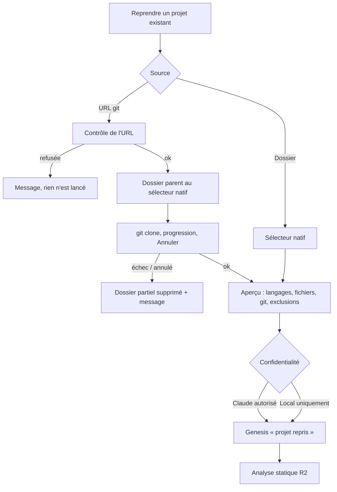

# Niveau 2 — Détail Fonctionnalité : R1 — Import d'un projet et confidentialité
> Projet : Gestionnaire_idées · Basé sur : L1f-reprise-projet.md (A4, A6), L1e-chirurgie-projet.md, spec 016
> Date : 2026-10-06 · Livraison : **MVP 1 — Voir**

## 1. Objectif de la fonctionnalité
Faire entrer dans l'app un projet écrit par d'autres (dossier local ou dépôt GitHub), en choisissant dès le départ si
son code peut être envoyé à Claude. Le projet devient un **genesis « projet repris »**, point de départ de l'analyse.

> Analogie : c'est l'accueil d'un musée. On dépose le projet au vestiaire (le dossier), on choisit son badge
> (« visite guidée par Claude » ou « visite libre, rien ne sort »), et la visite commence.

## 2. Use Cases précis

### UC-1 : Importer un dossier local
- **Acteur :** mentalyas
- **Déclencheur :** bouton « Reprendre un projet existant » (accueil de la carte) → « Depuis un dossier »
- **Scénario nominal :**
  1. Le sélecteur natif s'ouvre ; mentalyas choisit le dossier.
  2. L'app affiche un aperçu : nom, langages détectés (TS / C# / PHP), nombre de fichiers retenus, dépôt git ou non.
  3. mentalyas choisit le niveau de confidentialité (UC-3) et valide.
  4. Un genesis « projet repris » est créé, lié au dossier ; l'analyse (R2) démarre.
- **Scénarios alternatifs / erreurs :**
  - Dossier de données de l'app ou un de ses parents → refusé (« dossier réservé à l'app »).
  - Aucun langage reconnu → import possible, mais l'explorateur n'aura que l'arborescence (message clair).
  - Dossier déjà lié à un genesis → proposer d'ouvrir ce genesis plutôt que d'en créer un second.
  - Projet trop gros (au-delà des limites R1-R5) → aperçu avec ce qui sera ignoré ; mentalyas peut choisir un
    sous-dossier.
- **Post-condition :** genesis créé, dossier lié, niveau de confidentialité enregistré.

### UC-2 : Cloner un dépôt GitHub
- **Acteur :** mentalyas
- **Déclencheur :** « Reprendre un projet existant » → « Depuis GitHub (ou une URL git) »
- **Scénario nominal :**
  1. mentalyas colle l'URL (`https://…` ou `git@…`).
  2. Il choisit le dossier parent au sélecteur natif (défaut proposé : la racine des projets, spec 016).
  3. L'app lance `git clone` (git de mentalyas, identifiants gérés par git) ; progression affichée, bouton Annuler.
  4. À la fin : même suite qu'UC-1 à partir de l'étape 2.
- **Scénarios alternatifs / erreurs :**
  - URL d'un autre format (`ext::`, `file://`, chemin, option commençant par `-`) → refusée avant tout lancement.
  - Authentification demandée / refusée → message : « git n'a pas pu s'authentifier : connecte-toi avec ton
    gestionnaire git habituel, puis réessaie » (l'app ne demande jamais de mot de passe ni de jeton).
  - Dossier cible déjà existant et non vide → refus, proposer un autre nom.
  - Annulation ou échec → le dossier partiellement cloné est supprimé (il a été créé par l'app, jamais un autre).
  - git introuvable → message d'installation.
- **Post-condition :** dépôt cloné localement, puis comme UC-1.

### UC-3 : Choisir et changer le niveau de confidentialité
- **Acteur :** mentalyas
- **Scénario nominal :**
  1. À l'import, deux choix explicites, sans valeur présélectionnée : **« Claude autorisé »** ou **« Local uniquement »**,
     avec une phrase sur la conséquence de chacun.
  2. Le niveau est affiché en permanence (badge) sur l'explorateur, la carte et le chat du projet.
  3. Il peut être changé plus tard dans le menu du genesis.
- **Scénarios alternatifs :**
  - Local → Claude : confirmation (« le code de ce projet pourra être envoyé à Claude »).
  - Claude → Local : immédiat ; l'app prévient que ce qui a déjà été envoyé ne peut pas être rappelé.
- **Post-condition :** toutes les fonctions du projet respectent le niveau courant (R1-R7).

## 3. Workflow (Mermaid)

## 4. Règles métier
| # | Règle | Justification |
|---|-------|----------------|
| R1-1 | Le chemin d'un projet vient **uniquement** du sélecteur natif (ou du clone dans un dossier choisi au sélecteur), jamais d'un texte de l'interface | Constitution I (pas de chemin forgé) |
| R1-2 | URL acceptée : `https://hôte/…` ou `git@hôte:…` ; tout le reste refusé ; l'URL est passée à git après `--` | Les transports `ext::` / `file://` peuvent exécuter des commandes ; une URL commençant par `-` serait lue comme une option |
| R1-3 | git lancé par chemin absolu, sans shell ; aucun hook ni sous-module n'est exécuté ; **rien** du projet n'est lancé (installation, build, scripts) | Code importé = non fiable |
| R1-4 | Le dossier de données de l'app (et ses parents) ne peut jamais être importé | Même règle que `--add-dir` (spec 014) |
| R1-5 | Fichiers ignorés d'office : `.git/`, `node_modules/`, `vendor/`, `bin/`, `obj/`, `dist/`, `build/`, `.next/`, fichiers listés par `.gitignore`, binaires, fichiers > 1 Mo | Bruit, taille, performances |
| R1-6 | Fichiers **jamais lus ni envoyés**, quel que soit le niveau : `.env*`, `*.pem`, `*.key`, `*.pfx`, `*.p12`, `appsettings.*.json` contenant des secrets probables, `id_rsa*` | Secrets d'un employeur |
| R1-7 | « Local uniquement » : aucune donnée du projet n'est envoyée à Claude (analyse, guide, diagnostic, chat) ; les fonctions qui en ont besoin passent par Ollama ou sont désactivées avec explication | A4 ; vérifié par un test automatique |
| R1-8 | Les liens symboliques ne sont pas suivis hors du dossier du projet | Évite de lire hors du périmètre |
| R1-9 | Limites indicatives MVP : 20 000 fichiers retenus ; au-delà, choisir un sous-dossier | Temps d'analyse ; à mesurer au niveau 3 |

## 5. Critères d'acceptation (Definition of Done)
- [ ] Importer un dossier TS, un dossier C# et un dossier Laravel crée un genesis « projet repris » par projet.
- [ ] Cloner un dépôt public par `https://` fonctionne, avec progression et annulation (dossier partiel supprimé).
- [ ] Les URL `ext::sh -c …`, `file:///…`, `--upload-pack=…` sont refusées sans lancer git (tests).
- [ ] Le dossier de données de l'app est refusé (test).
- [ ] Un `.env` présent dans le projet n'apparaît nulle part (explorateur, contexte Claude, guide) (test).
- [ ] En « Local uniquement », aucun appel à Claude n'est possible pour ce projet (test d'intégration).
- [ ] Le badge de confidentialité est visible sur l'explorateur, la carte et le chat ; axe sans violation.

## 6. Signal de complexité — Niveau 3 nécessaire ?
| Critère | Présent ? | Détail |
|---------|-----------|--------|
| Logique métier complexe (calculs, machine à états) | Oui | États du clone (en cours, annulé, échoué, prêt), confidentialité qui gouverne toutes les autres fonctions |
| Intégration API tierce | Oui | git (processus externe), sélecteur natif |
| Données sensibles (paiement/santé/légal) | Oui | Code et secrets d'un employeur |
| Accès multi-rôles / permissions différenciées | Non | Un seul utilisateur |

**Recommandation :** Niveau 3 nécessaire (validation d'URL, filtrage des secrets, garde de confidentialité transverse).
