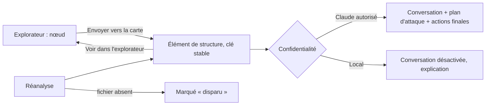

# Niveau 2 — Détail Fonctionnalité : R6 — Pont explorateur ↔ carte de structure
> Projet : Gestionnaire_idées · Basé sur : L1f-reprise-projet.md (A4, A5), L3-carte-structure.md (spec 009),
> L2-reprise-explorateur.md, L2-reprise-diagnostic.md · Date : 2026-10-06 · Livraison : **MVP 2 — Juger**

## 1. Objectif de la fonctionnalité
Passer de « comprendre » à « travailler » : un élément repéré dans l'explorateur est **envoyé vers la carte de
structure** du projet, où il devient un neurone avec sa conversation, son plan d'attaque et ses actions finales. Dans
l'autre sens, un élément de la carte rouvre l'explorateur centré sur lui.

> Analogie : l'explorateur est l'atlas, la carte de structure est l'établi. On repère la pièce dans l'atlas, on la pose
> sur l'établi pour la travailler, et on peut toujours retourner voir où elle se trouve dans l'ensemble.

## 2. Use Cases précis

### UC-1 : Envoyer un élément vers la carte
- **Acteur :** mentalyas
- **Déclencheur :** « Envoyer vers la carte de structure » (panneau de détail ou sélection multiple)
- **Scénario nominal :**
  1. L'élément devient un élément de structure (spec 009) du genesis : type déduit (module, composant, interface,
     donnée), titre, chemins, résumé en analogie, verdict de diagnostic.
  2. Ses liens avec les éléments déjà sur la carte sont repris (`appelle`, `depend_de`).
  3. Il apparaît sur la carte, mis en évidence.
- **Scénarios alternatifs :** déjà présent → mis à jour par sa clé (`composant:<chemin>`), jamais dupliqué.
- **Post-condition :** élément de structure lié à son nœud de l'explorateur.

### UC-2 : Retrouver un élément de la carte dans l'explorateur
- **Scénario nominal :** « Voir dans l'explorateur » sur un élément de structure → l'explorateur s'ouvre au bon niveau,
  centré et isolé sur lui.

### UC-3 : Travailler sur un élément
- **Scénario nominal :** depuis la carte, la conversation de l'élément s'ouvre (spec 008) avec, en plus du contexte
  habituel, ses **appelants, appelés et son diagnostic** ; plan d'attaque et actions finales comme pour tout élément.
- **Scénarios alternatifs :** projet en « Local uniquement » → la conversation Claude est **désactivée** pour ce projet
  (explication + lien pour changer le niveau) ; les autres actions restent possibles.

### UC-4 : Rester à jour après une réanalyse
- **Scénario nominal :** une réanalyse met à jour le diagnostic et les liens des éléments envoyés ; un élément dont le
  fichier a disparu est marqué **« disparu »**, jamais supprimé d'office.

## 3. Workflow (Mermaid)

## 4. Règles métier
| # | Règle | Justification |
|---|-------|----------------|
| R6-1 | Clé stable d'un élément envoyé = clé de la carte de structure (`composant:<chemin relatif>`, `module:<nom>`) | Réutilise R3 de la spec 009 : pas de doublons |
| R6-2 | Seuls les éléments **choisis** vont sur la carte ; le graphe complet reste dans l'explorateur | A5 : la carte reste lisible (≤ 12 enfants conseillés par élément) |
| R6-3 | Le contexte d'une conversation d'élément inclut ses appelants / appelés (noms et chemins) et son diagnostic ; jamais un fichier de secrets | Claude travaille avec la vraie carte du code |
| R6-4 | « Local uniquement » ⇒ aucune conversation Claude, aucun outil MCP de lecture du graphe pour ce projet | A4 |
| R6-5 | Un élément « disparu » n'est retiré qu'à la demande de mentalyas (annulable, Historique) | Rien ne disparaît sans qu'il le décide |
| R6-6 | Claude peut lire le graphe par le pont MCP (nouvel outil de lecture, R2) pour répondre sur le projet ; il ne le modifie pas | Lecture libre, écriture gouvernée (constitution) |

## 5. Critères d'acceptation (Definition of Done)
- [ ] Envoyer deux fois le même élément ne crée pas de doublon (test).
- [ ] « Voir dans l'explorateur » centre et isole le bon nœud.
- [ ] La conversation d'un élément envoyé cite ses appelants et son diagnostic dans le contexte (test).
- [ ] En « Local uniquement », la conversation est désactivée avec explication (test).
- [ ] Un fichier supprimé puis réanalysé → élément « disparu », toujours présent (test).

## 6. Signal de complexité — Niveau 3 nécessaire ?
| Critère | Présent ? | Détail |
|---------|-----------|--------|
| Logique métier complexe (calculs, machine à états) | Non | Réutilise l'upsert par clé de la spec 009 |
| Intégration API tierce | Non | Pont MCP existant (un outil de lecture en plus) |
| Données sensibles (paiement/santé/légal) | Oui (faible) | Couvert par la garde de confidentialité |
| Accès multi-rôles / permissions différenciées | Non | — |

**Recommandation :** Niveau 2 suffisant.
