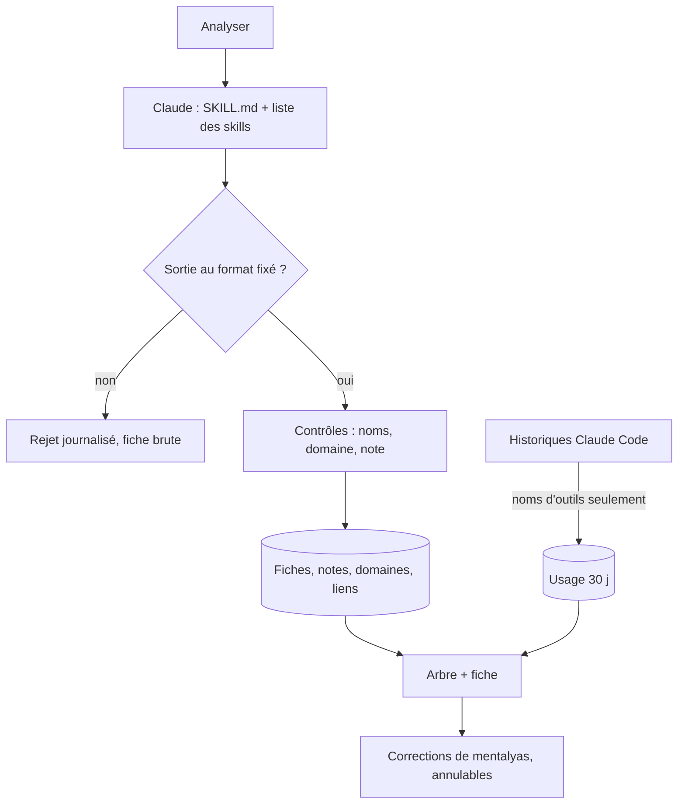

# Niveau 2 — Détail Fonctionnalité : SK-B — Comprendre et noter les skills
> Projet : Gestionnaire_idées · Basé sur : L1h-arbre-de-skills.md (A2, A3, A6), L2-skills-voir.md
> Date : 2026-10-07 · Livraison : **lot B**

## 1. Objectif de la fonctionnalité
Transformer chaque `SKILL.md` en une **fiche technique** claire (ce qu'il fait, quand l'utiliser, quand ne pas
l'utiliser), lui donner une **note de qualité** justifiée, un **domaine** (sa branche) et des **liens de sens** avec les
autres skills ; montrer à côté son **usage réel**.

> Analogie : la fiche d'un objet dans un jeu — description, statistiques, rareté, objets compatibles ; et le compteur
> de combien de fois on s'en est servi.

## 2. Use Cases précis

### UC-1 : Analyser la toile
- **Acteur :** mentalyas (« Analyser les skills », toute la toile ou un skill) ; automatique pour un skill nouveau ou
  modifié (sur sa demande, pas en arrière-plan)
- **Scénario nominal :**
  1. Claude reçoit, pour chaque skill à analyser, son `SKILL.md` (borné) et la liste des autres skills (noms +
     descriptions).
  2. Il rend, au format fixé : fiche (résumé, quand l'utiliser, quand l'éviter, déclencheurs, entrées / sorties,
     exemples d'usage), note de qualité 1–5 avec une justification par critère, domaine, liens de sens proposés
     (« enchaîne vers », « complète », « alternative à ») avec justification.
  3. L'app vérifie (noms de skills existants, domaine connu ou nouveau proposé, note bornée) et enregistre.
- **Scénarios alternatifs / erreurs :**
  - Réponse invalide → rejetée, journalisée ; la fiche brute (`SKILL.md`) reste affichée.
  - Skill de plugin → fiche et note produites, mais aucune modification possible (A8).
- **Post-condition :** fiches, étoiles, branches, liens pointillés visibles.

### UC-2 : Compter l'usage
- **Scénario nominal :** l'app parcourt les historiques de Claude Code (fichiers `.jsonl` des 30 derniers jours) et ne
  retient que les appels de l'outil `Skill` (nom du skill) et les commandes `/nom` tapées ; elle affiche « 12 appels / 30 j »
  et la date du dernier appel. Recalcul à l'ouverture de la page (au plus une fois par heure).

### UC-3 : Corriger
- **Scénario nominal :** mentalyas change la note (sa note prime, marquée « toi »), le domaine d'un skill, ajoute ou
  retire un lien ; tout est annulable.

## 3. Workflow (Mermaid)

## 4. Règles métier
| # | Règle | Justification |
|---|-------|----------------|
| SB-1 | **Grille de qualité** fixe, 4 critères notés 0–5 : clarté des déclencheurs (quand l'appeler), profondeur (méthode, étapes), garde-fous (sécurité, confirmations, limites), exemples / gabarits ; étoiles = moyenne arrondie, au moins 1 | Note comparable et explicable |
| SB-2 | La note de mentalyas **prime** sur celle de Claude et n'est pas écrasée par une nouvelle analyse | Il connaît l'usage réel |
| SB-3 | Domaines de départ : Projet & organisation, Design & UI, Docs & cours, Code & qualité, Données & IA, Photo & médias, Divers ; Claude peut proposer un nouveau domaine (validé par mentalyas) | Branches stables |
| SB-4 | Lien de sens accepté seulement entre deux skills inventoriés, jamais vers soi, justification ≤ 200 car. | Pas de lien inventé |
| SB-5 | **Usage** : seuls le nom de l'outil `Skill`, son argument `skill` et les balises de commande `/nom` sont lus ; aucun autre texte n'est gardé ni envoyé à Claude ; compte agrégé par skill | Minimisation (constitution IV) |
| SB-6 | Analyse par Claude seulement à la demande ; skill inchangé (même empreinte du fichier) → pas de réanalyse | Coût maîtrisé |

## 5. Critères d'acceptation (Definition of Done)
- [ ] « Analyser les skills » produit une fiche, une note justifiée par critère, un domaine et des liens pour chaque skill.
- [ ] Une sortie qui cite un skill inexistant est écartée (test).
- [ ] L'usage de `hub` sur 30 jours correspond au nombre d'appels réels (test sur historiques fictifs) ; aucun texte de
      conversation n'est conservé (test).
- [ ] La note corrigée par mentalyas survit à une nouvelle analyse ; annulation possible.

## 6. Signal de complexité — Niveau 3 nécessaire ?
| Critère | Présent ? | Détail |
|---------|-----------|--------|
| Logique métier complexe | Oui | Grille, contrôles, priorité des corrections |
| Intégration API tierce | Oui | Tâche Claude (`claude -p`) |
| Données sensibles | Oui | Historiques de Claude Code |
| Multi-rôles | Non | — |

**Recommandation :** **Niveau 3** : schéma de sortie, lecture minimale des historiques, tables.
