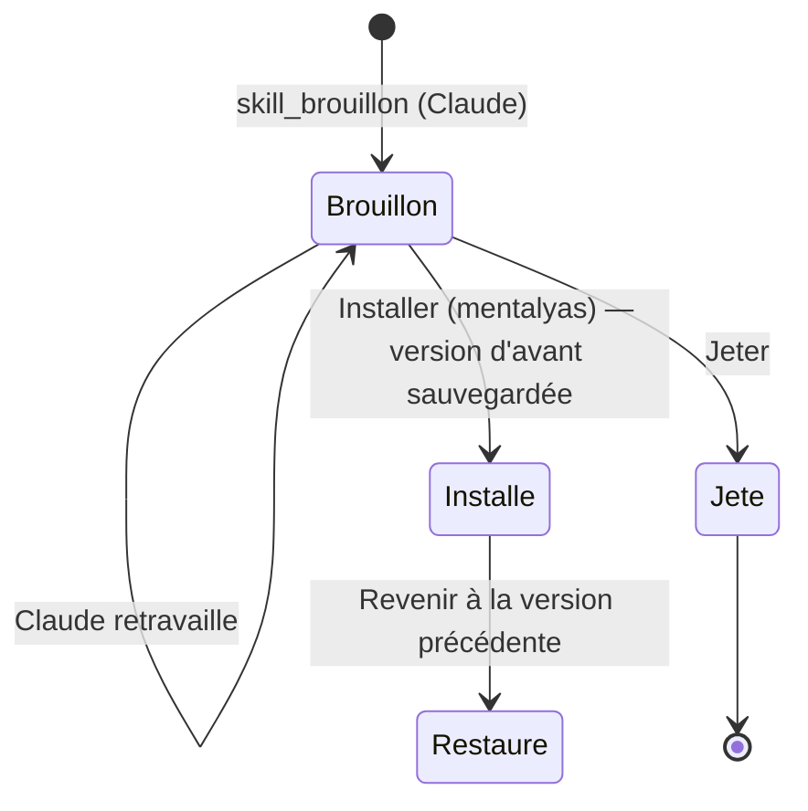

# Niveau 2 — Détail Fonctionnalité : SK-C — Faire évoluer ses skills avec Claude
> Projet : Gestionnaire_idées · Basé sur : L1h-arbre-de-skills.md (A4, A7, A8), L2-skills-comprendre.md
> Date : 2026-10-07 · Livraison : **lot C**

## 1. Objectif de la fonctionnalité
Brainstormer avec Claude **sur les skills seulement** : en créer, en améliorer, en combiner, apprendre à s'en servir ;
toute modification passe par un **brouillon** que mentalyas relit avant d'**installer**, et chaque version installée peut
être rétablie.

> Analogie : l'atelier de forge du jeu. On essaie une amélioration sur l'établi (brouillon), on compare avec l'arme
> actuelle, puis on l'équipe — et l'ancienne reste au coffre si la nouvelle déçoit.

## 2. Use Cases précis

### UC-1 : Conversation « Skills »
- **Acteur :** mentalyas (volet de droite sans sélection)
- **Scénario nominal :** conversation Claude Code dédiée, avec en contexte la toile (noms, descriptions, domaines, notes,
  liens) ; Claude répond, propose des combinaisons, des techniques d'usage, des skills à créer ; il dessine des brouillons
  avec l'outil `skill_brouillon`.

### UC-2 : Conversation d'un skill
- **Scénario nominal :** skill sélectionné → sa fiche + sa conversation (contexte : son `SKILL.md`, ses fichiers, ses liens,
  son usage) ; « Améliore la section déclencheurs » → Claude produit un brouillon de ce skill.

### UC-3 : Brouillon → revue → installation
- **Scénario nominal :**
  1. Claude appelle `skill_brouillon` (nom, en-tête, contenu, fichiers annexes texte) : le brouillon est enregistré dans
     l'app, **rien n'est écrit sur le disque**.
  2. Le volet affiche le brouillon : fiche, différences avec la version installée (ou « nouveau skill »).
  3. mentalyas clique **Installer** : l'app sauvegarde la version installée, écrit le nouveau `SKILL.md` (et annexes)
     dans le dossier du skill, l'arbre se met à jour.
  4. **Revenir à la version précédente** : restaure la dernière version sauvegardée (confirmation).
- **Scénarios alternatifs / erreurs :**
  - Skill de plugin → « Dupliquer en skill personnel » crée un brouillon personnel de même contenu ; le plugin n'est
    jamais modifié.
  - Skill de projet → écrit dans le dépôt du projet ; jamais commité par l'app (git du projet).
  - Nom de skill déjà pris (création) → refus, nom à changer.
  - Le fichier a changé sur le disque depuis le brouillon (édité ailleurs) → avertissement, différences recalculées,
    installation à reconfirmer.

## 3. Workflow (Mermaid)

## 4. Règles métier
| # | Règle | Justification |
|---|-------|----------------|
| SC-1 | Claude n'écrit **jamais** directement dans un dossier de skills : seul l'outil `skill_brouillon` (données dans l'app) ; l'écriture sur disque est un geste de mentalyas (« Installer ») exécuté par le main | A4 ; un skill change Claude partout |
| SC-2 | Écriture limitée aux dossiers de skills personnels et de projets liés ; nom de skill `[a-z0-9-]{1,64}` ; fichiers annexes texte, chemins relatifs sans remontée ; pas de script dans un brouillon de Claude (les scripts ne viennent que d'un import revu, lot D) | Sécurité |
| SC-3 | Chaque installation sauvegarde la version remplacée (dossier du profil, 10 versions par skill) ; « Revenir » restaure la dernière | Retour arrière |
| SC-4 | Les conversations Skills ont pour dossier de travail un espace dédié du profil (lecture des skills autorisée par l'app) ; leurs outils de fichiers suivent le mode de permission, mais l'écriture dans les dossiers de skills passe par le brouillon | Pas de contournement |
| SC-5 | Le brouillon est historisé (création, modifications) ; « Installer » et « Revenir » sont des lots annulables (fichiers rétablis) | Constitution II |

## 5. Critères d'acceptation (Definition of Done)
- [ ] Dans la conversation d'un skill, « améliore ses déclencheurs » produit un brouillon et ses différences ; rien sur le
      disque avant « Installer ».
- [ ] Installer puis Revenir rend le fichier identique à l'original (test).
- [ ] Un brouillon visant un chemin hors des dossiers de skills, un nom invalide ou un script est refusé (tests).
- [ ] Dupliquer un skill de plugin ne touche pas le plugin.
- [ ] Conversation « Skills » : Claude propose une combinaison de deux skills en citant leurs fiches.

## 6. Signal de complexité — Niveau 3 nécessaire ?
| Critère | Présent ? | Détail |
|---------|-----------|--------|
| Logique métier complexe | Oui | Cycle brouillon / installé / versions, conflit disque |
| Intégration API tierce | Oui | Conversations Claude Code, nouvel outil MCP |
| Données sensibles | Oui | Écriture hors du projet, comportement global de Claude |
| Multi-rôles | Non | — |

**Recommandation :** **Niveau 3** : outil `skill_brouillon`, chemins, versions, amendement éventuel de la constitution.
