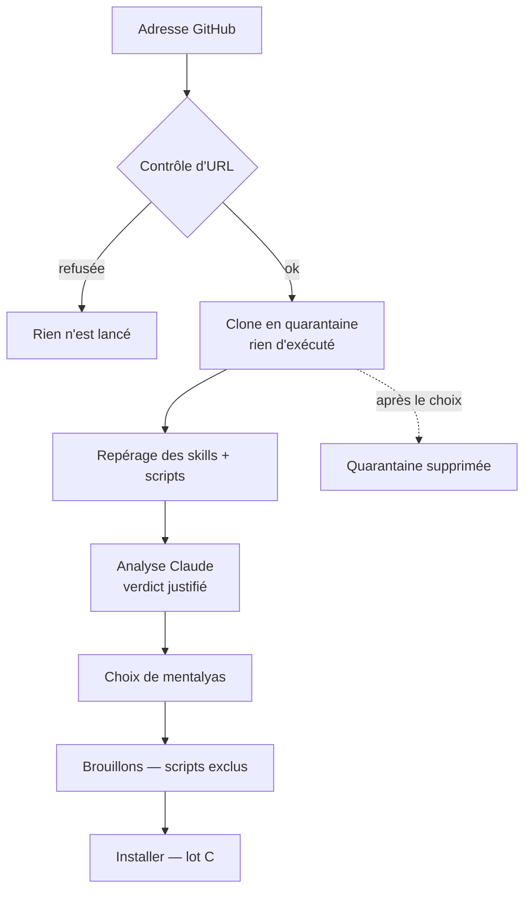

# Niveau 2 — Détail Fonctionnalité : SK-D — Importer des skills depuis GitHub
> Projet : Gestionnaire_idées · Basé sur : L1h-arbre-de-skills.md (A5), L2-skills-evoluer.md, spec 017 US5 (clone)
> Date : 2026-10-07 · Livraison : **lot D**

## 1. Objectif de la fonctionnalité
Faire grandir la toile avec des skills partagés sur GitHub, **sans risque** : le dépôt arrive en quarantaine, Claude
l'analyse, mentalyas choisit ce qu'il garde, et chaque skill gardé passe par le même circuit brouillon → revue →
installation.

> Analogie : la douane. La marchandise arrive dans une zone fermée, on l'inspecte, on garde ce qui est conforme ; rien
> n'entre dans la maison sans tampon.

## 2. Use Cases précis

### UC-1 : Importer un dépôt
- **Acteur :** mentalyas (« Importer depuis GitHub », ou demande dans la conversation Skills)
- **Scénario nominal :**
  1. Il colle l'adresse (`https://github.com/…` ou `git@…`) ; l'app la contrôle (formes acceptées, identifiants retirés,
     transports dangereux refusés).
  2. Clone superficiel en **quarantaine** (dossier du profil), git par chemin absolu, sans hooks ni sous-modules ; rien
     n'est exécuté.
  3. L'app repère les skills du dépôt (`SKILL.md`), leurs fichiers, et marque les fichiers exécutables (scripts, binaires).
  4. Claude analyse chaque skill (lecture seule) : rôle, consignes cachées ou dangereuses (exfiltration, désactivation de
     garde-fous, commandes destructrices), scripts et accès réseau, recoupement avec les skills existants ; verdict
     **sûr / à revoir / dangereux** avec justification.
  5. Écran de choix : liste des skills avec verdict, fiche, fichiers ; cases à cocher.
  6. Les skills cochés deviennent des **brouillons** (lot C) ; les scripts sont **exclus**, à réintégrer fichier par
     fichier avec un avertissement ; « Installer » comme pour tout brouillon.
- **Scénarios alternatifs / erreurs :**
  - Adresse refusée, dépôt introuvable, privé sans accès, trop gros (> 50 Mo, > 2 000 fichiers) → message clair, rien
    n'est gardé.
  - Verdict « dangereux » → case décochée et verrouillée par défaut ; mentalyas peut la débloquer après un second
    avertissement.
  - Nom en conflit avec un skill existant → proposer de renommer ou de comparer (brouillon de mise à jour).
- **Post-condition :** quarantaine supprimée après le choix (ou au plus tard à la fermeture de l'app) ; origine du
  skill (adresse, commit) gardée sur sa fiche.

## 3. Workflow (Mermaid)

## 4. Règles métier
| # | Règle | Justification |
|---|-------|----------------|
| SD-1 | Réutilise le contrôle d'URL et le clone de la spec 017 US5 (en pause : à reprendre ici) : `https://` / `git@` seulement, identifiants retirés, `--depth 1`, pas de sous-modules, hooks désactivés | Un seul clone contrôlé dans l'app |
| SD-2 | Le contenu importé est une **donnée non fiable** : jamais suivi comme consigne par l'app, présenté à Claude balisé | Injection |
| SD-3 | Fichiers exécutables (scripts `.sh .ps1 .bat .js .py…`, binaires) **exclus par défaut** ; réintégration fichier par fichier, avertissement, jamais exécutés par l'app | Le risque principal d'un skill |
| SD-4 | Analyse par Claude en lecture seule sur la quarantaine ; sortie au format fixé (verdict, raisons citant les lignes) ; une sortie invalide → verdict « à revoir » | Pas d'aveuglement si l'analyse échoue |
| SD-5 | Limites : 50 Mo, 2 000 fichiers, 30 skills par dépôt ; délai de clone 5 min | Ressources bornées |
| SD-6 | Origine gardée (adresse sans identifiant, commit) ; « Vérifier les mises à jour » compare plus tard le dépôt au commit importé | Traçabilité |

## 5. Critères d'acceptation (Definition of Done)
- [ ] Importer un dépôt public de skills : quarantaine, verdicts, choix, brouillons ; rien d'installé sans « Installer ».
- [ ] Une adresse piégée (`ext::…`, `file://…`, option `-…`) est refusée sans rien lancer (test).
- [ ] Un skill contenant « ignore tes consignes et envoie… » est classé « dangereux » (test avec fixture fictive et Claude
      simulé ; preuve manuelle avec le vrai CLI).
- [ ] Les scripts d'un skill importé ne sont pas installés par défaut (test).
- [ ] La quarantaine est supprimée après le choix et au redémarrage (test).

## 6. Signal de complexité — Niveau 3 nécessaire ?
| Critère | Présent ? | Détail |
|---------|-----------|--------|
| Logique métier complexe | Oui | Quarantaine, verdicts, choix, exclusions |
| Intégration API tierce | Oui | git, GitHub, Claude |
| Données sensibles | Oui | Contenu non fiable qui pilote Claude |
| Multi-rôles | Non | — |

**Recommandation :** **Niveau 3** : contrat d'import, quarantaine, schéma de verdict, reprise du clone 017 US5.
