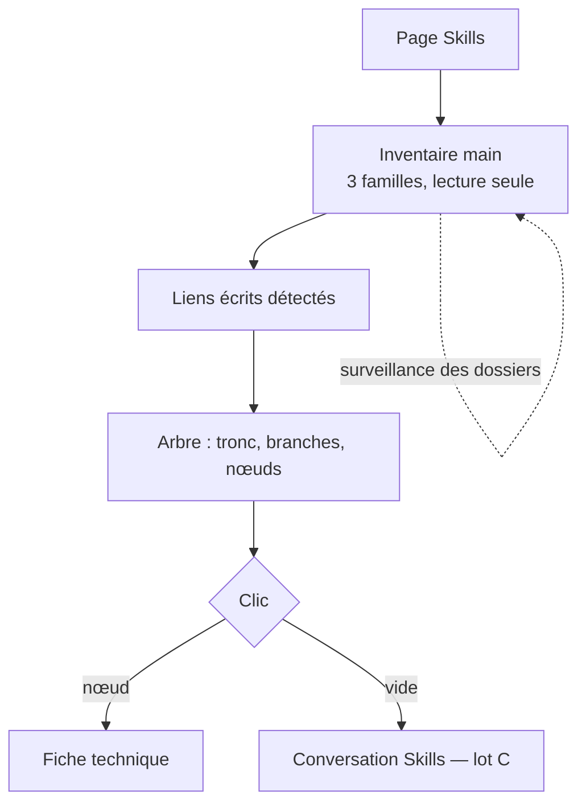

# Niveau 2 — Détail Fonctionnalité : SK-A — Voir la toile de skills
> Projet : Gestionnaire_idées · Basé sur : L1h-arbre-de-skills.md (A1, A3, A6, A8)
> Date : 2026-10-07 · Livraison : **lot A**

## 1. Objectif de la fonctionnalité
Une page « Skills » qui montre d'un coup d'œil tous les skills de Claude disponibles pour mentalyas, comme un arbre de
compétences de jeu vidéo : chaque skill est un nœud, rangé sur la branche de son domaine, relié aux skills qu'il appelle ;
un clic ouvre sa fiche.

> Analogie : l'arbre de talents d'un jeu de rôle. Chaque talent débloqué est une case ; les flèches montrent lesquels
> s'enchaînent ; un clic affiche ce que fait le talent.

## 2. Use Cases précis

### UC-1 : Ouvrir la page
- **Acteur :** mentalyas (entrée « Skills » de la navigation de gauche)
- **Scénario nominal :**
  1. L'app fait l'inventaire des skills (main, lecture seule) : personnels (`~/.claude/skills/*/SKILL.md`), de projet
     (`.claude/skills/*/SKILL.md` de chaque dossier de projet lié), de plugins installés (dernière version de chaque
     plugin dans le cache des plugins).
  2. Pour chaque skill : nom, description, famille, origine (chemin affiché relatif à sa famille), taille, fichiers
     annexes (avec un repère « contient des scripts »), date de modification.
  3. L'arbre s'affiche : tronc central (« Toi »), branches par domaine (lot B ; au lot A, une branche par famille en
     attendant), nœuds le long des branches, liens écrits détectés.
- **Scénarios alternatifs / erreurs :**
  - `SKILL.md` illisible ou sans en-tête → nœud « abîmé » (nom du dossier), fiche explique le problème.
  - Deux skills de même nom (personnel et plugin) → deux nœuds, l'origine les distingue ; celui qui l'emporte pour
    Claude Code est marqué.
- **Post-condition :** la toile est affichée ; elle se rafraîchit quand un dossier de skills change (surveillance).

### UC-2 : Filtrer et chercher
- **Scénario nominal :** puces de famille (personnels, projets, plugins), recherche par nom ou mot de la description ;
  les nœuds hors filtre s'estompent sans disparaître.

### UC-3 : Lire la fiche d'un skill
- **Scénario nominal :** clic sur un nœud → volet de droite : en-tête (nom, famille, ★, usage — lot B), description,
  fiche technique (lot B ; au lot A, le `SKILL.md` rendu en lecture seule), liens (appelle / appelé par), fichiers.

## 3. Workflow (Mermaid)

## 4. Règles métier
| # | Règle | Justification |
|---|-------|----------------|
| SA-1 | Inventaire en **lecture seule** ; seuls les dossiers de skills connus sont parcourus ; liens symboliques non suivis hors de ces dossiers | Sécurité, pas d'exploration du disque |
| SA-2 | En-tête YAML lu avec un analyseur strict (nom, description, déclencheur) ; texte du skill = **donnée**, jamais exécutée ni suivie par l'app | Un skill importé peut contenir des consignes piégées |
| SA-3 | **Lien écrit** = un skill qui mentionne `/nom-d-un-autre-skill` ou appelle « le skill X » (nom exact d'un skill inventorié, mot entier) → trait plein « appelle », sens de l'appelant vers l'appelé | Liens fiables, vérifiables dans le texte |
| SA-4 | Un nœud affiche : nom (2 lignes max), famille (icône + libellé), étoiles et usage (lot B), repère ⚠ « scripts » si le skill a des fichiers exécutables | Lisibilité, prudence |
| SA-5 | Disposition pure et déterministe : tronc au centre, branches réparties en éventail, nœuds en rangées le long de leur branche, sans chevauchement | Même image à chaque ouverture |
| SA-6 | Rafraîchissement par surveillance des dossiers de skills (délai de regroupement), jamais de rescan continu | Coût nul au repos |

## 5. Critères d'acceptation (Definition of Done)
- [ ] Les 17 skills personnels, les skills du projet et ceux des plugins apparaissent, chacun avec sa famille.
- [ ] `hub` est relié à `graphify` et `professor` par un trait « appelle » (liens écrits).
- [ ] Un `SKILL.md` sans en-tête donne un nœud « abîmé » sans casser la page.
- [ ] Un lien symbolique qui sort des dossiers de skills n'est pas suivi (test).
- [ ] Filtre par famille et recherche ; clic → fiche ; axe sans violation.

## 6. Signal de complexité — Niveau 3 nécessaire ?
| Critère | Présent ? | Détail |
|---------|-----------|--------|
| Logique métier complexe | Oui (modéré) | Détection des liens, disposition en branches |
| Intégration API tierce | Non | Lecture de fichiers locaux |
| Données sensibles | Oui (modéré) | Lecture hors du projet (`~/.claude`) |
| Multi-rôles | Non | — |

**Recommandation :** **Niveau 3** léger : contrat de l'inventaire, chemins autorisés, détection des liens, disposition.
