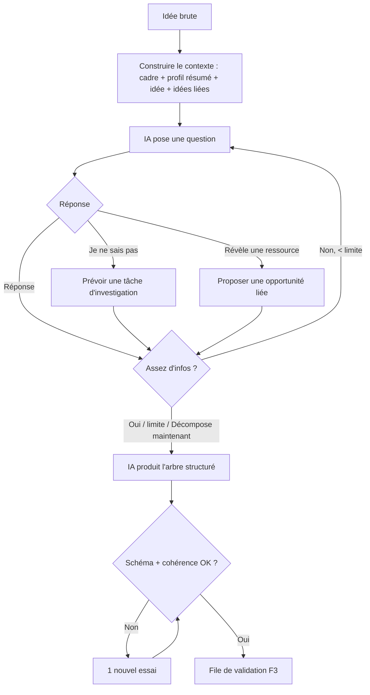

# Niveau 2 — Détail Fonctionnalité : F2 — Structuration IA (questionnaire + décomposition)
> Projet : Gestionnaire_idées · Basé sur : docs/brainstorm/L1-fondation.md, L2-capture-rapide.md
> Date : 2026-09-28 · Livraison : **MVP-1**

## 1. Objectif de la fonctionnalité
Transformer une idée brute en **arbre de tâches actionnable** : l'IA pose des questions pour comprendre,
puis produit une décomposition avec sous-tâches, branches conditionnelles, dépendances/déclencheurs et
opportunités. C'est le cœur du « secrétaire ».

## 2. Use Cases précis

### UC-1 : Mener le questionnaire
- **Acteur :** mentalyas + IA (Claude, raisonnement profond)
- **Déclencheur :** « Structurer » sur une idée brute (depuis l'app ou `Ctrl+Entrée` dans le widget)
- **Scénario nominal :**
  1. L'app construit le contexte : cadre système + profil résumé + idée + idées liées pertinentes (résumées).
  2. L'IA pose **une question à la fois**, avec des réponses rapides proposées quand c'est possible
     (ex. « As-tu déjà l'argent ? [Oui] [Non] [En partie] »).
  3. mentalyas répond (clic ou texte libre).
  4. L'IA enchaîne jusqu'à disposer d'assez d'infos, ou jusqu'à la limite de questions.
  5. L'IA annonce « J'ai assez d'éléments » → passage à UC-2.
- **Scénarios alternatifs / erreurs :**
  - mentalyas répond « je ne sais pas » → l'IA crée une **tâche d'investigation** (« Trouver le prix ») au lieu d'inventer.
  - mentalyas clique « Décompose maintenant » → décomposition avec les infos disponibles, trous signalés.
  - mentalyas quitte → session sauvegardée, reprise possible plus tard.
  - API Claude indisponible / plafond budget atteint → proposer : attendre, ou questionnaire simplifié par l'IA locale (qualité réduite, signalée).
- **Post-condition :** réponses enregistrées avec l'idée.

### UC-2 : Produire la décomposition
- **Acteur :** IA (Claude)
- **Déclencheur :** fin du questionnaire
- **Scénario nominal :**
  1. L'IA produit un **arbre structuré** (format validé par schéma) : tâches, sous-tâches, conditions
     (question + branches), dépendances/déclencheurs, opportunités, montants, dates estimées.
  2. L'app valide la structure (schéma + cohérence : pas de cycle, références existantes).
  3. La proposition part dans la file de validation (F3) — **rien n'est encore appliqué**.
- **Scénarios alternatifs / erreurs :**
  - Réponse invalide → 1 nouvel essai automatique avec le message d'erreur ; sinon échec affiché, réponses conservées.
  - Cycle de dépendances détecté → proposition rejetée, nouvel essai.
- **Post-condition :** proposition « en attente de validation ».

### UC-3 : Créer une opportunité en cours de route
- **Acteur :** IA + mentalyas
- **Déclencheur :** une réponse révèle une ressource (« j'ai une mission mariage payée 1 250 € le 15/11 »)
- **Scénario nominal :**
  1. L'IA propose de créer une **opportunité** (objectif + tâche + rentrée) distincte de l'idée courante.
  2. Elle la relie à l'idée courante (« finance »).
  3. Le tout arrive dans la même proposition à valider.
- **Post-condition :** opportunité proposée et liée.

### UC-4 : Restructurer une idée déjà décomposée
- **Acteur :** mentalyas
- **Déclencheur :** « Restructurer » sur une idée (situation changée)
- **Scénario nominal :** l'IA reçoit l'arbre actuel + ce qui a changé, pose les questions nécessaires et
  propose un **différentiel** (ajouts/modifs/suppressions), présenté en F3.

## 3. Workflow (Mermaid)

## 4. Règles métier
| # | Règle | Justification |
|---|-------|----------------|
| R1 | Une question à la fois, réponses rapides proposées quand possible | Rapide, pas de formulaire indigeste |
| R2 | Limite par défaut : 8 questions (configurable) | Évite l'interrogatoire sans fin et borne le coût |
| R3 | L'IA **n'invente jamais** un prix, une date ou un montant : elle demande, ou crée une tâche d'investigation | Anti-hallucination (cadre L1) |
| R4 | Une condition = une question fermée + 2 à 4 branches | Arbre lisible dans l'organigramme |
| R5 | Profondeur max de l'arbre : 5 niveaux | Lisibilité ; au-delà, c'est une nouvelle idée |
| R6 | Aucune modification n'est appliquée sans validation (F3) | Décision L1 option A |
| R7 | Les montants sont stockés en centimes d'euro (entiers) | Pas d'erreurs d'arrondi |
| R8 | Hors périmètre (image, poème…) → refus poli + recentrage | Cadre L1 |
| R9 | Le questionnaire est sauvegardé à chaque réponse | Reprise sans perte |

## 5. Critères d'acceptation (Definition of Done)
- [ ] L'exemple de référence « 2e écran » produit un arbre avec condition « argent ? », branche budget et opportunité liée
- [ ] Une réponse « je ne sais pas » produit une tâche d'investigation, jamais une valeur inventée
- [ ] Toute sortie IA passe la validation de schéma avant affichage
- [ ] Un cycle de dépendances est détecté et refusé
- [ ] Questionnaire interrompu → reprise au même point
- [ ] Mode dégradé (Claude indisponible) clairement signalé
- [ ] Une demande hors périmètre est refusée et recentrée

## 6. Signal de complexité — Niveau 3 nécessaire ?
| Critère | Présent ? | Détail |
|---------|-----------|--------|
| Logique métier complexe (calculs, machine à états) | **Oui** | Session de questionnaire (états), arbre conditionnel, graphe de dépendances, validation de cohérence |
| Intégration API tierce | **Oui** | Claude (via F9) |
| Données sensibles (paiement/santé/légal) | **Oui** | Montants, rentrées |
| Accès multi-rôles / permissions différenciées | Non | — |

**Recommandation :** **Niveau 3 nécessaire** (schéma de l'arbre, contrat de sortie IA, états de session).
