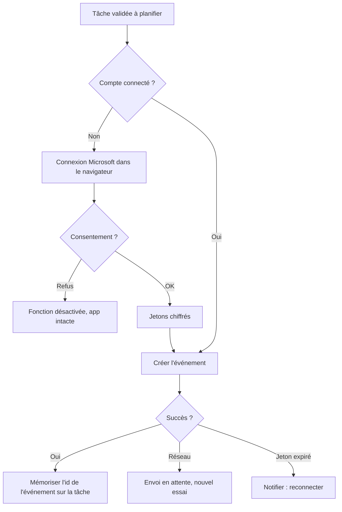

# Niveau 2 — Détail Fonctionnalité : F6 — Synchro Outlook
> Projet : Gestionnaire_idées · Basé sur : docs/brainstorm/L1-fondation.md, L2-validation.md, L2-planning.md
> Date : 2026-09-28 · Livraison : **MVP-2**

## 1. Objectif de la fonctionnalité
Faire exister les tâches validées là où mentalyas les voit déjà : dans son calendrier Outlook
(compte Microsoft personnel), donc aussi sur son téléphone, avec les rappels natifs d'Outlook.

## 2. Use Cases précis

### UC-1 : Connecter le compte Microsoft (une fois)
- **Acteur :** mentalyas
- **Déclencheur :** Réglages → « Connecter Outlook », ou première tentative d'envoi
- **Scénario nominal :**
  1. Le navigateur système s'ouvre sur la page de connexion Microsoft.
  2. mentalyas se connecte et accepte les autorisations demandées (calendrier uniquement).
  3. L'app reçoit les jetons, les stocke chiffrés, affiche « Connecté ».
- **Scénarios alternatifs / erreurs :** refus du consentement → retour propre, fonctionnalité désactivée, reste de l'app intacte.

### UC-2 : Envoyer une tâche validée vers Outlook
- **Acteur :** système, après validation (F3) ou action « Envoyer à Outlook » (F5)
- **Scénario nominal :**
  1. L'app crée un événement : titre, date/heure (ou journée entière), durée, description courte, rappel.
  2. L'identifiant de l'événement Outlook est mémorisé sur la tâche.
- **Scénarios alternatifs / erreurs :**
  - Hors ligne / erreur réseau → tâche marquée « envoi en attente », nouvel essai automatique.
  - Jeton expiré et non renouvelable → notification « Reconnecter Outlook », envois conservés.

### UC-3 : Répercuter une modification ou une suppression
- **Scénario nominal :** date modifiée / tâche abandonnée dans l'app → mise à jour / suppression de l'événement
  lié, **après confirmation** pour la suppression.
- **Scénarios alternatifs :** événement supprimé entre-temps dans Outlook → lien retiré, tâche conservée, info affichée.

### UC-4 : Déconnecter
- **Scénario nominal :** Réglages → « Déconnecter » → jetons effacés ; les événements déjà créés restent dans Outlook.

## 3. Workflow (Mermaid)

## 4. Règles métier
| # | Règle | Justification |
|---|-------|----------------|
| R1 | Sens unique au MVP : app → Outlook (pas de lecture des modifs faites dans Outlook) | Simplicité ; bidirectionnel en v2 |
| R2 | Autorisations minimales : calendrier (lecture/écriture) + connexion hors ligne, rien d'autre | Moindre privilège |
| R3 | Aucun envoi sans validation humaine | Décision L1 |
| R4 | Les événements créés portent un marqueur (catégorie Outlook « Gestionnaire idées ») | Les retrouver / distinguer facilement |
| R5 | Aucun montant ni détail financier dans l'événement Outlook, sauf si mentalyas l'ajoute | Minimisation hors de l'app |
| R6 | Un échec d'envoi ne bloque jamais l'app ; file d'attente persistante | Robustesse |
| R7 | Suppression d'un événement Outlook toujours confirmée | Action destructive externe |

## 5. Critères d'acceptation (Definition of Done)
- [ ] Connexion avec un compte Microsoft personnel réussie, jetons chiffrés au repos
- [ ] Création d'un événement visible dans Outlook web et mobile
- [ ] Modification de date répercutée ; suppression après confirmation
- [ ] Hors ligne → envoi différé réussi au retour du réseau
- [ ] Déconnexion efface les jetons
- [ ] Aucun jeton dans les logs

## 6. Signal de complexité — Niveau 3 nécessaire ?
| Critère | Présent ? | Détail |
|---------|-----------|--------|
| Logique métier complexe (calculs, machine à états) | Partiel | File d'envoi avec états (en attente / envoyé / échec) |
| Intégration API tierce | **Oui** | Microsoft Graph + connexion OAuth2 (MSAL, PKCE) |
| Données sensibles (paiement/santé/légal) | **Oui** | Jetons d'accès à un compte personnel |
| Accès multi-rôles / permissions différenciées | Non | — |

**Recommandation :** **Niveau 3 nécessaire** (flux OAuth, stockage des jetons, contrat Graph, file d'envoi).
