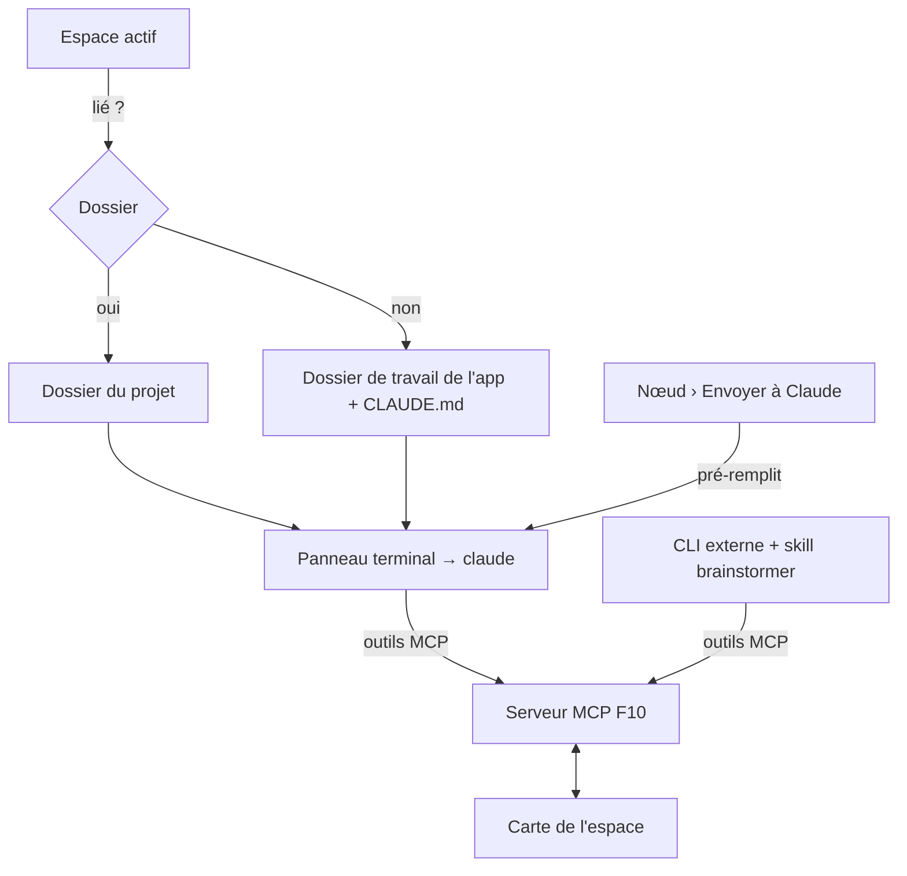

# Niveau 2 — Détail Fonctionnalité : F12 Terminal intégré & espaces (+ F13 skill `brainstormer`)
> Projet : Gestionnaire_idées · Basé sur : L1-fondation.md, L1b-brainstormer.md, L4b-neurones.md,
> **L1c-pont-claude-code.md**, **L2-pont-mcp.md** · Date : 2026-10-04

## 1. Objectif de la fonctionnalité
Travailler avec Claude Code **dans l'app**, comme dans un IDE : un panneau terminal lance le vrai `claude` dans le
dossier de l'**espace** actif. Un espace est une carte nommée, éventuellement liée à un vrai dossier (ex. ArtisaStock)
— Claude y voit les fichiers du projet et la carte (F10). Le skill `brainstormer` (F13) apporte la même expérience
depuis n'importe quel CLI externe.

## 2. Use Cases précis

### UC-1 : Créer un espace lié à un dossier
- **Acteur :** mentalyas
- **Déclencheur :** « Nouvel espace » dans la barre latérale
- **Scénario nominal :**
  1. Nom de l'espace ; option « Lier à un dossier » → sélecteur de dossier natif de Windows.
  2. L'espace apparaît dans la liste ; il devient l'espace actif (carte vide).
- **Scénarios alternatifs / erreurs :**
  - Dossier lié introuvable plus tard (déplacé, disque débranché) → badge « dossier introuvable », proposition de
    relier ; la carte reste accessible.
- **Post-condition :** espace persisté ; son dossier mémorisé.

### UC-2 : Changer d'espace
- **Acteur :** mentalyas
- **Scénario nominal :** clic sur un espace → sa carte s'affiche ; son terminal (s'il existe) reprend où il était.
- **Post-condition :** les outils MCP visent par défaut l'espace actif.

### UC-3 : Ouvrir Claude dans l'app
- **Acteur :** mentalyas
- **Déclencheur :** bouton « Claude » ou `Ctrl+ù` (raccourci type IDE, à confirmer)
- **Scénario nominal :**
  1. Un panneau terminal s'ouvre (bas ou droite, redimensionnable, mémorisé).
  2. L'app lance `claude` dans le dossier de l'espace (ou dans le dossier de travail de l'app si non lié).
  3. Claude a déjà le serveur MCP de la carte (F10) : il peut lire et dessiner tout de suite.
- **Scénarios alternatifs / erreurs :**
  - `claude` introuvable → panneau explicatif (installation, lien vers la doc officielle) au lieu d'un terminal vide.
  - `claude` se termine (`/exit`, plantage) → « Session terminée — Relancer ».
- **Post-condition :** une session Claude Code par espace, vivante tant que l'app est ouverte.

### UC-4 : « Envoyer à Claude » depuis un nœud
- **Acteur :** mentalyas
- **Déclencheur :** menu d'un nœud (ou d'une sélection) › « Envoyer à Claude »
- **Scénario nominal :**
  1. Le panneau terminal s'ouvre si besoin.
  2. L'app **pré-remplit** la ligne de saisie de Claude avec une référence à la sélection (« À propos de la
     sélection : … ») **sans valider** ; mentalyas complète sa demande et appuie sur Entrée.
- **Post-condition :** Claude reçoit la demande ; il lit la sélection par `selection_lire`.

### UC-5 : Retrouver le contexte de l'app
- **Acteur :** Claude Code
- **Scénario nominal :** à la connexion, Claude lit les **instructions du serveur MCP** (règles d'usage de la carte) ;
  dans le dossier de travail de l'app, un `CLAUDE.md` maintenu par l'app les complète. Dans un dossier lié,
  l'app **n'écrit rien** dans le projet de mentalyas : les instructions du serveur suffisent.

### UC-6 : Installer l'intégration Claude Code (F13)
- **Acteur :** mentalyas, Réglages › Claude Code
- **Déclencheur :** bouton « Installer l'intégration »
- **Scénario nominal :**
  1. L'app affiche **ce qu'elle va faire** : enregistrer le serveur MCP dans la config utilisateur de Claude Code,
     installer le skill `brainstormer` dans `~/.claude/skills/`.
  2. Après confirmation, elle le fait ; un bouton « Tester » vérifie que `claude` voit le serveur.
  3. « Désinstaller » retire les deux.
- **Post-condition :** depuis n'importe quel CLI, « travaillons dans le brainstormer » fonctionne (L2-pont-mcp UC-1).

## 3. Workflow (Mermaid)

## 4. Règles métier
| # | Règle | Justification |
|---|-------|----------------|
| R1 | Le terminal lance **uniquement `claude`**, directement (pas d'interpréteur de commandes intermédiaire), dans le dossier de l'espace. | L'interface ne peut jamais faire exécuter une commande arbitraire au main. |
| R2 | L'interface ne transmet au terminal **que des frappes** et des demandes « ouvrir / relancer / fermer » pour un espace ; jamais un chemin ni une commande. | Frontière IPC minimale (principe I). |
| R3 | Le dossier d'un espace se choisit **par le sélecteur natif** (main) ; il est mémorisé côté main. | Pas de chemin fourni par l'interface. |
| R4 | Les permissions de Claude Code restent **celles du CLI** (demandes de confirmation affichées dans le terminal). | L'app n'élargit rien. |
| R5 | L'app n'écrit **jamais** dans un dossier lié ; `CLAUDE.md` seulement dans son propre dossier de travail. | Le projet de mentalyas lui appartient. |
| R6 | Les contenus existants migrent dans un espace par défaut « Général » ; chaque élément de carte appartient à un espace. | Aucune perte à la migration. |
| R7 | Installer l'intégration modifie la config de Claude Code **après confirmation explicite**, et se désinstalle. | Hors du périmètre de l'app : consentement. |
| R8 | « Envoyer à Claude » **pré-remplit sans valider**. | mentalyas garde la main sur ce qui part. |

## 5. Critères d'acceptation (Definition of Done)
- [ ] Créer un espace lié à un dossier ; le terminal s'y ouvre et Claude voit les fichiers du projet.
- [ ] Dans ce terminal, Claude dessine sur la carte de l'espace actif (F10) sans configuration supplémentaire.
- [ ] Changer d'espace change la carte et le terminal ; revenir retrouve la session.
- [ ] « Envoyer à Claude » pré-remplit la saisie avec la sélection, sans valider.
- [ ] `claude` absent → panneau explicatif ; `claude` terminé → « Relancer ».
- [ ] Migration : toutes les idées et blocs existants sont dans « Général ».
- [ ] Installer / Tester / Désinstaller l'intégration ; depuis un CLI externe, « travaillons dans le brainstormer » marche.
- [ ] Tests : frontière IPC du terminal (refus de tout autre programme / chemin), migration des espaces.

## 6. Signal de complexité — Niveau 3 nécessaire ?
| Critère | Présent ? | Détail |
|---------|-----------|--------|
| Logique métier complexe (calculs, machine à états) | Oui | Cycle de vie des sessions terminal par espace ; migration de données |
| Intégration API tierce | Oui | Pseudo-terminal natif (`node-pty`), affichage `xterm`, config de Claude Code |
| Données sensibles (paiement/santé/légal) | Oui | Exécution de processus depuis l'app ; écriture dans la config utilisateur de Claude Code |
| Accès multi-rôles / permissions différenciées | Non | — |

**Recommandation :** Niveau 3 nécessaire (sécurité du pseudo-terminal, modèle de données des espaces, installation).
