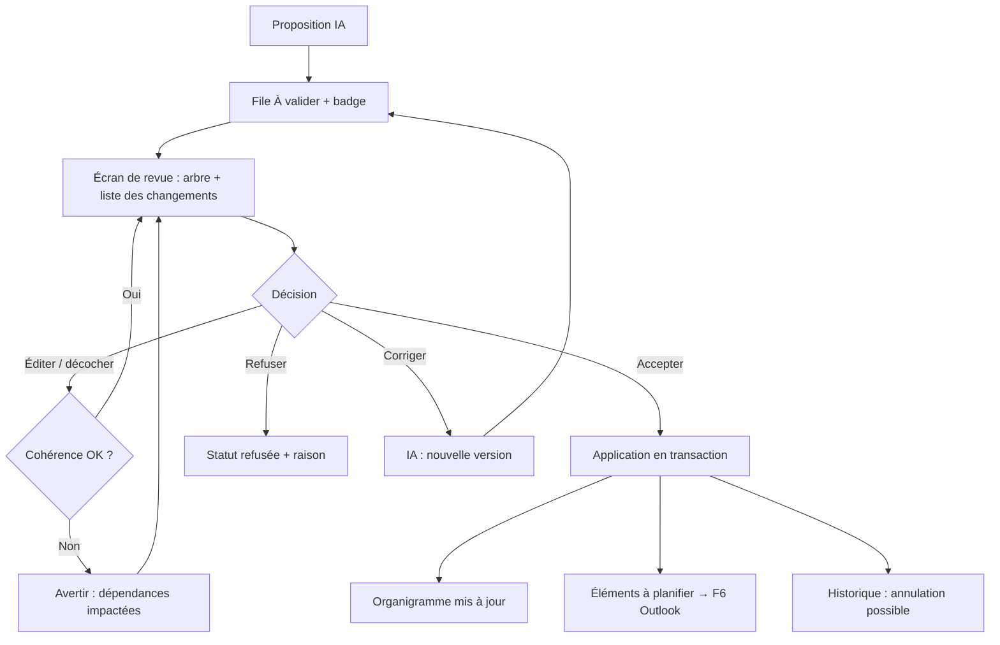

# Niveau 2 — Détail Fonctionnalité : F3 — Aperçu & validation
> Projet : Gestionnaire_idées · Basé sur : docs/brainstorm/L1-fondation.md, L2-structuration-ia.md
> Date : 2026-09-28 · Livraison : **MVP-1**

## 1. Objectif de la fonctionnalité
Garder mentalyas maître de son agenda : toute proposition de l'IA (décomposition, restructuration,
suggestion proactive, événement Outlook) est relue, modifiable, puis acceptée ou refusée. Rien n'est écrit sans lui.

## 2. Use Cases précis

### UC-1 : Relire et accepter une proposition
- **Acteur :** mentalyas
- **Déclencheur :** une proposition arrive dans la file (badge sur l'icône tray + liste « À valider »)
- **Scénario nominal :**
  1. L'écran de revue montre la proposition **sous forme d'arbre** (aperçu organigramme) + une liste lisible.
  2. Chaque élément est marqué : ➕ ajout · ✏️ modification · ➖ suppression.
  3. mentalyas peut décocher des éléments, modifier un texte, un montant, une date.
  4. « Accepter » → application **en une seule transaction** ; l'organigramme (F4) est mis à jour.
  5. Les éléments marqués « à planifier » partent vers la synchro Outlook (F6, MVP-2).
- **Scénarios alternatifs / erreurs :**
  - Modification qui casse la cohérence (ex. décocher une tâche dont une autre dépend) → avertissement explicite, choix : décocher aussi la dépendante ou annuler.
  - Échec d'application → rien n'est appliqué (tout ou rien), message clair.
- **Post-condition :** proposition « acceptée », données mises à jour.

### UC-2 : Refuser une proposition
- **Acteur :** mentalyas
- **Scénario nominal :** « Refuser » (+ raison facultative : « pas pertinent », « faux », « plus tard »).
  La raison est gardée comme exemple négatif pour le contexte de l'agent.
- **Post-condition :** proposition « refusée », aucune donnée modifiée.

### UC-3 : Demander une correction à l'IA
- **Acteur :** mentalyas
- **Scénario nominal :** « Corriger » + consigne (« ne pas passer par l'épargne, uniquement la mission »)
  → l'IA produit une nouvelle version de la proposition, qui remplace l'ancienne dans la file.

### UC-4 : Annuler une validation récente
- **Acteur :** mentalyas
- **Déclencheur :** « Annuler » dans la notification post-validation ou l'historique
- **Scénario nominal :** l'app restaure l'état précédent (via l'historique des changements).
- **Scénarios alternatifs :** un événement déjà créé dans Outlook → proposé à la suppression aussi (avec confirmation).

## 3. Workflow (Mermaid)

## 4. Règles métier
| # | Règle | Justification |
|---|-------|----------------|
| R1 | Aucune écriture (données, Outlook, budget) sans « Accepter » explicite | Décision L1 option A |
| R2 | Application tout-ou-rien (transaction) | Pas d'état à moitié appliqué |
| R3 | Chaque validation est historisée et annulable | Heuristique Nielsen « annuler disponible » |
| R4 | Les propositions non traitées restent dans la file ; rappelées dans le briefing (F8) | Rien ne se perd |
| R5 | Une proposition devenue obsolète (l'idée a changé depuis) est marquée « périmée » | Éviter d'appliquer sur une base qui a bougé |
| R6 | Les refus (et raisons) nourrissent le contexte de l'agent | L'assistant apprend du cadre, sans ré-entraînement |

## 5. Critères d'acceptation (Definition of Done)
- [ ] Ajouts / modifications / suppressions visuellement distincts
- [ ] Édition d'un élément avant acceptation possible (texte, montant, date)
- [ ] Décocher un élément dont un autre dépend déclenche un avertissement
- [ ] Échec simulé pendant l'application → aucune donnée modifiée
- [ ] Annulation d'une validation restaure l'état précédent
- [ ] Proposition périmée détectée et signalée

## 6. Signal de complexité — Niveau 3 nécessaire ?
| Critère | Présent ? | Détail |
|---------|-----------|--------|
| Logique métier complexe (calculs, machine à états) | Partiel | Statuts de proposition + historique/annulation — géré par le modèle de F2 |
| Intégration API tierce | Non | — |
| Données sensibles (paiement/santé/légal) | Partiel | Montants édités ici, stockés via F2 |
| Accès multi-rôles / permissions différenciées | Non | — |

**Recommandation :** Niveau 2 suffisant — le modèle de données (propositions, historique) sera couvert par le niveau 3 de F2.
