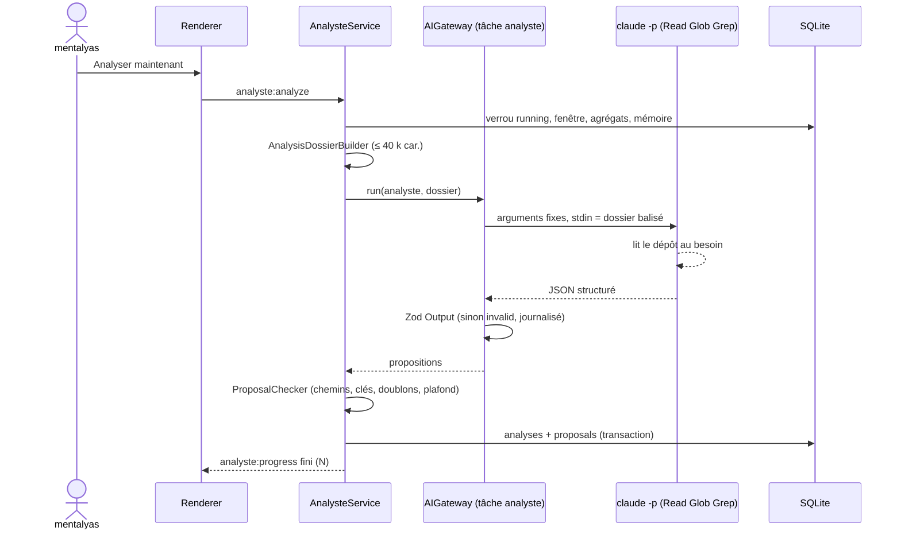

# Niveau 3 — Conception Technique : AN-B — Analyste
> Basé sur : L1g-analyste-interne.md (A4, A5, A6, A8, A9) + L2-analyste-analyse.md + L3-analyste-sonde.md
> Date : 2026-10-07 · Code lu : `infrastructure/ai/ClaudeCliProvider.ts` (arguments de `claude -p`),
> `application/conversation/ConversationService.ts` (`--tools`, `--allowedTools`), `db/schema.ts` (`ai_calls`)

## 1. Contrat IPC
| Canal | Sens | Entrée (Zod) | Sortie | Erreurs |
|-------|------|--------------|--------|---------|
| `analyste:analyze` | invoke | `{ force?: boolean }` (`force` = ignorer le seuil, manuel seulement) | `{ analysisId }` | `PROBE_INACTIVE`, `ANALYSIS_RUNNING`, `UPDATE_CODING`, `NOT_ENOUGH_DATA` |
| `analyste:cancel` | invoke | `{ analysisId }` | `ok` | `NOT_FOUND` |
| `analyste:proposals` | invoke | `{ status?, category?, cursor?, limit ≤ 50 }` | `{ items: ProposalView[], next? }` | — |
| `analyste:decide` | invoke | `{ id, decision: 'accept' \| 'refuse' \| 'postpone', reason? (≤ 200) }` | `ProposalView` | `NOT_FOUND`, `INVALID_TRANSITION` |
| `analyste:analyses` | invoke | `{ limit ≤ 20 }` | historique des analyses | — |
| `analyste:progress` (événement) | main → renderer | — | `{ analysisId, step: 'dossier' \| 'claude' \| 'controle' \| 'fini', proposals? }` | — |

## 2. Moteur : tâche `analyste` de l'AIGateway
Constitution III : tout appel IA lancé par l'app passe par l'`AIGateway`. On y ajoute la tâche `analyste`, **seule
tâche automatique avec des outils** (amendement IV, A9).

Arguments du CLI (construits par le main, valeurs fixes) — différences avec `ClaudeCliProvider` en **gras** :
```
claude -p --output-format json --json-schema <schéma §4> --model <Opus 5.5>
  --tools "Read Glob Grep"              ← au lieu de ""
  --allowedTools "Read Glob Grep"       ← lecture sans demande, rien d'autre n'existe
  --setting-sources "" --strict-mcp-config   (aucun réglage, aucun serveur MCP)
  --no-session-persistence --disable-slash-commands --permission-prompts none
  --max-turns 40
  --system-prompt <consigne figée « Analyste interne »>
cwd = dépôt désigné · stdin = dossier d'analyse balisé · délai 15 min
```
- `ProviderRequest` gagne `tools?: 'read-only'` et `cwd?` ; refusés pour toute autre tâche (test).
- **À vérifier sur la version du CLI installée** (comme pour `--setting-sources` en spec 008) : qu'un `Read` sur un
  chemin hors du `cwd` (ex. `%APPDATA%`) est **refusé** avec `--permission-prompts none`. Sinon : ajouter
  `--disallowedTools "Read(//<appdata>/**)"` et un test qui le prouve. Bloquant avant livraison.

## 3. Dossier d'analyse (entrée)
Construit par `AnalysisDossierBuilder` (pur, testé), borné à **~40 000 caractères** :
```
<dossier version="1">
  <fenetre debut=… fin=… evenements=… />
  <observations>          ← agrégats, chacun avec une clé citable
    obs:err:3  error.renderer TypeError module=canvas frames=[buildGraph.ts:212] ×14 (7 jours)
    obs:lent:1 ipc.call reprise:analyze p50=1,2 s p95=8,4 s ×31
    obs:ia:2   tâche categorize : 23 appels, 1 seule empreinte d'entrée → 1 seule sortie
    obs:aller:4 explorateur → carte → explorateur < 10 s ×19
    obs:inutil:1 screen=widgets jamais ouvert sur 30 j
    obs:seq:2  neuron.create → link.create → neuron.move ×42
  </observations>
  <code>                   ← graphe de la spec 017 sur le dépôt : modules, fonctions jamais appelées (hors points d'entrée)
  </code>
  <memoire>                ← ≤ 30 dernières propositions : catégorie, titre, statut, raison du refus
  </memoire>
</dossier>
```
Agrégats : comptages par événement ; erreurs groupées par `code + module + premier cadre` ; p50/p95 par canal ;
**allers-retours** (A → B → A en < 10 s) ; **séquences** fréquentes de 3 actions ; écrans et actions du catalogue à 0
sur la fenêtre ; IA : `input_fp` vus ≥ 5 fois avec une seule `output_fp`. Fenêtre = depuis la dernière analyse réussie
(bornée à la conservation).

## 4. Sortie (schéma Zod fermé)
```ts
const Proposal = z.object({
  categorie: z.enum(['bug', 'ia_vers_code', 'parcours', 'code_mort', 'evolutivite']),
  titre: z.string().min(5).max(80),
  constat: z.string().max(1200),
  preuves: z.object({
    observations: z.array(z.string().regex(/^obs:[a-z]+:\d+$/)).max(10),
    code: z.array(z.object({ chemin: z.string().max(200), debut: z.int().min(1).optional(), fin: z.int().optional() })).max(10)
  }),
  proposition: z.string().max(1500),
  gain: z.string().max(300),
  risque: z.enum(['faible', 'moyen', 'eleve']),
  gravite: z.int().min(1).max(4),
  confiance: z.number().min(0).max(1),
  fichiersVises: z.array(z.string().max(200)).max(20)
}).strict()
const Output = z.object({ propositions: z.array(Proposal).max(10) }).strict()
```
**Contrôles après Zod** (dans `ProposalChecker`, pur) : chemins relatifs, sans `..`, résolus (realpath) **dans** le
dépôt et existants ; clés `obs:` présentes dans le dossier envoyé ; preuve obligatoire sauf `evolutivite` (marquée
« idée, sans preuve d'usage ») ; dédoublonnage (empreinte `categorie + fichiers triés` contre les propositions
ouvertes) ; plafond (réglage, défaut 5) par gravité décroissante ; refus antérieur sans nouvelle clé `obs:` → écarté.

## 5. Schéma de données
| Table | Colonnes | Contraintes | Index |
|-------|----------|-------------|-------|
| `analyses` | `id` text PK · `trigger` (manual / auto) · `status` (running / done / failed / cancelled) · `window_from`, `window_to` · `events` int · `proposals` int · `ai_call_id` text? · `error_code` text? · `started_at`, `finished_at` | une seule `running` (contrôle applicatif + index partiel) | `(started_at)` |
| `proposals` | `id` text PK · `analysis_id` FK · `category` · `title` · `finding` · `proposal` · `gain` · `risk` · `severity` · `confidence` · `evidence` (JSON) · `files` (JSON) · `dedupe_key` · `status` · `refusal_reason` text? · `created_at`, `updated_at` | `status` ∈ new, postponed, refused, accepted, coding, to_fix, ready, kept, discarded, reverted, merged_into | `(status, created_at)`, `(dedupe_key)` |
Le texte des propositions est **écrit par Claude sur le code de l'app** (pas sur les idées de mentalyas) : il peut être
gardé en base.

## 6. Accroche sur la carte (A6)
- Le genesis « Brainstormer » = celui dont le dossier lié est le dépôt désigné. S'il n'existe pas : la boîte propose
  « Lier et cartographier le Brainstormer » (parcours spec 017 existant).
- Une proposition s'accroche aux **éléments de structure** dont un chemin couvre un de ses `fichiersVises` (même
  correspondance que le volet « Fichiers » d'un élément) ; aucun → accrochée au genesis.
- Rendu : badge « N propositions » sur `ElementNode` (lecture seule, aucune écriture sur la carte : la boîte reste la
  source).

## 7. Diagramme de séquence


## 8. Cas limites techniques
- **Concurrence :** une analyse à la fois ; refusée pendant un codage (lot C) pour ne pas lire un dépôt en mouvement.
- **Idempotence :** relancer après un échec repart de la même fenêtre (elle n'avance qu'après succès).
- **Transactions :** analyse + propositions enregistrées ensemble ; échec du CLI → `analyses.status = failed`, rien
  d'autre.
- **Volumétrie :** dossier tronqué par priorité (erreurs > lenteurs > IA > parcours > inutilisés) ; agrégats calculés
  en SQL (`GROUP BY`) sur ≤ 200 000 lignes.
- **Annulation :** tue le processus `claude` (arbre de processus), `status = cancelled`.

## 9. Sécurité spécifique
| Risque | Vecteur | Mitigation |
|--------|---------|------------|
| Injection de prompt | Commentaire piégé dans le code lu, nom d'événement | Aucun outil d'écriture ni de commande ; dossier balisé = donnée ; sortie au schéma fermé ; chemins revérifiés |
| Lecture des données de mentalyas | `Read` sur `%APPDATA%/gestionnaire-idees` | `cwd` = dépôt ; vérification bloquante §2 ; test qui tente la lecture |
| Exécution via réglages ou hooks | `.claude/settings.json` du dépôt | `--setting-sources ""`, `--strict-mcp-config` (constat spec 008) |
| XSS par une proposition | Texte de Claude affiché | Rendu texte / Markdown assaini existant, jamais de HTML brut |
| Consommation | Boucle d'outils | `--max-turns 40`, délai 15 min, une analyse à la fois, journal `ai_calls` |
| Fuite d'usage | Agrégats envoyés | Agrégats sans contenu (catalogue fermé), pseudonymes jamais envoyés (seulement des comptes) |
