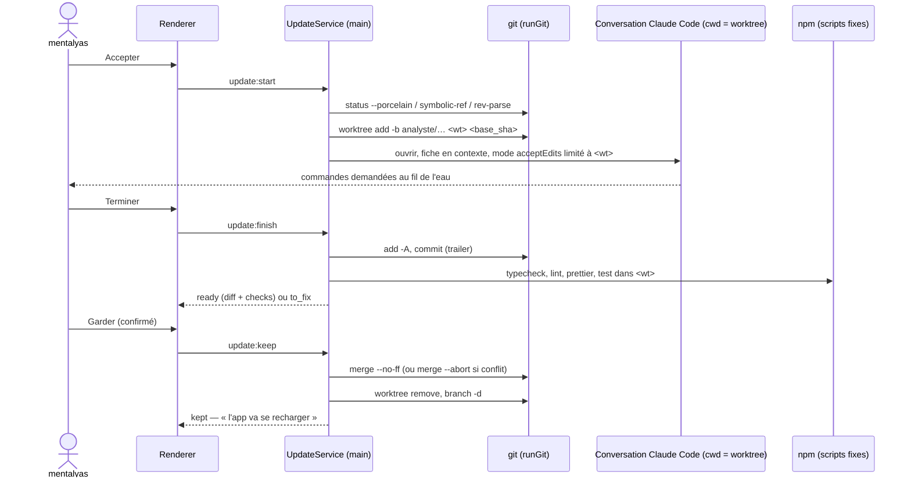

# Niveau 3 — Conception Technique : AN-C — Appliquer une proposition
> Basé sur : L1g-analyste-interne.md (A3, A9) + L2-analyste-appliquer.md + L3-analyste-analyse.md
> Date : 2026-10-07 · Code lu : `infrastructure/projects/GitCli.ts` (`resolveGit`, `runGit` : git par chemin absolu,
> `shell: false`), `application/conversation/ConversationService.ts` (modes de permission, outils)

## 1. Contrat IPC
| Canal | Sens | Entrée (Zod) | Sortie | Erreurs |
|-------|------|--------------|--------|---------|
| `analyste:update:start` | invoke | `{ proposalId }` | `UpdateView` | `REPO_DIRTY`, `NOT_ON_BASE`, `UPDATE_CODING`, `INVALID_TRANSITION` |
| `analyste:update:finish` | invoke | `{ updateId }` (Claude a fini) | `UpdateView` (commit + vérifications) | `NOTHING_CHANGED`, `GIT_FAILED` |
| `analyste:update:diff` | invoke | `{ updateId }` | `{ files: [{ path, added, removed }], patch (≤ 500 Ko) }` | `NOT_FOUND` |
| `analyste:update:keep` | invoke | `{ updateId, confirm: true }` | `UpdateView` | `CHECKS_NOT_GREEN`, `REPO_DIRTY`, `MERGE_CONFLICT` |
| `analyste:update:discard` | invoke | `{ updateId, reason? }` | `UpdateView` | `NOT_FOUND` |
| `analyste:update:revert` | invoke | `{ updateId, confirm: true }` | `UpdateView` | `REPO_DIRTY`, `REVERT_CONFLICT` |
| `analyste:update:progress` (événement) | main → renderer | — | `{ updateId, step, check? }` | — |

## 2. Commandes git (toutes par `runGit`, arguments fixes, noms générés par l'app)
`<repo>` = dépôt désigné · `<base>` = `main` · `<b>` = `analyste/<id8>-<slug>` (slug = titre en `[a-z0-9-]`, ≤ 30) ·
`<wt>` = `<repo>/.analyste/worktrees/<id8>`

| Étape | Commandes |
|-------|-----------|
| Pré-contrôle | `git -C <repo> status --porcelain` vide · `git -C <repo> symbolic-ref --short HEAD` = `<base>` · `git -C <repo> rev-parse <base>` → `base_sha` |
| Créer | `git -C <repo> worktree add -b <b> <wt> <base_sha>` · jonction `node_modules` (§3) |
| Commit | `git -C <wt> add -A` (le worktree ne contient que le travail de Claude) · `git -C <wt> commit -m <message> --trailer "Analyste-Proposal: <id>"` → `head_sha` |
| Garder | pré-contrôle sur `<repo>` · `git -C <repo> merge --no-ff --no-edit -m "feat(gestionnaire-idees): <titre> (analyste <id8>)" <b>` → `merge_sha` ; conflit → `git -C <repo> merge --abort` · puis `git -C <repo> worktree remove <wt>` · `git -C <repo> branch -d <b>` |
| Jeter | `git -C <repo> worktree remove --force <wt>` · `git -C <repo> branch -D <b>` |
| Annuler | pré-contrôle · `git -C <repo> revert -m 1 --no-edit <merge_sha>` → `revert_sha` ; conflit → `git -C <repo> revert --abort` |
| Nettoyage au démarrage | `git -C <repo> worktree list --porcelain` ∩ table `analyst_updates` ; orphelin sans changement → retiré ; avec changements → demandé |

**Jamais** : `push`, `reset`, `rebase`, `--force` sur une branche, `checkout` dans `<repo>`, `commit` hors `<wt>`.
`.analyste/` est ajouté au `.gitignore` et exclu de `tsconfig`, Vitest, ESLint, Prettier et graphify.

## 3. Coder et vérifier
- **Conversation** : une conversation Claude Code (spec 008/014) avec `cwd = <wt>`, dossiers autorisés = `[<wt>]`,
  mode **Accepter les modifications** (écritures dans `<wt>` sans demande, **commandes demandées** à mentalyas), fiche
  de la proposition en contexte comme **donnée balisée**. Elle s'ouvre dans le volet de la boîte Analyste.
- **`node_modules`** : jonction Windows `<wt>/node_modules` → `<repo>/node_modules` (aucune réinstallation, même
  Electron). Si la proposition touche `package.json` ou `package-lock.json` → la jonction est retirée et `npm ci` dans
  `<wt>` est demandé à mentalyas (dépendance nouvelle = règle « signaler avant d'ajouter »).
- **Vérifications par l'app** à `finish` : `npm run typecheck`, `npm run lint`, `npx prettier --check src tests`,
  `npm test` dans `<wt>`, une à une, délai 10 min chacune ; résultat (ok / échec + 50 dernières lignes) dans
  `checks`. **Nouveau programme lancé par l'app : `npm`** (chemin absolu résolu, liste fermée de scripts, `shell: false`)
  → amendement I (§6).

## 4. Schéma de données
| Table | Colonnes | Contraintes | Index |
|-------|----------|-------------|-------|
| `analyst_updates` | `id` text PK · `proposal_id` FK unique · `branch` · `worktree_path` · `base_sha` · `head_sha`? · `merge_sha`? · `revert_sha`? · `status` (coding / to_fix / ready / kept / discarded / reverted / failed) · `checks` JSON `{ typecheck, lint, prettier, test: 'ok' \| 'fail' \| 'pending' }` · `conversation_id`? · `discard_reason`? · `created_at`, `updated_at` | une seule `coding` à la fois ; `branch` unique | `(status)` |
`proposals.status` suit `analyst_updates.status` (accepted → coding → ready / to_fix → kept / discarded → reverted).

## 5. Diagramme de séquence

## 6. Amendements de la constitution (texte proposé)
- **II, ajout** : « Analyste interne (spec 0NN) : sur une proposition acceptée explicitement, l'app MAY créer une branche
  `analyste/*` dans un worktree du dépôt source désigné, y commiter, la fusionner dans la branche de base sur « Garder »
  et la révoquer par `git revert` ; elle MUST NOT pousser, réécrire l'historique ni commiter ailleurs. »
- **IV, ajout** : « La tâche `analyste` est la seule tâche automatique dotée d'outils : lecture et recherche seulement,
  dans le dépôt source désigné, sans réglage ni serveur MCP. »
- **I, ajout à la liste des programmes** : « `npm`, résolu par chemin absolu, limité aux scripts `typecheck`, `lint`,
  `test` et à `prettier --check`, dans un worktree `analyste/*`. »

## 7. Cas limites techniques
- **Rechargement à chaud :** en `npm run dev`, la fusion dans `<repo>` recharge l'app (electron-vite). La fusion est
  donc la **dernière** opération ; l'état est écrit en base **avant** (`kept` en attente) et confirmé au redémarrage
  (`merge_sha` présent dans `git log`) ; message préalable « l'app va se recharger ».
- **Concurrence :** une mise à jour en codage à la fois ; analyse refusée pendant un codage ; `keep` / `revert` refusés
  si `<repo>` est sale ou hors de `<base>`.
- **Idempotence :** chaque étape vérifie l'état git réel avant d'agir (branche existe ? worktree présent ? fusion déjà
  faite ?) : un `keep` rejoué après rechargement ne fusionne pas deux fois.
- **Transactions :** git n'est pas transactionnel → séquence avec retour arrière explicite : échec après `worktree add`
  → `worktree remove --force` + `branch -D` ; conflit de fusion → `merge --abort` ; conflit de revert → `revert --abort`.
- **Volumétrie :** diff tronqué à 500 Ko pour l'affichage (le commit, lui, est complet).
- **Main a avancé** entre la création et « Garder » : la fusion `--no-ff` l'absorbe ; conflit → abort, proposer de
  continuer la conversation (Claude fusionne `main` dans la branche, dans `<wt>`) ou de jeter.

## 8. Sécurité spécifique
| Risque | Vecteur | Mitigation |
|--------|---------|------------|
| Modifier l'app sans accord | Analyse ou rythme qui code seul | Seul `analyste:update:start` crée un worktree, déclenché par un clic « Accepter » (aucun appel depuis le rythme, test) |
| Écrire hors du worktree | Claude qui vise `<repo>` ou `%APPDATA%` | Dossiers autorisés = `[<wt>]` ; écriture ailleurs = demande refusée par défaut ; hook d'avant-écriture existant (spec 014) |
| Injection d'arguments git | Nom de branche ou chemin venant de Claude | Noms et chemins générés par l'app (`id8` + slug filtré), arguments en tableau, `shell: false` |
| Commandes dangereuses | Claude lance `git push`, `rm -rf` | Mode Accepter les modifications : toute commande est demandée à mentalyas |
| Perte de travail | Jeter un worktree avec des changements | Confirmation si `git -C <wt> status --porcelain` non vide |
| Code malveillant gardé | Proposition qui ajoute une dépendance ou un appel réseau | Diff obligatoire avant « Garder », vérifications vertes, dépendance nouvelle signalée (`package.json` touché → bandeau) |
| Push accidentel | — | Aucune commande `push` dans le code de l'app (test qui inspecte les arguments) |
