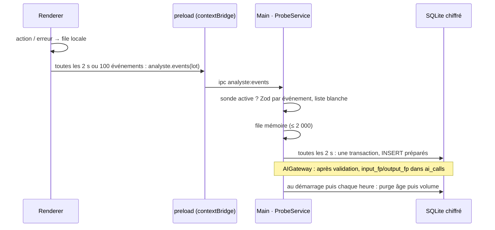

# Niveau 3 — Conception Technique : AN-A — Sonde
> Basé sur : L1g-analyste-interne.md (A2, A7) + L2-analyste-sonde.md · Date : 2026-10-07
> Code lu : `infrastructure/logging/logger.ts` (liste blanche, `stdoutSink`), `db/schema.ts` (`ai_calls`),
> `ipc/registry.ts`, `infrastructure/secrets/SecretStore.ts`

## 1. Contrat IPC
| Canal | Sens | Entrée (Zod) | Sortie | Erreurs |
|-------|------|--------------|--------|---------|
| `analyste:events` | renderer → main, sans réponse attendue | `{ events: ProbeEvent[] }` (≤ 100) | `ok` | lot invalide → événements fautifs ignorés, compteur `probe.dropped` |
| `analyste:observations` | invoke | `{ family?, from?, to?, cursor?, limit ≤ 200 }` | `{ items: ObservationView[], next? , totals }` | `PROBE_INACTIVE` |
| `analyste:purge` | invoke | `{ confirm: true }` | `{ deleted }` | `PROBE_INACTIVE` |
| `analyste:settings:get` / `:set` | invoke | `{ retentionDays 7–90, maxEvents 10k–200k }` | réglages | `INVALID_INPUT` |
| `analyste:repo:choose` | invoke | — (dialogue natif dans le main) | `{ repoPath, active }` | `NOT_BRAINSTORMER_REPO`, `PACKAGED_APP` |

`ProbeEvent` = union discriminée sur `event` : chaque nom du **catalogue** (`src/shared/analyste/events.ts`) a son
schéma de champs. Aucun champ libre ; chaînes ≤ 48 caractères, énumérations partout où c'est possible.

## 2. Catalogue des événements (première version)
| Famille | Source | Événements | Champs |
|---------|--------|------------|--------|
| **navigation** | renderer | `screen.open`, `panel.open`, `panel.close` | `screen` (énum : carte, chat, réglages, historique, reprise, explorateur, documents, widgets…), `durationMs` à la fermeture |
| **action** | renderer | `neuron.create`, `neuron.move`, `link.create`, `proposal.accept`, `history.undo`, `chat.send`, `widget.place`, `structure.open`… | `subjectKind` (énum), `subjectRef` (pseudonyme), `via` (souris, clavier, menu, MCP) |
| **erreur** | main (journal) + renderer (`error`, `unhandledrejection`) | `error.main`, `error.renderer`, `error.ipc` | `code` (nom de l'erreur ou code métier), `module`, `frames` (≤ 5 « fichier:ligne » **relatifs au dépôt** ; jamais le message) |
| **performance** | main (enveloppe du registre IPC) | `ipc.call` | `channel`, `durationMs`, `status` (ok / error) |
| **IA** | `AIGateway` | lu dans `ai_calls` (pas de doublon) | + `input_fp`, `output_fp` (§3) |

- Le message d'une erreur n'est **jamais** gardé (il peut contenir un texte saisi) : seulement son nom, son code et les
  cadres de pile situés dans le dépôt.
- `ipc.call` est mesuré **une fois** dans l'enveloppe du registre IPC : toutes les fonctionnalités sont couvertes sans
  toucher leur code.
- Le journal existant gagne un second puits : `createLogger(teeSink(stdoutSink, probeSink))` ; `warn` / `error` →
  famille erreur, `info` connus du catalogue → famille action.

## 3. Schéma de données
### Tables
| Table | Colonnes | Contraintes | Index |
|-------|----------|-------------|-------|
| `observations` | `id` integer PK auto · `at` integer (ms) · `family` text · `event` text · `screen` text? · `subject_kind` text? · `subject_ref` text? · `via` text? · `channel` text? · `code` text? · `module` text? · `frames` text? (JSON ≤ 5) · `duration_ms` integer? · `status` text? · `count` integer défaut 1 | `family` ∈ énum ; longueurs bornées ; aucune colonne de texte libre | `(at)`, `(family, at)`, `(event, at)` |
| `ai_calls` (existante) | + `input_fp` text? · `output_fp` text? | 16 car. hex ; remplies seulement si la sonde est active | + `(kind, input_fp)` |
| réglages (table clé/valeur existante, à confirmer au plan) | `analyste.repoPath`, `analyste.retentionDays`, `analyste.maxEvents` | validés par Zod à la lecture | — |

Migration Drizzle `00NN_analyste_probe` + `migrations/down/00NN_analyste_probe.down.sql` écrit à la main (constitution).

### Empreintes et pseudonymes
- **Clé** : 32 octets aléatoires créés à l'activation, chiffrés par `SecretStore` (`safeStorage`/DPAPI — protection des
  données de Windows liée à ta session) ; jamais en base en clair, jamais envoyés.
- **`input_fp`** = `HMAC-SHA256(clé, kind ‖ version de la consigne ‖ JSON canonique de l'entrée)` tronqué à 16 hex.
  JSON canonique = clés triées, espaces de bord retirés. Le modèle n'entre pas dans l'empreinte (même travail, autre
  modèle = même entrée).
- **`output_fp`** = idem sur la sortie **validée** (après Zod). Une sortie invalide n'a pas d'empreinte.
- **`subject_ref`** = `HMAC-SHA256(clé, "ref" ‖ id de l'objet)` tronqué à 12 hex : stable sur la fenêtre, sans lien
  calculable avec la base sans la clé.

## 4. Diagramme de séquence

## 5. Cas limites techniques
- **Concurrence :** une seule file d'écriture dans le main ; écriture par lots en transaction ; aucune lecture
  bloquante sur le chemin d'une action.
- **Idempotence :** un lot rejoué (rechargement du renderer) peut dupliquer quelques événements : accepté (statistiques),
  pas de clé d'unicité.
- **Rafales :** au-delà de 2 000 événements en file, les événements `action` / `navigation` identiques consécutifs sont
  fusionnés (`count` += 1) ; au-delà de 5 000, les nouveaux sont abandonnés et comptés (`probe.dropped`).
- **Transactions :** échec d'écriture → lot abandonné, compteur, jamais d'exception remontée à l'app.
- **Volumétrie :** 50 000 lignes ≈ quelques Mo ; purge `DELETE … WHERE at < ?` puis
  `DELETE … WHERE id <= (SELECT id … ORDER BY id DESC LIMIT 1 OFFSET maxEvents)`.
- **App installée :** `app.isPackaged` → le service n'est pas créé, `analyste:*` répond `PACKAGED_APP`, le renderer ne
  monte pas la file.

## 6. Sécurité spécifique
| Risque | Vecteur | Mitigation |
|--------|---------|------------|
| Fuite de contenu | Message d'erreur, champ libre, nom de fichier personnel | Catalogue fermé (Zod), aucun message d'erreur, cadres de pile filtrés au dépôt, chaînes ≤ 48 |
| Retrouver un texte par son empreinte | Dictionnaire sur des textes courts (« oui », « acheter du pain ») | HMAC à clé locale chiffrée : sans la clé, aucune empreinte calculable |
| Renderer compromis qui inonde la base | Appels massifs `analyste:events` | Lots ≤ 100, file bornée, abandon compté, purge par volume |
| Sonde active hors développement | App installée chez un contributeur | `app.isPackaged` ⇒ service absent ; activation seulement par dialogue natif + vérification du dépôt |
| Désignation d'un faux dépôt | Dossier piégé qui se dit « Brainstormer » | Vérifications : racine git (`git rev-parse --show-toplevel`), `package.json` au nom attendu, `src/main/bootstrap.ts` présent, et dossier = celui d'où tourne l'app (`app.getAppPath()` dedans) |
| Journalisation sensible | Nouvelle entrée de log | Le puits de la sonde réutilise la liste blanche du journal (`sanitize`) avant son propre schéma |
