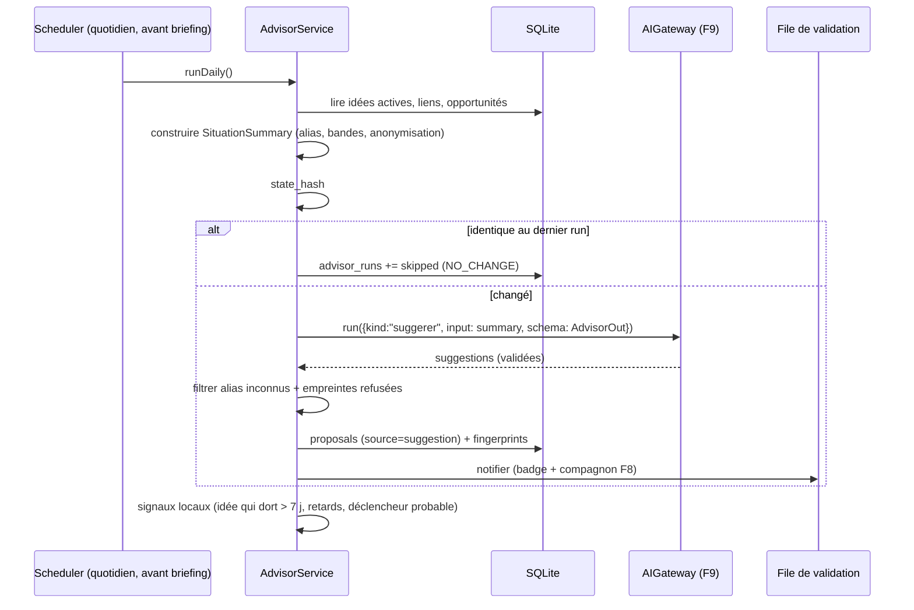

# Niveau 3 — Conception Technique : F7 — Conseiller proactif
> Basé sur : docs/brainstorm/L1-fondation.md + docs/brainstorm/L2-conseiller-proactif.md + L3-moteur-ia.md
> Date : 2026-09-28 · Livraison : MVP-2

## 1. Contrat API

### 1a. Canaux IPC
| Canal | Entrée | Sortie | Codes d'erreur |
|-------|--------|--------|-----------------|
| `advisor:estimate` | — | `{ changed: boolean, estimatedCostCents: number }` | — |
| `advisor:run` | `{ confirmCostCents: number }` (doit égaler l'estimation courante ±10 %) | `{ suggestions: Proposal[] }` | `NO_CHANGE`, `BUDGET_EXCEEDED`, `AI_*`, `ESTIMATE_OUTDATED` |
| `advisor:localSignals` | — | `LocalSignal[]` | — |
| `advisor:lastRun` | — | `{ at, suggestionsCount, skippedReason? }` | — |

Les suggestions sont des `proposals` (source `suggestion`) → validées/refusées via F3.

### 1b. Entrée envoyée à Claude — « Résumé de situation » (produit localement)
```ts
SituationSummary = {
  asOf: string,                                  // date ISO
  ideas: Array<{
    key: string,                                 // alias stable "I12" (pas l'uuid)
    category: string, status: string,
    title: string,                               // anonymisé : noms de personnes → [personne]
    openTasks: number, nextDue?: string,
    amountBand?: "<100" | "100-500" | "500-1000" | "1000-2500" | ">2500",   // bandes, pas de montant exact
    blockedBy?: string[]                          // alias
  }>,                                             // ≤ 40 idées actives, les plus récentes / proches d'échéance
  opportunities: Array<{ key: string, amountBand: string, expected?: string }>,
  links: Array<{ from: string, to: string, kind: string }>,
  rejectedPatterns: string[]                     // empreintes textuelles des suggestions refusées récentes
}
```
La table de correspondance alias ↔ uuid reste **en mémoire locale**, jamais envoyée.

### 1c. Sortie attendue (schéma Zod, `messages.parse`)
```ts
AdvisorOut = {
  suggestions: Array<{                           // 0..3
    type: "financement" | "regroupement" | "ordonnancement" | "idee_qui_dort" | "doublon",
    ideaKeys: string[],                          // alias existants uniquement (1..4)
    title: string,                               // ≤ 120
    explanation: string,                         // ≤ 400 — « pourquoi »
    proposedChanges: {
      links?: Array<{ from: string, to: string, kind: "finances" | "related" | "blocks" }>,
      reorder?: Array<{ ideaKey: string, beforeIdeaKey: string }>
    }
  }>
}
```
Contrôles après parsing : chaque alias existe, types autorisés, pas de doublon avec `rejectedPatterns`.

## 2. Schéma de données détaillé
| Table | Colonnes | Contraintes | Index |
|-------|----------|-------------|-------|
| `advisor_runs` | id, trigger (`daily`/`manual`), state_hash, status (`done`/`skipped`/`failed`), skipped_reason?, suggestions_count, ai_call_id?, created_at | — | created_at |
| `suggestion_fingerprints` | id, fingerprint (sha256 de type + alias triés + cibles), proposal_id, status (`pending`/`accepted`/`rejected`), created_at | fingerprint unique tant que rejetée < 60 jours | fingerprint |

`state_hash` = empreinte du résumé de situation → **pas de nouvel appel si identique** au dernier run réussi.

## 3. Diagramme de séquence (Mermaid)


## 4. Cas limites techniques
- **Concurrence :** un seul run à la fois (verrou en mémoire + `advisor_runs` en cours) ; un run manuel pendant le run quotidien renvoie le résultat en cours.
- **Idempotence :** même `state_hash` → pas de nouvel appel ; suggestions dédupliquées par empreinte.
- **PC éteint à l'heure prévue :** le run quotidien s'exécute au prochain démarrage (au plus une fois par jour calendaire).
- **Suggestion devenue invalide :** idée archivée/modifiée avant validation → proposition marquée `stale` (mécanisme F3).
- **Volumétrie :** résumé plafonné à 40 idées actives (priorité : échéance proche, récente, liée à une opportunité) ; coût visé par run < 0,05 € (à mesurer).
- **Signaux locaux** (sans IA) : requêtes SQL simples — `ideas.status = raw AND created_at < now-7j`, tâches `due_date < today AND status != done`, déclencheurs `on_trigger` liés à une opportunité dont `expected` est passée.

## 5. Sécurité spécifique à cette fonctionnalité
| Risque | Vecteur | Mitigation |
|--------|---------|------------|
| Profilage financier chez un tiers | Envoi de la situation complète | Bandes de montants, alias, noms de personnes retirés, plafond de 40 idées |
| Hallucination d'entités | Alias inventés | Rejet de toute suggestion référant un alias inconnu |
| Harcèlement / spam | Suggestions répétées | Max 3/run, empreintes des refus 60 jours |
| Dérive de coût | Runs répétés | `state_hash`, 1 run quotidien auto, confirmation du coût pour le manuel |
| Application silencieuse | Bug | Suggestions = propositions F3, jamais appliquées directement |
