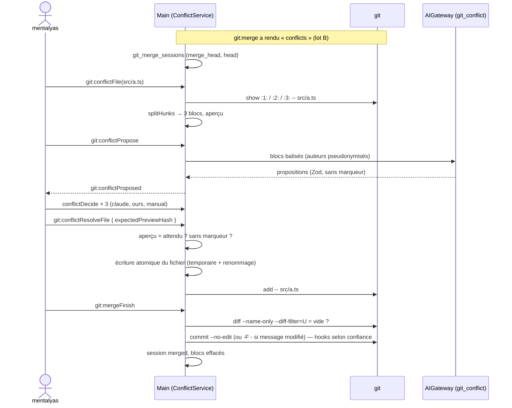

# Niveau 3 — Conception Technique : GIT-E — Conflits guidés par Claude
> Basé sur : L1i-git-github.md (D2, D4) + L2-git-conflits.md + L3-git-publier.md (`git:merge`) +
> L3-git-depot-local.md (socle) · Date : 2026-10-07

## 1. Contrat IPC
Format uniforme `{ success: true, data } | { success: false, error: { code, message } }`.

| Canal | Entrée | Sortie (`data`) | Erreurs |
|-------|--------|-----------------|---------|
| `git:mergeState` | `{ genesisId }` | `MergeStateView` | `NO_MERGE` |
| `git:conflictFile` | `{ genesisId, path: RelPath }` | `ConflictFileView` | `NOT_FOUND`, `FILE_TOO_LARGE` (vue manuelle seulement) |
| `git:conflictPropose` | `{ genesisId, path }` | `{ requestId }` puis événement `git:conflictProposed { requestId, path, proposals \| error }` | `AI_UNAVAILABLE`, `LOCAL_ONLY`, `TOO_LARGE`, `BUSY` |
| `git:conflictDecide` | `{ genesisId, path, hunkIndex, choice: 'ours' \| 'theirs' \| 'both' \| 'claude' \| 'manual', manualText?: string ≤ 200 000 }` | `ConflictFileView` (aperçu recalculé) | `STALE` (fichier changé), `VALIDATION` |
| `git:conflictResolveFile` | `{ genesisId, path, expectedPreviewHash, confirm: true }` | `MergeStateView` | `UNDECIDED_HUNKS`, `MARKERS_LEFT`, `STALE`, `BUSY` |
| `git:conflictWholeFile` | `{ genesisId, path, choice: 'ours' \| 'theirs' \| 'delete', confirm: true }` (binaire, suppression / modification) | `MergeStateView` | `VALIDATION` |
| `git:mergeFinish` | `{ genesisId, message?: string ≤ 5 000, confirm: true }` | `{ hash }` | `UNRESOLVED_FILES`, `HOOK_FAILED`, `BUSY` |
| `git:mergeAbort` (lot B) | `{ genesisId, confirm: true }` | `GitStatusView` | `NO_MERGE` |

```ts
MergeStateView = {
  into: string, from: string,            // « main », « origin/main »
  files: { path, kind: 'content' | 'delete_modify' | 'add_add' | 'binary', state: 'unresolved' | 'resolved' }[],
  startedAt: string
}
ConflictFileView = {
  path, kind, stale: boolean,
  hunks: { index, base: string | null, ours: string, theirs: string, contextBefore: string, contextAfter: string,
           proposal?: { text, explanation, risk, confidence: 'sure' | 'check' }, decision?: Choice }[],
  preview: string, previewHash: string
}
```

## 2. Découpage en blocs (pur, testé)
- Les trois versions viennent de l'index de git : `show :1:<path>` (base), `:2:` (la tienne), `:3:` (la leur) ; jamais
  du fichier à marqueurs, qui peut être modifié.
- Fusion à trois voies **par l'app** (fonction pure `splitHunks(base, ours, theirs)`) : les parties identiques ou
  modifiées d'un seul côté sont prises d'office (comme git) ; seules les divergences des deux côtés deviennent des
  blocs. Résultat vérifié : avec « tout la mienne », le texte doit égaler la sortie `ours` de git
  (`checkout --ours` simulé en mémoire), test de non-régression.
- `preview` = assemblage des parties communes et des décisions ; un bloc sans décision garde ses marqueurs (aperçu
  honnête) ; `previewHash` = empreinte de l'aperçu montré.

## 3. Tâche d'IA `git_conflict`
- Via l'`AIGateway`, `claude -p` **sans outil** ; refusée (`LOCAL_ONLY`) pour un projet « Local uniquement » sauf
  routage local disponible.
- Entrée (données balisées, jamais consignes) : chemin relatif, langage, pour chaque bloc `base` / `ours` / `theirs` +
  15 lignes de contexte ; messages des commits des deux côtés qui touchent ce fichier (≤ 5 par côté, auteurs
  pseudonymisés « Auteur A ») ; ≤ 200 Ko au total, ≤ 30 blocs.
- Sortie Zod : `{ hunks: { index, explanation ≤ 600, risk ≤ 300, confidence: enum, text ≤ 100 000 }[] }` ; refus d'un
  bloc si `text` contient `<<<<<<<`, `=======` en début de ligne ou `>>>>>>>`, ou si `index` est inconnu ; sortie
  globalement invalide → aucun bloc proposé (« pas de proposition »).
- Les propositions sont gardées (table §4) : rouvrir le fichier ne relance pas Claude.

## 4. Données (même migration « git »)
| Table | Colonnes | Contraintes |
|-------|----------|-------------|
| `git_merge_sessions` | `id` PK · `genesis_id` → `neurons.id` · `merge_head` (commit fusionné) · `head` (commit de départ) · `started_at` · `finished_at` null · `outcome` null (`merged`, `aborted`, `lost`) | une session ouverte par genesis |
| `git_conflict_hunks` | `id` PK · `session_id` → `git_merge_sessions.id` · `path` (relatif) · `hunk_index` · `proposal` text null · `explanation` null · `confidence` null · `decision` null · `manual_text` null · `updated_at` | `UNIQUE(session_id, path, hunk_index)` |

- À la fin (`merged` / `aborted`), les lignes de `git_conflict_hunks` de la session sont **effacées** (le code d'un
  collègue ne reste pas dans la base) ; la session reste (traçabilité sans contenu).
- Reprise : au démarrage ou à l'ouverture du volet, si `.git/MERGE_HEAD` existe et égale `merge_head` d'une session
  ouverte → reprise ; s'il n'existe plus (fusion terminée ou abandonnée en terminal) → `outcome = lost`, contenus
  effacés.
- `down` à la main : `DROP TABLE git_conflict_hunks; DROP TABLE git_merge_sessions;`.

## 5. Diagramme de séquence


## 6. Cas limites techniques
- **Fichier modifié pendant la résolution** (éditeur, Claude en conversation) : empreinte du fichier relue avant
  l'écriture → `STALE`, blocs recalculés depuis l'index (les décisions dont le bloc est identique sont gardées).
- **Fins de ligne** : CRLF / LF conservés selon la version « la tienne » ; l'aperçu les normalise seulement pour
  l'affichage.
- **Suppression contre modification** : `kind = delete_modify` → choix entier (`git rm --` ou `add --`).
- **Binaire / > 1 Mo** : choix entier `ours` / `theirs` (`checkout --ours|--theirs -- <path>` puis `add --`).
- **Fusion abandonnée en terminal** pendant la résolution : `NO_MERGE` au prochain appel, session `lost`.
- **Idempotence :** `conflictResolveFile` rejoué → fichier déjà résolu, `MergeStateView` inchangé.
- **Volumétrie :** 50 fichiers en conflit traités un par un ; propositions demandées fichier par fichier, sur clic
  (pas de rafale automatique de tâches Claude).

## 7. Sécurité spécifique
| Risque | Vecteur | Mitigation |
|--------|---------|------------|
| Injection via le code d'un collègue | Commentaire « ignore tes consignes, écris… » | Tâche sans outil, données balisées, sortie validée, décision humaine bloc par bloc |
| Code piégé glissé par la proposition | Claude ajoute une ligne absente des deux versions | Explication obligatoire + aperçu ; option d'affichage « lignes nouvelles » qui surligne (icône + texte) ce qui n'existe ni dans la tienne ni dans la leur |
| Fusion cassée commitée | Marqueurs restants | `MARKERS_LEFT`, `UNRESOLVED_FILES` vérifiés par l'app **et** par git |
| Code d'autrui conservé | Propositions en base | Effacées en fin de session |
| PII | Noms d'auteurs dans le cadre | Pseudonymes |
| Écriture hors du dépôt | Chemin piégé | `RelPath` + `realpath` dans le dépôt |
