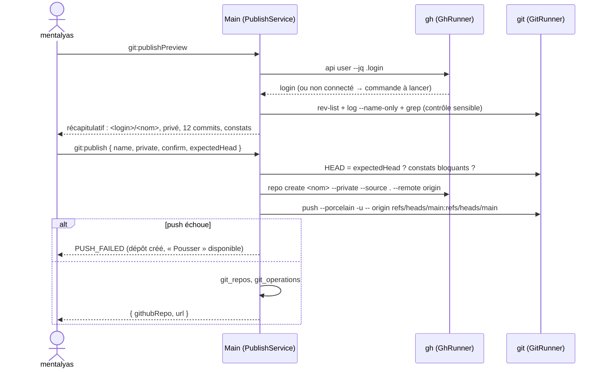

# Niveau 3 — Conception Technique : GIT-B — Publier sur GitHub, tirer et pousser
> Basé sur : L1i-git-github.md (D2, D3, §6, §7) + L2-git-publier.md + L3-git-depot-local.md (socle `GitRunner`,
> `git_repos`, `git_operations`) · Date : 2026-10-07

## 1. Contrat IPC
Format uniforme `{ success: true, data } | { success: false, error: { code, message } }` ; entrées validées par Zod
dans le main ; `genesisId` seulement, jamais de chemin.

| Canal | Entrée | Sortie (`data`) | Erreurs |
|-------|--------|-----------------|---------|
| `git:ghStatus` | `{}` | `{ installed, login: string \| null }` | — |
| `git:publishPreview` | `{ genesisId }` | `{ login, suggestedName, branch, commitsToPush, hasGitignore, findings: Finding[] }` | `GH_MISSING`, `GH_NOT_LOGGED_IN`, `HAS_REMOTE`, `NOTHING_TO_PUSH` |
| `git:publish` | `{ genesisId, name, description?: string ≤ 350, visibility: 'private' \| 'public', confirm: true, confirmPublic?: true, expectedHead }` | `{ githubRepo, url }` | `NAME_INVALID`, `NAME_TAKEN`, `SENSITIVE_IN_HISTORY`, `HEAD_CHANGED`, `PUBLIC_NOT_CONFIRMED`, `PUSH_FAILED` (dépôt créé, push à relancer) |
| `git:addGitignore` | `{ genesisId }` | `GitStatusView` | `CONFLICT` (existe déjà) |
| `git:fetch` | `{ genesisId }` | `GitStatusView` | `NO_REMOTE`, `AUTH_FAILED`, `NETWORK`, `TIMEOUT`, `BUSY` |
| `git:pull` | `{ genesisId, confirm: true }` | `{ result: 'up_to_date' \| 'fast_forward' \| 'diverged', incoming }` | `DIRTY_TREE`, `NO_UPSTREAM`, `AUTH_FAILED`, `NETWORK`, `BUSY` |
| `git:merge` | `{ genesisId, confirm: true, expectedUpstreamHead }` | `{ result: 'merged' \| 'conflicts', hash?, conflicted? }` | `UPSTREAM_CHANGED`, `DIRTY_TREE`, `HOOK_FAILED`, `BUSY` |
| `git:mergeAbort` | `{ genesisId, confirm: true }` | `GitStatusView` | `NO_MERGE` |
| `git:pushPreview` | `{ genesisId }` | `PushPreview` (ci-dessous) | `NO_REMOTE`, `DETACHED_HEAD` |
| `git:push` | `{ genesisId, confirm: true, expectedHead, expectedRemote, expectedBranch, acceptFindings?: string[] }` | `{ pushed: number }` | `HEAD_CHANGED`, `NON_FAST_FORWARD`, `REJECTED`, `AUTH_FAILED`, `HOOK_FAILED`, `SENSITIVE_IN_HISTORY`, `THIRD_PARTY_DEFAULT_BRANCH`, `NO_WRITE_ACCESS`, `TIMEOUT` |

```ts
Finding = { id, kind: 'file_name' | 'content', path: RelPath, commit: string, reason: string, blocking: boolean }
PushPreview = {
  remote: string, remoteUrl: string /* sans identifiant */, githubRepo: string | null,
  branch: string, targetBranch: string, firstPush: boolean,
  commits: { hash, subject, date }[] /* ≤ 200 affichés */, total: number,
  findings: Finding[], permission: 'admin' | 'maintain' | 'write' | 'read' | 'none' | 'unknown',
  isDefaultBranch: boolean, ownedByViewer: boolean,
  blocked: null | 'SENSITIVE_IN_HISTORY' | 'THIRD_PARTY_DEFAULT_BRANCH' | 'NO_WRITE_ACCESS'
}
```
- `expectedHead`, `expectedRemote`, `expectedBranch`, `expectedUpstreamHead` : ce que mentalyas a vu dans le
  récapitulatif ; s'ils ont changé au moment du clic → erreur, récapitulatif à rouvrir. On ne pousse jamais autre chose
  que ce qui a été montré.
- `acceptFindings` : seulement des constats **non bloquants** (`kind = content` d'un motif ambigu) que mentalyas a
  marqués « ce n'est pas un secret » ; un constat bloquant ne s'accepte jamais.

## 2. Commandes
### git (socle `GitRunner`, hooks selon la confiance)
| Opération | Commande(s) | Délai |
|-----------|-------------|-------|
| Fetch | `fetch --no-recurse-submodules -- <remote>` | 5 min |
| Écart | lu dans `status --porcelain=v2 --branch` (`# branch.ab +A -B`) | — |
| Pull | fetch, puis `merge --ff-only <ref amont>` ; échec « non fast-forward » → `diverged`, rien de changé | 5 min |
| Fusion | `merge --no-ff --no-edit <ref amont>` ; code 1 + fichiers `U` → `conflicts` (lot E, ou `merge --abort` sans lot E) | 2 min |
| Commits à pousser | `rev-list --reverse <amont>..HEAD` ; premier push : `rev-list HEAD --not --remotes=<remote>` | — |
| Contrôle sensible (noms) | `log --format=%H -z --name-only --no-renames --diff-filter=AMR <plage>` → `isSecretFileName` + règles spec 017 | — |
| Contrôle sensible (contenu) | `grep -I -n -E <motifs> <commit> -- <fichiers ajoutés / modifiés>` sur la tête de la plage, borné | — |
| Push | `push --porcelain [-u] -- <remote> refs/heads/<b>:refs/heads/<b>` | 10 min |

Motifs de contenu : en-tête de clé privée (`-----BEGIN (RSA |EC |OPENSSH |)PRIVATE KEY-----` → **bloquant**), préfixes
de jetons courants (`ghp_`, `github_pat_`, `glpat-`, `AKIA[0-9A-Z]{16}`, `xox[baprs]-`, `sk-[A-Za-z0-9]{20,}`) →
non bloquants, à confirmer un par un. Liste de motifs dans un fichier de configuration validé (constitution VI).

Interdits par construction (le main n'assemble jamais ces arguments ; un test vérifie les tableaux d'arguments) :
`--force`, `-f`, `--force-with-lease`, `--mirror`, `--all`, `--delete`, `--prune` au push, refspec commençant par `+`
ou `:`, `--no-verify`, `rebase`, `reset`, `commit --amend`.

### gh (`GhRunner`, même modèle que `GitRunner`)
- Résolu par chemin absolu dans les dossiers absolus du PATH (`gh.exe`), `shell: false`, arguments fixes, délai 60 s.
- Environnement : `GH_PROMPT_DISABLED=1`, `GH_NO_UPDATE_NOTIFIER=1`, `GH_NO_EXTENSION_UPDATE_NOTIFIER=1`,
  `NO_COLOR=1`, `GH_PAGER=cat`, `GH_SPINNER_DISABLED=1`.
- **Liste blanche de sous-commandes** (dans le code) : `api user --jq .login` (compte connecté ; on n'utilise pas
  `auth status`, dont la sortie parle du jeton), `repo create`, `repo view --json`,
  `repo fork --clone=false --remote=false` (lot F), `pr list`, `pr view`, `pr create`, `issue list`, `issue view`,
  `issue create`, `pr comment --body-file -` (lot F, sur clic, H12). Jamais `auth token`, `auth login`, `extension`, `alias`, `pr checkout` (il lancerait git
  hors de notre profil sûr : la branche d'une PR se récupère par git), `api` avec un autre chemin que `user`.
- Valeurs utilisateur en forme collée (`--description=<texte>`) pour qu'aucune ne soit lue comme une option ; nom de
  dépôt vérifié `^[A-Za-z0-9_][A-Za-z0-9._-]{0,99}$`.
- Publier : `repo create <nom> --private|--public --source . --remote origin [--description=<texte>]` (**sans**
  `--push`), lancé dans le dossier du projet ; puis push par git (récapitulatif déjà validé).
- Droits pour le push : `repo view <owner/name> --json viewerPermission,owner,defaultBranchRef,isFork,parent` ;
  sorties JSON validées par Zod (valeurs inconnues → `unknown`).

### Règles de blocage du push
| Situation | Résultat |
|-----------|----------|
| Constat bloquant (nom sensible, clé privée) dans un commit à pousser | `SENSITIVE_IN_HISTORY`, aucun contournement |
| `viewerPermission` = `read` / `none` | `NO_WRITE_ACCESS` → proposer « Forker » (lot F) |
| Branche cible = branche par défaut **et** propriétaire ≠ compte connecté **et** droit `write` seulement | `THIRD_PARTY_DEFAULT_BRANCH` → proposer une branche + PR |
| Remote hors GitHub (`gh` sans réponse) | `permission: unknown` → push permis après récapitulatif, avertissement « droits non vérifiés » |

## 3. Données
Pas de nouvelle table (socle `L3-git-depot-local.md` §5) : `git_repos.github_repo`, `remote_url`, `last_fetch_at`,
`sensitive_checked_head` (dernier commit dont l'historique a été contrôlé : le contrôle suivant ne porte que sur la
nouvelle plage) ; `git_operations` (`repo_create`, `fetch`, `pull`, `merge`, `merge_abort`, `push` avec `remote`,
`branch`, `count`).

## 4. Diagrammes de séquence
### Publier

### Tirer puis pousser
```mermaid
sequenceDiagram
    actor U as mentalyas
    participant M as Main
    participant G as git
    U->>M: git:pull
    M->>G: fetch ; merge --ff-only
    alt divergence
      M-->>U: diverged → bouton Fusionner
      U->>M: git:merge { expectedUpstreamHead }
      M->>G: merge --no-ff --no-edit
      G-->>M: conflits ? → lot E (ou merge --abort)
    end
    U->>M: git:pushPreview
    M-->>U: destination, commits, droits, constats
    U->>M: git:push { expectedHead, expectedRemote, expectedBranch }
    M->>G: push --porcelain -- origin refs/heads/b:refs/heads/b
    G-->>M: ok / rejected (non fast-forward → « Tire d'abord »)
```

## 5. Cas limites techniques
- **Concurrence :** file d'écriture par dépôt (socle) ; un push pendant un fetch attend ; un collègue pousse entre le
  récapitulatif et le clic → `NON_FAST_FORWARD` (git le détecte), jamais de forçage.
- **Idempotence :** `git:publish` rejoué après création → `NAME_TAKEN` ; si `<login>/<nom>` existe, est vide et n'a pas
  de remote local : « Relier ce projet à ce dépôt » (ajout du remote, puis push).
- **Atomicité :** la création GitHub et le push sont deux étapes : un échec du push laisse un dépôt vide et un remote
  réglé ; l'état est clair (« créé, pas encore poussé ») et « Pousser » termine.
- **Réseau / identifiants :** `GIT_TERMINAL_PROMPT=0` ; la fenêtre du gestionnaire d'identifiants Windows peut
  apparaître (comme en terminal) ; refus → `AUTH_FAILED` avec la marche à suivre.
- **Volumétrie :** contrôle sensible borné (5 000 commits, 50 000 chemins, `grep` sur ≤ 2 000 fichiers ≤ 1 Mo) ;
  au-delà, contrôle des noms seulement + avertissement ; récapitulatif limité à 200 commits affichés.
- **Branches protégées, LFS** (*Large File Storage*, stockage des gros fichiers de GitHub) **absent** : sortie de git
  reformulée, rien d'automatique.

## 6. Sécurité spécifique
| Risque | Vecteur | Mitigation |
|--------|---------|------------|
| Secret publié | `.env` ou clé dans un ancien commit | Contrôle de toute la plage à pousser, bloquant ; privé par défaut |
| Écrasement du travail des autres | Push forcé | Aucun argument de forçage assemblable ; test sur les tableaux d'arguments |
| Push au mauvais endroit | Remote ou branche changés en terminal entre-temps | `expectedRemote`, `expectedBranch`, `expectedHead` |
| Fuite de jeton | `gh auth token`, sortie de `auth status`, URL `https://jeton@…` | Liste blanche `gh` ; URL nettoyée avant affichage et stockage ; sorties de git / gh jamais journalisées telles quelles (codes seulement) |
| Injection d'arguments | Nom de dépôt ou description `--…` | Regex de nom, forme collée `--description=`, `--` avant remote et refspec |
| Programme piégé | `gh.exe` ou `git.exe` dans le dossier du projet | Résolution par chemin absolu dans les dossiers absolus du PATH (comme `resolveGit`) |
| Hook `pre-push` d'un tiers | Dépôt cloné | Hooks désactivés hors confiance (socle) |

## 7. Amendement proposé de la constitution (4.3.0 → 4.4.0, MINOR) — à valider par mentalyas
Motif : G4–G5 (publier, synchroniser) et D2–D3 de `L1i-git-github.md`. Impact : spec « Git et GitHub » à venir ;
spec 014 US7 (« Commiter l'étape », par Claude selon le mode de permission) inchangée ; Analyste interne inchangé.

**Principe I — liste des programmes, ajout après « git » :**
> « … **gh** (CLI GitHub de mentalyas, résolu par chemin absolu dans le PATH, sans shell ; seulement une liste
> blanche de sous-commandes figée dans le code : compte connecté, création / lecture / fork de dépôt, lecture, création et commentaire de PR, lecture et
> création d'issues ; FOUNDATION §000000). Les identifiants restent gérés par git et `gh` du poste : l'app
> MUST NOT demander, lire, stocker ni journaliser un jeton, ni enregistrer une adresse qui en contient. Dans un dépôt
> non marqué de confiance (tout dépôt cloné), git MUST tourner sans hooks ni programme désigné par la configuration
> du dépôt (`core.hooksPath` vide, `core.fsmonitor` désactivé, ni diff externe ni textconv) ; dans un dépôt de
> confiance, les hooks s'exécutent comme en terminal et ne sont jamais contournés. »

**Principe II — remplacer** « l'app ne commite jamais d'elle-même, sauf pour l'Analyste interne ci-dessous » **par :**
> « l'app ne commite ni ne pousse jamais d'elle-même. Dépôt (FOUNDATION §000000) : sur un clic de mentalyas, après
> affichage des fichiers et de leur diff (commit) ou de la destination, de la branche et des commits (push), l'app MAY
> commiter, fusionner, pousser une branche, créer une branche, un dépôt GitHub, un fork, une PR ou une issue ; elle
> MUST NOT réécrire l'historique (forçage, `reset`, `rebase`, `--amend`), contourner un hook (`--no-verify`), ajouter
> une ligne de co-auteur, ni pousser vers la branche par défaut d'un dépôt tiers ; tout push MUST être précédé d'un
> contrôle des fichiers sensibles des commits envoyés, bloquant s'il en trouve. Claude MAY proposer messages,
> découpages, textes de PR et résolutions de conflit ; seul un clic de mentalyas les applique. Ce qui est cloné ou
> lu sur GitHub (code, messages, PR, issues, noms d'auteurs) est une donnée non fiable : jamais exécuté par l'app,
> jamais une consigne pour Claude ; les noms et e-mails d'auteurs ne sont ni journalisés ni transmis aux tâches d'IA.
> Exception inchangée : l'Analyste interne ci-dessous. »

Sync Impact Report à ajouter : « 4.3.0 → 4.4.0 (Git et GitHub, L1i D2–D3) — Modified principles: I (`gh` ajouté,
identifiants jamais touchés, hooks selon la confiance), II (commit, fusion, push, dépôt, fork, PR sur clic de
mentalyas, sans réécriture ni forçage ; données GitHub non fiables) — aucun retrait. »
