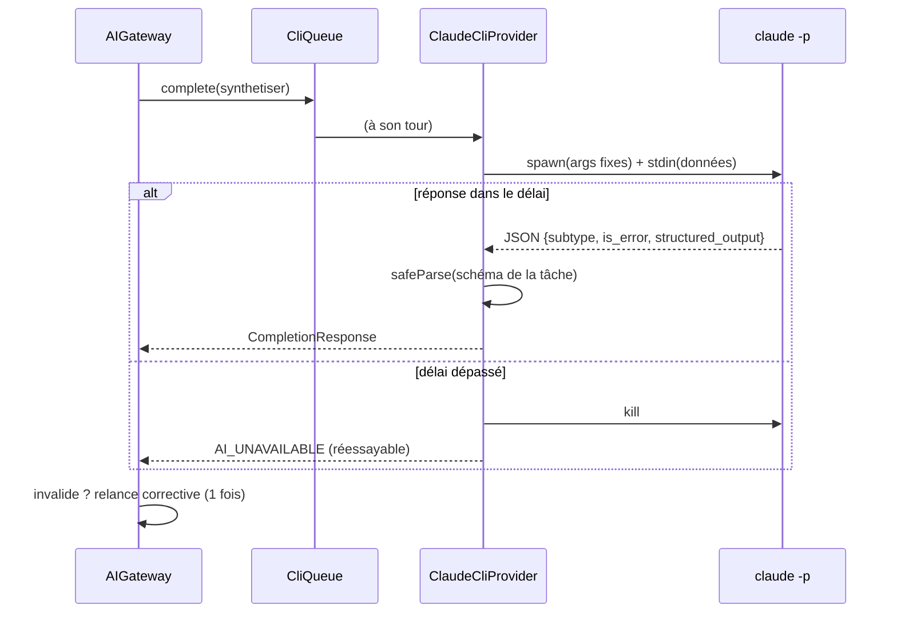

# Niveau 3 — Conception Technique : F11 Moteur CLI
> Basé sur : L1c-pont-claude-code.md + L2-moteur-cli.md · Date : 2026-10-04
> Vérifié sur la machine de mentalyas : Claude Code **2.1.289**, essai réel `claude -p --json-schema` concluant (§0).

## 0. Mesure préalable (2026-10-04)
Appel d'essai : `claude -p --output-format json --json-schema <schéma> --tools "" --strict-mcp-config
--no-session-persistence --disable-slash-commands --model haiku --system-prompt "<consigne>"`, entrée par stdin.
- Résultat : `structured_output` conforme au schéma, `is_error: false`, `subtype: success`.
- Durée : **2,6 s** (Haiku), dont ~1,2 s avant le premier contenu.
- Surcoût fixe : **~6 000 jetons d'entrée** par appel (consigne système du CLI + mémoire utilisateur), mis en cache
  1 h. Inclus dans l'abonnement ; le champ `total_cost_usd` est un prix catalogue indicatif, pas une facture.
- **Piège :** `--bare` (mode minimal) force l'authentification par clé API et ignore l'abonnement → **ne jamais
  l'utiliser**.

## 1. Contrat : `ClaudeCliProvider` (implémente `AIProvider` existant)
| Méthode | Lancement | Entrée (stdin) | Sortie | Erreurs (`ProviderError`) |
|---------|-----------|----------------|--------|---------------------------|
| `complete(req)` | `claude -p --output-format json --json-schema <z.toJSONSchema(req.schema)> --tools "" --strict-mcp-config --no-session-persistence --disable-slash-commands --permission-prompts none --model <m> --effort <e> --system-prompt <blocs système concaténés>` | `req.user` | `structured_output` → `req.schema.safeParse` → `CompletionResponse` | `AI_UNAVAILABLE` (absent, délai, `is_error` réseau/surcharge), `AUTH_FAILED` (non connecté), `LIMIT_REACHED` (nouveau, réessayable : limite d'abonnement) |
| `research(req)` | idem sans `--json-schema`, avec `--tools WebSearch` | `req.user` | `result` (texte) ; sources extraites du texte (liste « Sources : » imposée par la consigne) | idem |
| `isAvailable()` | `claude --version` puis `claude auth status` (mis en cache 60 s) | — | `{ up, model, problem }` : `not_installed` \| `not_logged_in` \| `ok` | — |

- **Lancement** : `child_process.spawn(cheminClaude, args, { cwd: <%APPDATA%/gestionnaire-idees/cli-sandbox>, shell: false, windowsHide: true })`.
  Chemin de `claude` résolu une fois (`where claude`, ou réglage manuel), jamais construit depuis une donnée.
- **Données utilisateur** : uniquement par **stdin**, jamais en argument (R9 L2). Les blocs système sont du texte de
  l'app (consignes de tâche, profil) : passés par `--system-prompt` ; au-delà de ~24 000 caractères (limite de ligne
  de commande Windows ~32 000), écrits dans un fichier temporaire du bac à sable et passés par `--system-prompt-file`
  (à confirmer : `--system-prompt-file` est cité par l'aide de `--bare` ; sinon tout passe par stdin).
- **Délais** (`domain/ai/routing.ts`) : 60 s questions/liens, 180 s synthèse/révision, 240 s widget ; dépassement →
  `kill`, `AI_UNAVAILABLE` réessayable.
- **File** : un seul appel Claude à la fois (`CliQueue`) ; les suivants attendent (ordre d'arrivée).
- **Relance corrective** inchangée (passerelle) : une seconde tentative avec l'erreur Zod jointe.

## 2. Schéma de données détaillé
| Table | Changement | Contraintes | Index |
|-------|-----------|-------------|-------|
| `ai_config` | retirer `monthly_cap_cents`, `alert_*`, colonnes de clé ; ajouter `claude_path` (text, null = auto) | — | — |
| `ai_calls` | garder `task`, `engine`, `model`, `duration_ms`, `status` ; ajouter `engine` = `'claude_cli'` ; les colonnes de coût deviennent facultatives (anciens appels conservés) | — | existant |
| secret `CLAUDE_SECRET` | supprimé du coffre au premier démarrage (avec confirmation dans les notes de version) | — | — |
- Migration `0018_cli_engine` + down.

## 3. Diagramme de séquence (Mermaid)

## 4. Cas limites techniques
- **Concurrence :** `CliQueue` sérialise ; l'interface affiche « Claude réfléchit… (2 en attente) ».
- **Idempotence :** une tâche rejouée depuis la file (`LocalQueue`) est sans effet de bord (le résultat passe par
  l'aperçu et la confirmation, comme aujourd'hui).
- **Transactions / rollback :** aucune écriture avant validation Zod et confirmation de l'utilisateur.
- **Volumétrie :** 40 000 caractères d'arbre pour la synthèse (borne actuelle) — bien sous la fenêtre de contexte.
- **Latence des questions de croissance (`etendre`, routées vers Ollama aujourd'hui) :** restent sur Ollama ; si
  mentalyas les bascule sur Claude, ~3 à 6 s attendues — à mesurer.
- **Arrêt de l'app :** tous les processus `claude` en cours sont tués à la fermeture (`before-quit`).
- **Mémoire utilisateur chargée par le CLI** (`~/.claude/CLAUDE.md`) : elle s'ajoute à chaque appel (surcoût fixe
  §0). À tester : `--setting-sources` vide / `project` et un dossier de travail sans `CLAUDE.md` ; si la mémoire
  perturbe les sorties, le schéma imposé reste le garde-fou.

## 5. Sécurité spécifique à cette fonctionnalité
| Risque | Vecteur | Mitigation |
|--------|---------|------------|
| Injection de commande | Données d'idée dans la ligne de commande | `shell: false`, arguments fixes de l'app, données **uniquement** par stdin |
| Tâche automatique qui agit sur le disque | Outils du CLI | `--tools ""` (aucun outil) ; recherche : `--tools WebSearch` seul ; `--permission-prompts none` (toute demande de permission refusée d'office) ; `--strict-mcp-config` (aucun serveur MCP, dont le Brainstormer lui-même : pas de boucle) |
| Dossier de travail piégé | `CLAUDE.md` ou réglages déposés dans le dossier | Dossier `cli-sandbox` propre à l'app, vidé au démarrage |
| Binaire `claude` usurpé | Chemin résolu par le `PATH` | Chemin affiché dans Réglages ; possibilité de le fixer ; vérification `--version` |
| Données personnelles dans les journaux | Sortie du CLI | Journaux : tâche, durée, statut, modèle seulement (jamais stdin/stdout) |
| Conditions d'usage de l'abonnement | Appels automatiques depuis une app | Usage personnel par l'outil officiel ; à vérifier avant le lot 2 (point ouvert L1c §8) |

## 6. Plan de retrait (après bascule validée)
1. Routage `claude` → `ClaudeCliProvider` ; l'ancien fournisseur reste branché derrière un réglage caché le temps de
   valider (une version).
2. Puis suppression : `ClaudeProvider.ts`, `@anthropic-ai/sdk`, `BudgetGuard`, `domain/ai/cost.ts`, `Anonymizer` sur
   le chemin Claude + tâche `anonymiser`, `anonymizationRules.ts`, cadre `out_of_scope` (`SystemFrame`, schémas
   `kind: out_of_scope`), réglages clé/budget de `AiSettingsPage`, `scripts/ai-usage.cjs` (remplacé par l'écran d'usage).
3. Tests adaptés ; T016 (spec 006) rejoué.
