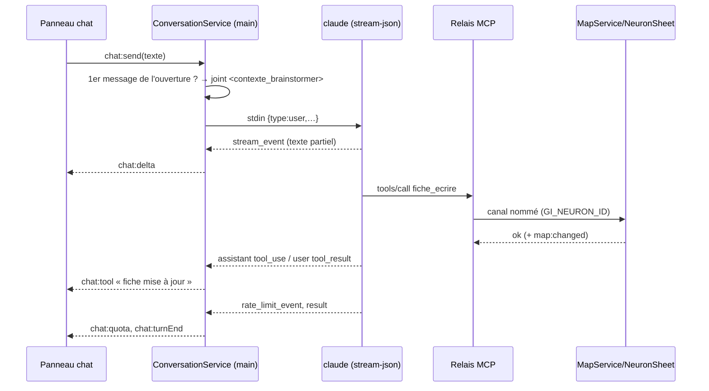

# Niveau 3 — Conception Technique : F15 Neurone conversationnel
> Basé sur : L1d + L2-neurone-conversationnel.md + L3-pont-mcp.md · Date : 2026-10-04
> Vérifié sur Claude Code 2.1.289 : flux `stream-json` en entrée et sortie, `apiKeySource: none` (abonnement),
> `rate_limit_event` (utilisation 5 h / 7 jours), hooks utilisateur coupés par `--setting-sources project`.

## 1. Contrats

### 1.1 Processus d'une conversation (main → CLI)
```
claude -p --input-format stream-json --output-format stream-json --verbose --include-partial-messages
  --session-id <uuid>            (création)   |   --resume <uuid>   (reprise)
  --model <modèle de la conversation>
  --setting-sources project      (pas de hooks ni réglages utilisateur)
  --strict-mcp-config --mcp-config <json : serveur « brainstormer » = relais, env GI_PROFILE_DIR, GI_NEURON_ID>
  --allowedTools "mcp__brainstormer Read Glob Grep WebSearch"   --permission-prompts none
  --append-system-prompt <cadre du Brainstormer (stable)>
cwd = %APPDATA%/gestionnaire-idees/workspace   ·   shell: false   ·   données par stdin uniquement
```
- **Entrée** : une ligne JSON par message `{"type":"user","message":{"role":"user","content":"…"}}`.
- **Sortie** lue par l'app : `system/init` (session, modèle), `stream_event` (texte partiel), `assistant`
  (blocs `text` / `tool_use`), `user` (`tool_result`), `rate_limit_event`, `result` (fin de tour, durée, erreurs).
- **Contexte frais** : le cadre (system prompt) est stable — il est figé par session (`--system-prompt-snapshot` on).
  Les fiches changent : elles sont jointes **au premier message de chaque ouverture**, dans un bloc
  `<contexte_brainstormer>` ; Claude peut aussi les relire à tout moment par l'outil `neurone_contexte`.
- **Cycle de vie** : un processus vivant par conversation ouverte ; fermé après 10 min d'inactivité ou à la
  fermeture du panneau + 2 min ; 3 au plus en même temps ; tous tués à la fermeture de l'app.

### 1.2 Nouveaux outils MCP (relais → main) — neurone courant = `GI_NEURON_ID` (transmis dans la poignée de main)
| Outil | Entrée | Effet |
|-------|--------|-------|
| `neurone_contexte` | `{ id? }` | Cadre, type, couche, fiche du genesis, fiches du chemin, fiche du neurone, enfants |
| `fiche_ecrire` | `{ id?, sections: { points_cles?, decisions?, questions_ouvertes?, manques? }, resume? }` | Remplace les sections données ; 1 opération d'Historique « par Claude » |
| `maturite_evaluer` | `{ id?, niveau: insuffisant\|suffisant\|complet, manques[] }` | Met à jour la jauge |
| `type_definir` | `{ type }` (genesis seulement) | projet · achat · evenement · decision · apprentissage · general |
| `couche_proposer` | `{ id?, signal: string, neurones: [{ titre, objectif, complexe? }] (1..8) }` | Fantômes autour du neurone (statut `proposed`) |
| `remontee_proposer` | `{ texte, section }` | Proposition de modification de la fiche du genesis |
Les 9 outils de la spec 007 restent ; `neurone_*` refusent un neurone d'un autre arbre que celui de `GI_NEURON_ID`
(une conversation n'écrit que dans son arbre).

### 1.3 IPC (interface ↔ main)
| Canal | Entrée | Sortie |
|-------|--------|--------|
| `chat:open` | `{ neuronId }` | `{ messages, sheet, maturity, layer, funnel, quota }` |
| `chat:send` | `{ neuronId, text (≤ 20 000) }` | — (réponses par événements) |
| `chat:stop` | `{ neuronId }` | — (interrompt le tour) |
| `chat:close` | `{ neuronId }` | — |
| `proposal:decide` | `{ proposalId, decision: accept\|reject, edits? }` | état (naissances, remontée appliquée) |
| `neuron:createGenesis` | `{ title, x, y }` | neurone |
| `funnel:export` | `{ genesisId }` | dossier choisi par le sélecteur natif (main) |
| événements | `chat:delta`, `chat:message`, `chat:tool`, `chat:turnEnd`, `chat:error`, `chat:quota`, `map:changed` | — |

## 2. Données (migration `0018_neuron_conversations` + down)
| Table | Colonnes | Remarques |
|-------|----------|-----------|
| `neurons` (modifiée) | + `layer` int (1–4, racine = 1), `funnel` text (genesis), `session_id` text unique, `sheet_json` text, `maturity` text, `maturity_missing_json` | Racines = genesis ; enfants : `kind = 'layer_node'`, `parent_id`, `root_id` = genesis |
| `neuron_messages` (nouvelle) | `id`, `neuron_id`, `role` user\|assistant\|tool, `text`, `tool_name`, `created_at` | Affichage de l'historique (le CLI garde sa propre transcription) |
| `neuron_proposals` (nouvelle) | `id`, `neuron_id` (origine), `kind` layer\|uplift, `payload_json`, `status` proposed\|accepted\|rejected, `batch_id`, `created_at`, `decided_at` | Fantômes de couche et remontées |
| `change_log` | entités `neuron_sheet`, `neuron_proposal` | Annulation |
- Fiche (`sheet_json`) : `{ resume, points_cles[], decisions[], questions_ouvertes[], manques[] }`, ≤ 12 000 caractères ;
  rendue en Markdown L1–L4 à l'export.
- **Contexte joint borné** à 24 000 caractères : fiche du neurone entière, genesis entier, ancêtres intermédiaires réduits à
  `resume + decisions` au-delà de la borne.

## 3. Séquence — un tour de conversation


## 4. Cas limites
- **Concurrence** : un seul tour à la fois par conversation (envoi désactivé pendant un tour) ; plusieurs conversations
  en parallèle possibles (≤ 3 processus).
- **Reprise** : `--resume` échoue (transcription supprimée) → nouvelle session, l'app le signale et rejoint le contexte.
- **Tour interrompu** (`chat:stop`, fermeture) : processus arrêté, les écritures déjà faites restent (chacune annulable).
- **Quota** : `rate_limit_event` avec statut `rejected` → message avec l'heure de reprise ; `allowed_warning` → bandeau.
- **Volumétrie** : historique affiché paginé (200 derniers messages) ; fiche bornée.

## 5. Sécurité
| Risque | Vecteur | Mitigation |
|--------|---------|------------|
| Commande arbitraire | lancement du CLI | Chemin de `claude` résolu par le main, arguments fixes, `shell: false`, texte par stdin |
| Claude agit hors carte | outils | `--allowedTools` restreint + `--permission-prompts none` ; lecture limitée au dossier de travail |
| Hooks / réglages utilisateur injectés | sessions de l'app | `--setting-sources project` (vérifié) |
| Une conversation écrit dans un autre arbre | outils `neurone_*` | Arbre de `GI_NEURON_ID` vérifié par le main |
| Contenu interprété | bulles du chat | Texte brut (pas de HTML) ; Markdown éventuel plus tard via un rendu sans HTML brut |
| Secrets dans les journaux | flux du CLI | Journal : événement, durée, statut — jamais le texte |

## 6. Découpage proposé (spec 008)
- **Lot A — Chat d'un neurone** : ConversationService, panneau chat (flux), sessions, contexte joint, `neurone_contexte`,
  `fiche_ecrire`, `maturite_evaluer`, fiche condensée sur la carte, quota. Créer un genesis au clic droit.
- **Lot B — Entonnoir** : couches, `type_definir`, `couche_proposer` (fantômes + validation en bloc), `remontee_proposer`,
  éclosion + export.
- **Lot C — Bascule** : conversion des idées existantes, Ollama en tâches de fond, retrait de l'ancien moteur de
  croissance (questions Ollama, extensions, absorption).
