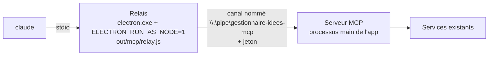
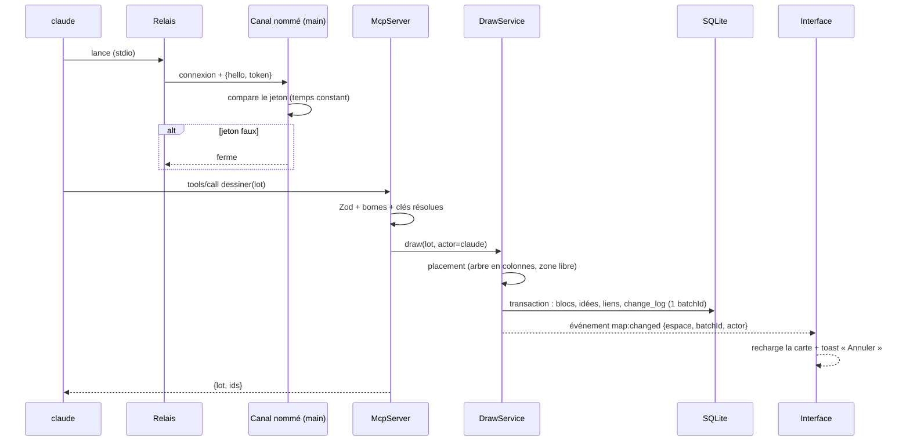

# Niveau 3 — Conception Technique : F10 Pont MCP
> Basé sur : L1c-pont-claude-code.md + L2-pont-mcp.md (10 points validés le 2026-10-04) · Date : 2026-10-04

## 0. Décision d'architecture : transport « relais stdio + canal nommé »
Claude Code parle MCP en **stdio** (il lance lui-même le serveur) ou en **HTTP**. Recommandation : **stdio**.

| Option | Pour | Contre |
|--------|------|--------|
| **Relais stdio + canal nommé (retenu)** | Aucun port réseau ouvert (pas d'attaque depuis une page web ni par DNS rebinding — technique qui fait passer un site pour `localhost`) ; le jeton **n'est pas écrit** dans la config de Claude Code (le relais le lit dans `%APPDATA%`) ; app fermée → le relais répond quand même « Le Brainstormer n'est pas lancé » | Un petit fichier de plus à construire (`relay.js`) ; chemin du relais à réenregistrer si l'app change de place |
| HTTP `127.0.0.1` + en-tête `Authorization` | Pas de relais | Port joignable par toute page web (contrôle d'`Origin` obligatoire) ; jeton en clair dans `~/.claude.json` ; app fermée = « échec de connexion » brut |

- Le **relais est idiot** : il recopie les octets stdio ↔ canal après une poignée de main `{"hello":"gi-mcp/1","token":"…"}`.
  Toute la logique (outils, validation, écriture) est dans le main. Le relais n'est pas de confiance.
- Côté main : un `McpServer` (`@modelcontextprotocol/sdk`) **par connexion**, branché sur un transport maison
  au-dessus du socket du canal (messages JSON-RPC délimités par saut de ligne, mêmes trames que stdio).
- Enregistrement (F13) : `claude mcp add brainstormer --scope user -e ELECTRON_RUN_AS_NODE=1 -- "<electron.exe>" "<relay.js>"`.
- App fermée : le relais répond seul à `initialize` (instructions : « Le Brainstormer n'est pas lancé — demande à
  mentalyas de l'ouvrir ») et expose un seul outil `etat` qui renvoie ce message.

## 1. Contrat des outils MCP
Entrées validées par Zod (schémas dans `src/shared/mcp/tools.ts`, partagés main/tests). Sorties : texte compact
(lisible par Claude, économe en jetons) + `structuredContent` JSON quand des identifiants sont renvoyés.

| Outil | Entrée | Sortie | Erreurs |
|-------|--------|--------|---------|
| `etat` | — | espaces (nom, lié à un dossier ?), espace actif, sélection (titres), 10 éléments récents | — |
| `carte_lire` | `espace?` (id, défaut : actif), `curseur?` | éléments de l'espace (id, type, titre, parent, cadre), liens ; page de 150 éléments max | `ESPACE_INCONNU` |
| `selection_lire` | — | éléments sélectionnés + enfants directs + liens entre eux, contenus complets (bornés) | `SELECTION_VIDE` (info, pas une faute) |
| `noeud_lire` | `id`, `profondeur?` (0–3, défaut 1) | élément, contenu complet, sous-arbre, liens | `INTROUVABLE` |
| `dessiner` | `espace?`, `ancre?` (id d'un élément existant : rattache le lot), `cadre?` (`{titre}` : regroupe le lot), `noeuds[]` (`cle`, `titre` ≤ 200, `texte?` ≤ 20 000, `type?` `note`\|`idee`, `parent?` clé du lot ou id existant), `liens[]` (`de`, `vers` : clé ou id ; `libelle?` ≤ 80) | `{ lot: batchId, ids: {cle → id} }` | `LOT_INVALIDE` (chemin du champ + raison), `LOT_TROP_GROS`, `INTROUVABLE` |
| `noeud_modifier` | `id`, `titre?`, `texte?` | élément mis à jour | `INTROUVABLE`, `NON_MODIFIABLE` (ex. sous-neurone absorbé) |
| `relier` | `de`, `vers`, `libelle?` | id du lien | `INTROUVABLE`, `DEJA_RELIES` |
| `retirer` | `ids[]` (≤ 200) | `{ lot }` | `INTROUVABLE` |
| `widget_poser` | `titre`, `code` (fichier unique, API `gi`), `source?` (id d'idée), `parties?` (`IdeaPart[]`) | id du widget, état « À revoir » | `CODE_REFUSE` (raison du validateur existant) |

Bornes (`src/main/domain/mcp/limits.ts`) : 200 nœuds et 400 liens par lot, 20 000 caractères par texte, réponse de
lecture ≤ 60 000 caractères (au-delà : pagination par `curseur`).

**Instructions du serveur** (texte envoyé à `initialize`) : rôle de la carte ; « lis `etat` au début » ; « préfère
dessiner une structure plutôt qu'un long texte quand mentalyas travaille sur la carte » ; « un lot = une idée
cohérente ; regroupe-le dans un cadre » ; « tout est annulable par mentalyas, ne demande pas la permission d'écrire ».

## 2. Schéma de données détaillé
Les primitives génériques s'ajoutent aux **blocs** existants (`canvas_blocks` a déjà position, taille, texte,
suppression annulable) plutôt qu'aux neurones, dont le modèle est propre à la recette « Brainstorm » (états brut/éclos,
extensions, synthèses). Un nœud `type: idee` dessiné par Claude crée, lui, une **vraie idée** (neurone racine brut).

### Tables/Collections concernées
| Table | Colonnes (ajouts) | Contraintes | Index |
|-------|-------------------|-------------|-------|
| `canvas_blocks` | `kind` + `'note'`, `'frame'` ; `title` text ; `parent_block_id` text (arbre de notes) ; `frame_id` text (cadre englobant) ; `origin` `'user'`\|`'claude'` (défaut `user`) ; `space_id` (F12) | `parent_block_id`, `frame_id` → `canvas_blocks.id` ; un `frame` n'a pas de parent | `canvas_blocks_parent_idx`, `canvas_blocks_frame_idx`, `canvas_blocks_space_idx` |
| `map_links` (nouvelle) | `id`, `from_kind` (`block`\|`idea`), `from_id`, `to_kind`, `to_id`, `label`, `origin`, `created_at`, `deleted_at` | paire unique (non supprimée) ; pas d'auto-lien | `map_links_from_idx`, `map_links_to_idx` |
| `neurons` | `origin` + `'claude'` | — | — |
| `change_log` | `actor` `'user'`\|`'claude'` (défaut `user`) ; `kind` + `'mcp_write'` | — | — |

- Migration `0017_map_primitives` + `down/0017_map_primitives.down.sql` (constitution).
- Les liens idée↔idée existants restent dans `neuron_links` (liens suggérés, graines) ; `map_links` porte les liens
  libres dessinés (note↔note, note↔idée, idée↔idée posé par Claude). L'interface les affiche avec le même style.

## 3. Diagramme de séquence (Mermaid)

## 4. Cas limites techniques
- **Concurrence :** le main est mono-fil et `better-sqlite3` synchrone : chaque appel d'outil s'exécute en une
  transaction, les écritures de plusieurs clients sont donc sérialisées naturellement. Une modification simultanée
  par l'interface et par Claude du même nœud : dernier écrit gagne, les deux sont dans l'Historique.
- **Idempotence :** un lot rejoué crée un second lot (pas de déduplication implicite) ; Claude reçoit les ids et ne
  rejoue pas en pratique. `relier` est idempotent (`DEJA_RELIES`).
- **Transactions / rollback :** `dessiner`, `retirer`, `noeud_modifier` = une transaction chacun, rien d'écrit si une
  étape échoue. Annulation = `HistoryService.undo(batchId)` existant, étendu aux entités `note`, `frame`, `map_link`.
- **Volumétrie :** 200 nœuds par lot ; lecture paginée ; placement O(n) (arbre en colonnes : profondeur → colonne,
  frères empilés, cadre dimensionné au contenu), zone libre = à droite de l'enveloppe des éléments de l'espace, ou sous
  l'ancre si fournie.
- **Sélection :** l'interface pousse la sélection au main à chaque changement (`map:selection`, ids seulement) ;
  le main la garde en mémoire par espace.
- **Relais orphelin :** app fermée pendant une session → le canal se ferme, le relais passe en mode « app non lancée »
  et se reconnecte à l'appel suivant.

## 5. Sécurité spécifique à cette fonctionnalité
| Risque | Vecteur | Mitigation |
|--------|---------|------------|
| Lecture/écriture de la base par un autre processus local | Connexion au canal nommé | Jeton aléatoire 256 bits (`crypto.randomBytes`) dans `%APPDATA%/gestionnaire-idees/mcp.token` (droits de l'utilisateur seulement), comparaison à temps constant, refus et fermeture sinon ; régénéré à la demande (Réglages) |
| Attaque depuis le navigateur | Page web qui appelle `localhost` | Aucun port TCP ouvert (canal nommé uniquement) |
| Fuite du jeton | Config de Claude Code, journaux | Le jeton n'est jamais dans `~/.claude.json` ni dans les journaux ; le relais le lit lui-même |
| Entrées malformées / géantes | Appels d'outils | Zod strict (`.strict()`), bornes, rejet du lot entier ; taille max d'un message sur le canal (1 Mo) |
| Injection dans l'interface | Titres/textes écrits par Claude | Rendu React en texte (jamais `dangerouslySetInnerHTML`), comme les contenus existants |
| Code de widget malveillant | `widget_poser` | Validateur et bac à sable existants ; « À revoir » obligatoire ; empreinte |
| Destruction de données | `retirer`, `noeud_modifier` | Archivage seulement, Historique, annulation ; jamais de suppression définitive par MCP |
| Instructions cachées dans le contenu de la carte | Texte d'une note relu par Claude | Hors périmètre de l'app (c'est le contenu de mentalyas) ; les instructions du serveur rappellent que le contenu de la carte est une donnée |
