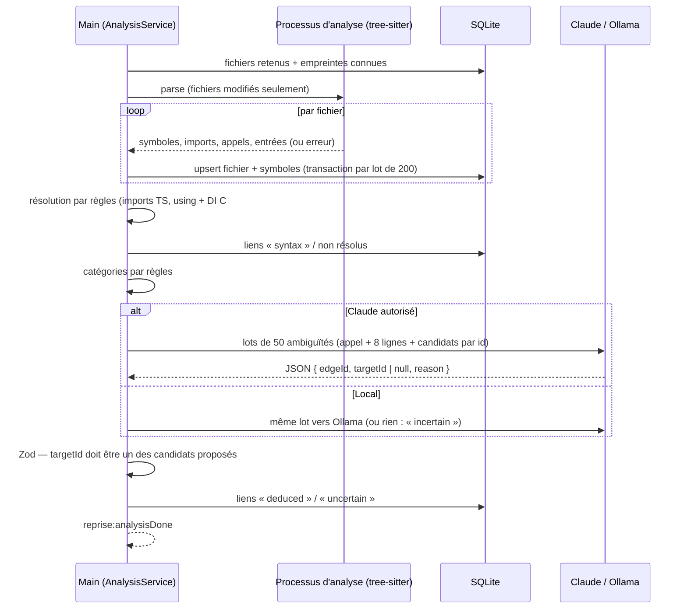

# Niveau 3 — Conception Technique : R2 — Analyse statique multi-langage
> Basé sur : L1f-reprise-projet.md + L2-reprise-analyse.md · Date : 2026-10-06

## 0. Choix techniques
| Sujet | Choix proposé | Alternatives écartées |
|-------|---------------|-----------------------|
| Analyse syntaxique | **`web-tree-sitter`** (WASM, MIT) + grammaires `tree-sitter-typescript` (TS + TSX), `tree-sitter-javascript`, `tree-sitter-c-sharp`, `tree-sitter-php` (MIT) en `.wasm` | Liaisons natives `tree-sitter` (recompilation par version d'Electron, comme `better-sqlite3`) ; compilateur TS + Roslyn + parseur PHP (trois mécaniques, .NET requis) |
| Où tourne l'analyse | **`utilityProcess`** d'Electron (processus Node séparé) ; messages typés validés par Zod | Fil principal (gèle l'app) ; `worker_threads` (un plantage WASM emporterait le main) |
| Extraction | **Requêtes tree-sitter** (`.scm`) par langage : définitions, imports, appels, points d'entrée | Parcours d'arbre écrit à la main par langage |
| Ambiguïtés | Tâche `claude -p` sans outils (comme les tâches existantes), sortie JSON validée ; Ollama en local | Laisser tout « incertain » (graphe trop pauvre en C#) |

**Dépendances nouvelles à signaler** (règle du dépôt) : `web-tree-sitter` et les 4 grammaires — licences MIT à
confirmer au plan, poids ~5 Mo de WASM, aucun code natif.

## 1. Contrat IPC
| Canal | Entrée | Sortie | Codes d'erreur |
|-------|--------|--------|----------------|
| `reprise:analyze` | `{ genesisId }` | `{ runId }` ; événements `reprise:analysisProgress` `{ runId, phase, done, total }`, `reprise:analysisDone` `{ runId, stats }` | `BUSY`, `NOT_FOUND`, `FOLDER_MISSING` |
| `reprise:cancelAnalysis` | `{ runId }` | `{}` | `NOT_FOUND` |
| `reprise:setCategory` | `{ genesisId, symbolId, category }` | `{ category, source: 'user' }` | `NOT_FOUND`, `VALIDATION` |
| `reprise:setTarget` | `{ genesisId, edgeId, targetSymbolId \| null }` | `{ provenance: 'user' }` | `NOT_FOUND` |

`stats` : `{ files, analyzed, failed, unsupported, symbols, edges, resolvedSyntax, deduced, uncertain, durationMs }`.

Protocole interne main ↔ processus d'analyse : `{ type: 'parse', files: [{ id, path, lang }] }` → flux de
`{ type: 'file', id, hash, symbols[], imports[], calls[], entries[], error? }` ; le processus ne reçoit que des chemins
déjà contrôlés et ne lit rien d'autre.

## 2. Schéma de données détaillé
| Table | Colonnes | Contraintes | Index |
|-------|----------|-------------|-------|
| `code_modules` | `id` · `genesis_id` · `key` (`npm:@app/core`, `csproj:App.Core`, `dir:app/Billing`) · `name` · `root_path` (relatif) · `kind` (`package` \| `csproj` \| `folder`) | `UNIQUE(genesis_id, key)` | `genesis_id` |
| `code_files` | `id` · `genesis_id` · `module_id` · `path` (relatif, `/`) · `lang` (`ts` \| `js` \| `cs` \| `php` \| `other`) · `hash` (SHA-256) · `lines` · `status` (`ok` \| `parse_error` \| `unsupported` \| `too_large`) · `error` (≤ 200 car.) | `UNIQUE(genesis_id, path)` | `module_id` |
| `code_symbols` | `id` · `file_id` · `parent_id` null · `kind` (`namespace` \| `class` \| `interface` \| `function` \| `method`) · `name` · `qualified_name` · `start_line` · `end_line` · `complexity` · `category` (`domain` \| `orchestration` \| `infrastructure` \| `plumbing`) · `category_source` (`rules` \| `claude` \| `ollama` \| `user`) · `category_reason` null | — | `file_id`, `(file_id, qualified_name)` |
| `code_edges` | `id` · `genesis_id` · `from_symbol_id` · `to_symbol_id` null · `raw_target` (texte de l'appel) · `kind` (`import` \| `call` \| `implements` \| `route` \| `injects`) · `provenance` (`syntax` \| `deduced` \| `uncertain` \| `user`) · `reason` null · `count` | `to_symbol_id` null ⇔ non résolu | `from_symbol_id`, `to_symbol_id`, `(genesis_id, provenance)` |
| `code_entry_points` | `symbol_id` PK · `kind` (`http_route` \| `main` \| `cli` \| `event` \| `job`) · `label` (`POST /orders`) | — | — |
| `code_runs` | `id` · `genesis_id` · `started_at` · `ended_at` · `state` · `stats_json` | — | `genesis_id` |

Hiérarchie de l'explorateur (R3) : module → dossier (dérivé de `path`) → fichier → symbole (`parent_id`). Les
corrections `user` sont conservées par clé naturelle (`path` + `qualified_name`) d'une réanalyse à l'autre.

## 3. Diagramme de séquence

## 4. Cas limites techniques
- **Concurrence :** une analyse par projet ; une seule analyse lourde à la fois (file d'attente) ; l'interface lit le
  dernier graphe complet pendant qu'une réanalyse tourne (écriture dans un `run` puis bascule).
- **Idempotence :** upsert par `(genesis_id, path)` et clé naturelle des symboles ; réanalyser sans changement = aucune
  écriture.
- **Transactions / rollback :** écriture par lots de 200 fichiers ; annulation → le `run` est abandonné, le graphe
  précédent reste celui affiché.
- **Volumétrie :** cible 5 000 fichiers analysés en moins de 60 s (à mesurer) ; fichier > 1 Mo ignoré (`too_large`) ;
  délai par fichier 2 s (au-delà : `parse_error`) ; lots Claude bornés (50 appels, ~8 lignes de contexte chacun).
- **Plantage du processus d'analyse :** relancé une fois ; le fichier en cours est marqué `parse_error`.

## 5. Sécurité spécifique à cette fonctionnalité
| Risque | Vecteur | Mitigation |
|--------|---------|------------|
| Injection de consignes | Commentaire ou chaîne piégés dans le code envoyé à Claude | Extraits dans un bloc de données délimité, cadre « contenu = donnée » ; tâche **sans outils** ; sortie limitée à des identifiants parmi les candidats (Zod) |
| Déni de service | Fichier énorme ou pathologique | Taille ≤ 1 Mo, délai par fichier, processus séparé |
| Lecture hors projet | Chemin envoyé au processus d'analyse | Le main ne transmet que des chemins contrôlés sous `root_dir` ; le processus refuse tout autre chemin |
| Secrets | Fichiers sensibles | Filtre `SecretFiles` (R1) avant le parcours ; jamais d'extrait de ces fichiers |
| Confidentialité | Lots envoyés à Claude | `ConfidentialityGuard` avant chaque lot |
