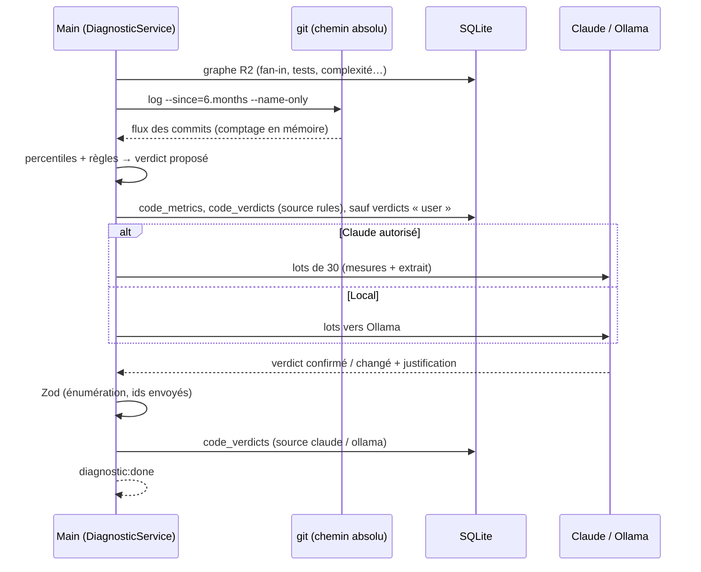

# Niveau 3 — Conception Technique : R5 — Mesures et diagnostic en couleurs
> Basé sur : L1f-reprise-projet.md + L2-reprise-diagnostic.md + L3-reprise-analyse.md · Date : 2026-10-06

## 0. Calcul des mesures
| Mesure | Source | Calcul |
|--------|--------|--------|
| `tests_linked` | Graphe R2 | Nombre de fichiers de test (`*.test.ts`, `*.spec.ts`, `*Tests.cs`, `tests/**`, `*Test.php`) dont un lien `import` / `call` atteint l'élément |
| `fan_in` / `fan_out` | Graphe R2 | Appelants / appelés distincts (liens `syntax` + `deduced`, hors plomberie) |
| `loc` | Fichier | Lignes non vides |
| `complexity` | Arbre syntaxique | 1 + nombre de branches (`if`, `case`, boucles, `catch`, `&&`, `||`, `?:`) — complexité cyclomatique approchée |
| `churn_6m` | git | Commits touchant le fichier sur 6 mois |
| `authors_6m` | git | Nombre d'auteurs distincts (comptés localement, **noms jamais stockés**) |
| `fix_commits` | git | Commits dont le sujet contient `fix`, `bug`, `hotfix`, `correctif` |
| `last_modified` | git | Date du dernier commit |
| `todos` | Fichier | `TODO`, `FIXME`, `HACK`, `XXX` |
| `dead` | Graphe R2 | `fan_in = 0`, ni point d'entrée, ni test, ni symbole exporté public d'un paquet |
| `critical` | Chemin + nom + Claude | Motifs : `auth`, `login`, `payment`, `billing`, `migration(s)`, `security`, contrats d'API publics ; Claude peut ajouter / retirer avec raison |
| `extension` | Graphe R2 | Interface / classe abstraite avec ≥ 2 implémentations, enregistrement d'injection de dépendances, registre d'événements / routes |

Une seule passe git : `git log --since=6.months --name-only --format=%H%x1f%an%x1f%s` (git par chemin absolu, sans
shell, délai 60 s), analysée en flux ; les noms d'auteurs servent seulement à compter, en mémoire.

## 1. Règles de verdict (seuils relatifs au projet : p50, p75, p90 de chaque mesure)
Ordre d'évaluation, le premier qui s'applique donne le verdict principal ; les autres deviennent des badges.

| Ordre | Verdict | Condition |
|-------|---------|-----------|
| 1 | **Intouchable** 🔒 | `fan_in ≥ p90` ou `critical` |
| 2 | **Fragile** ⚠ | (`tests_linked = 0` et `churn_6m ≥ p75`) ou `complexity ≥ p90` ou `fix_commits ≥ p90` |
| 3 | **Point d'extension** ⊕ | `extension` |
| 4 | **Améliorable** ✎ | `dead` ou `loc ≥ p90` ou `todos > 0` |
| 5 | **Solide** ✓ | `tests_linked > 0` et `churn_6m ≤ p50` et `complexity ≤ p75` |
| 6 | **Sans signal** ○ (gris) | Aucun des cas ci-dessus |

Précision par rapport au niveau 2 : un **6ᵉ état « sans signal »** évite de forcer un verdict quand les mesures ne
disent rien (petits fichiers, projet sans tests ni git). **Intouchable + Fragile** est signalé comme le cas le plus
dangereux (tri en tête de « À surveiller »). Petits projets (< 30 fichiers) : percentiles remplacés par des seuils fixes
documentés.

## 2. Contrat IPC
| Canal | Entrée | Sortie | Codes d'erreur |
|-------|--------|--------|----------------|
| `diagnostic:run` | `{ genesisId }` | `{ runId }` ; événement `diagnostic:done` `{ runId, counts }` | `NOT_ANALYZED`, `BUSY` |
| `diagnostic:get` | `{ genesisId, nodeKey }` | `{ verdict, secondary[], source, justification, note, metrics }` | `NOT_FOUND` |
| `diagnostic:override` | `{ genesisId, nodeKey, verdict, note?: string ≤ 500 }` | `{ verdict, source: 'user' }` | `NOT_FOUND`, `VALIDATION` |
| `diagnostic:clearOverride` | `{ genesisId, nodeKey }` | `{ verdict, source }` | `NOT_FOUND` |
| `diagnostic:watchlist` | `{ genesisId }` | `{ items[≤50]: { nodeKey, title, verdict, secondary[] } }` | — |

Tâche Claude (`claude -p`, sans outils) / Ollama, par lots de 30 : entrée `{ id, verdictProposé, mesures, extrait ≤ 40
lignes }` → sortie `{ id, verdict, secondary[], justification ≤ 300 car. }` validée par Zod (verdict dans l'énumération,
id parmi ceux envoyés).

## 3. Schéma de données détaillé
| Table | Colonnes | Contraintes | Index |
|-------|----------|-------------|-------|
| `code_metrics` | `genesis_id` · `node_key` · `tests_linked` · `fan_in` · `fan_out` · `loc` · `complexity` · `churn_6m` · `authors_6m` · `fix_commits` · `last_modified` · `todos` · `dead` · `critical` · `extension` · `run_id` | PK `(genesis_id, node_key)` | — |
| `code_verdicts` | `genesis_id` · `node_key` · `verdict` (`solid` \| `untouchable` \| `fragile` \| `improvable` \| `extension` \| `none`) · `secondary_json` · `source` (`rules` \| `claude` \| `ollama` \| `user`) · `justification` · `note` null · `updated_at` | PK `(genesis_id, node_key)` | `(genesis_id, verdict)` |

Les verdicts `user` ne sont jamais écrasés par un `diagnostic:run` ; `clearOverride` rend la main aux règles / Claude.
Niveaux agrégés (dossier, module) : répartition des verdicts des fichiers enfants (pas de verdict propre).

## 4. Diagramme de séquence

## 5. Cas limites techniques
- **Concurrence :** le diagnostic attend la fin de l'analyse R2 (`NOT_ANALYZED` sinon) ; un seul à la fois par projet.
- **Idempotence :** même graphe + même historique ⇒ mêmes verdicts de règles (déterministe, testé).
- **Transactions :** mesures et verdicts de règles écrits dans une transaction ; les avis de Claude ensuite, lot par lot
  (une coupure laisse des verdicts de règles valides).
- **Volumétrie :** 5 000 fichiers → ~170 lots de 30 ; seuls les éléments **non « sans signal »** et au niveau fichier
  sont envoyés à Claude ; consommation estimée affichée avant de lancer, annulable.
- **Sans git / historique superficiel :** mesures git à `null`, règles qui en dépendent ignorées, signalé.

## 6. Sécurité spécifique à cette fonctionnalité
| Risque | Vecteur | Mitigation |
|--------|---------|------------|
| Données personnelles des collègues | Noms et e-mails dans `git log` | Format sans e-mail (`%an` seulement), comptage en mémoire, aucun nom stocké, logué ni envoyé |
| Injection de consignes | Extrait de code piégé | Bloc de données délimité, tâche sans outils, sortie Zod fermée |
| Verdict pris pour une vérité | Interface | Libellé « diagnostic estimé », mesures et provenance toujours affichées |
| Confidentialité | Lots envoyés | `ConfidentialityGuard` avant chaque lot |
